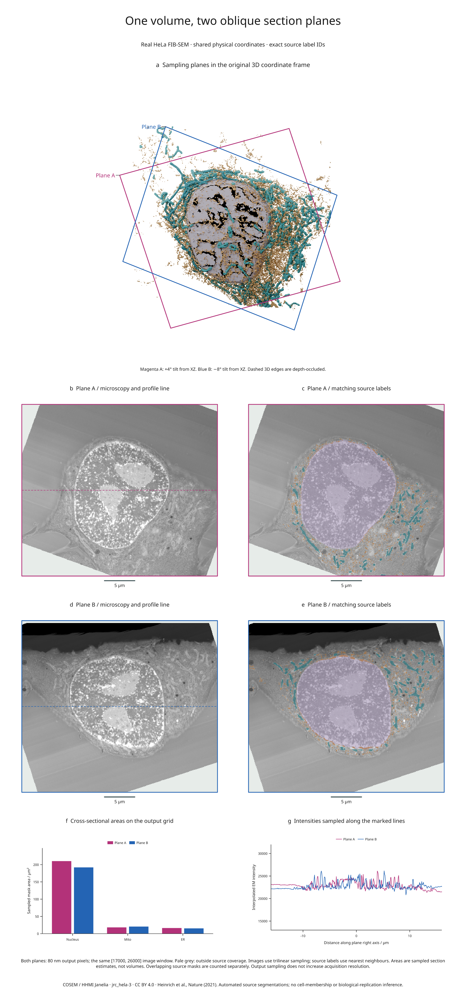

# Shared oblique planes in a real biological volume

Seven panels connect two physical planes through a COSEM HeLa microscopy crop:
their positions in the GPU-rendered organelle scene, raw intensity sections,
matching source labels, sampled cross-sectional areas and intensity profiles.

[Full-size figure](../gallery/oblique-biology.png) ·
[Executable recipe](../examples/oblique_biology.py) ·
[Sampling and measurement evidence](assets/research-preview/oblique-biology.json)



## Reproduce it

From the release checkout with Blender 4.2 or 4.5 LTS:

```sh
python -m pip install -e '.[volume,render]'
python -m pip install -r examples/biology/requirements.txt
python examples/oblique_biology.py --blender /path/to/blender
```

The recipe reuses the [real-microscopy example's](real-biology.md) hash-locked
source cache in `out/real-biology/source.n5/`. If missing, it downloads the
approximately 56.6 MB of recorded objects. Use `--source-cache` to choose another
location. A separately cached organelle scene fits the complete sampling planes;
the recipe checks every plane corner against the saved camera frame. The scene,
new figure and `sections.json` are written to `out/oblique-biology/`.

## What is shared across the panels

Both planes pass through the physical centroid of source nucleus label 1.
Plane A has an in-XZ rotation of +20° and a tilt of +4° from XZ; plane B uses
−18° and −8°. Their full bases and world corners are recorded, so the recipe
does not depend on an implicit Euler-angle convention.

Each output is **351 × 401 pixels**, spaced **0.08 × 0.08 µm**. The physical
rectangle is **28.08 × 32.08 µm** in height/width order. The source level remains
`s4`, with ZYX spacing **0.05184 × 0.064 × 0.064 µm**. No source axis is stretched.

- Panel a projects the exact sampling rectangles through the saved Blender
  camera. Solid edges are visible; dashed edges are depth-occluded. The
  organelle geometry remains intact; these are section markers, not cutaways.
- Panels b–e reuse the corresponding plane for raw microscopy and every label
  mask. Intensity interpolation is trilinear; integer labels use nearest
  neighbours. The image window is `[17000, 26000]`, and mask color has 55% weight.
- Panel f compares foreground mask areas on each output sampling grid. Source
  masks overlap and are measured separately. These estimates are not volumes.
- Panel g uses output row 175, marked by a dashed line on each raw section.
  Horizontal position is physical distance along that plane's right direction.
  Invalid samples break the plotted line rather than becoming zero intensity.

Pale grey areas in the section panels lie outside source coverage. They are not
included in area measurements. Label IDs, per-mask sampled areas, validity masks
for the profiles and unwindowed profile values are saved in the evidence file.
The [oblique-section API guide](oblique-sections.md) explains these contracts.

| Plane | Valid samples | Nucleus mask area | Mitochondrial mask area | ER mask area |
| --- | ---: | ---: | ---: | ---: |
| A | 131,502 / 140,751 | 210.2144 µm² | 18.2656 µm² | 16.3328 µm² |
| B | 130,876 / 140,751 | 192.0448 µm² | 20.6272 µm² | 15.3088 µm² |

## Interpretation and reuse

The data and automated labels are from **COSEM / HHMI Janelia, jrc_hela-3**.
These are visualizations of supplied segmentations, not ground truth or a
reanalysis of the publication. The fixed crop does not infer cell membership,
complete organelles or independent biological replication. Section areas depend
on the chosen plane and output pixel grid; no uncertainty model is supplied.

Data and derived figure: **CC BY 4.0**. Code: **MIT**. Attribution, source
checksums and known segmentation overlaps are documented in the
[original example](real-biology.md) and [third-party notices](../THIRD_PARTY_NOTICES.md).
Publication: Heinrich et al.,
[Whole-cell organelle segmentation in volume electron microscopy](https://doi.org/10.1038/s41586-021-03977-3),
*Nature* 599, 141–146 (2021). The new processing adds oblique resampling, plane
annotations, mask-area estimates and line profiles to the same source crop.
