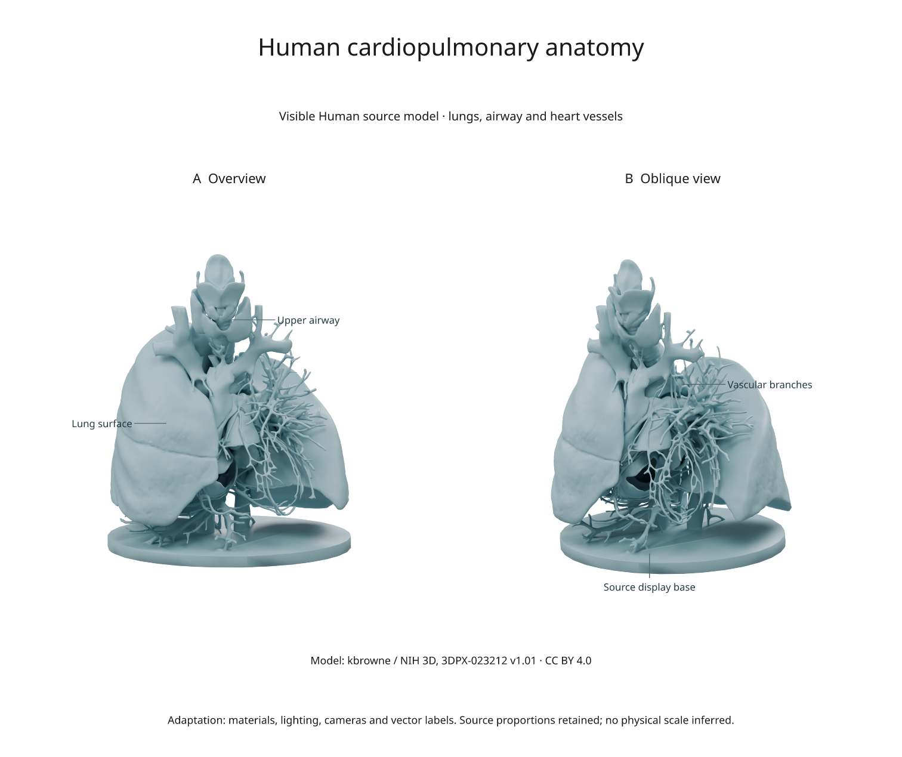
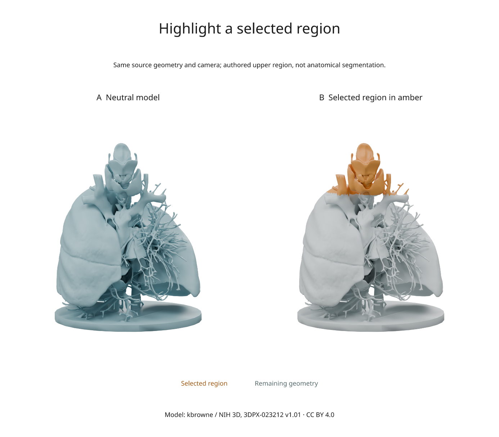

# Label a freely licensed anatomy model

Import an existing anatomical model into Blender, render two views, and add
vector labels with Inklet. This example uses **Visible Human Heart Vessels and
Lungs**, published by **kbrowne** on NIH 3D as **3DPX-023212, version 1.01**, under
[CC BY 4.0](https://creativecommons.org/licenses/by/4.0/).



[SVG](assets/scenes/open-anatomy.svg) · [PDF](assets/scenes/open-anatomy.pdf) ·
[NIH source model](https://3d.nih.gov/entries/3DPX-023212?version=1.01) ·
[Recipe](../examples/open_anatomy.py) · [Source manifest](../examples/assets/open-anatomy.json)

The source describes anatomy from the Visible Human male dataset. Its display
base is retained and labelled separately. This is a source-derived model;
material colour, lighting, cameras and explanatory labels are our additions.

## Download and render

From a checkout, install the rendering extra and use Blender 4.5 LTS:

```sh
python -m pip install -e '.[render]'
python examples/open_anatomy.py --blender /path/to/blender
```

Omit `--blender` if Blender is discoverable. The first run downloads a **2.59 MB
GLB** from NIH 3D. Later runs reuse the local file. Both new and cached files
must match the exact byte count and SHA-256 in the source manifest; mismatches
stop the build. No account or paid asset is required.

Outputs in `out/open-anatomy/` include the source GLB, `anatomy.blend`, two
camera renders in Inklet's cache, SVG/PDF/PNG exports, `attribution.json`,
`anatomy.anchors.json` and `review.txt`. The example uses Cycles, 64 samples and
300 DPI. It was checked with Blender 4.5.13.

## What the import changes

The [Blender importer](../examples/blender/open_anatomy_scene.py) uses Blender's
GLB importer, retains the mesh geometry and relative proportions, and assigns
a blue-grey material. It adds an orthographic overview, an oblique camera and
three area lights. The source's geometry is not simplified or reconstructed. Faces are assigned
to two objects for the optional region highlight described below.

GLB-to-Blender import converts coordinate conventions. Label coordinates are
therefore recorded in the imported Blender world, not copied from a screenshot.
The script casts camera rays through authored target positions and records the
actual surface intersections in `anatomy.anchors.json`.

The labels identify broad structures. They do not claim individual vessel
identities, tissue segmentation accuracy or patient-specific measurements.
No millimetre scale is inferred from the normalized GLB coordinates.

## Edit the labels

In `make_document()` in the figure recipe, edit the label text, `side` and
`clear` values. `annotate3d()` projects each stored surface point through the
corresponding rendered camera. The label uses 7.5-point text and a 0.22 mm leader.
`overlay(..., align='origin')` keeps it registered with the image.

The example uses `hidden='show'` for explanatory labels and records a depth pass.
Use `hidden='omit'` or `hidden='dash'` when the label should indicate whether its
target is visible. Recheck the labels after changing cameras. See
[scene annotations](scene-annotations.md) for the full controls.

To change only the annotations, reuse the existing rendered results in
`make_document()`; the labels and leaders are vector overlays. The scene image
remains raster in SVG/PDF, while the text remains editable.

## Highlight a selected region



[Highlight SVG](assets/scenes/open-anatomy-highlight.svg) ·
[Highlight PDF](assets/scenes/open-anatomy-highlight.pdf)

The example also exports `highlight.svg`, `highlight.pdf` and `highlight.png`.
Both panels use the same camera, lights and geometry. Only the object colours
change: the selection is amber and the remaining model is muted.

The source GLB is fused rather than divided into named organs. The importer
therefore makes an **authored upper-region selection**: faces whose centres have
`z > 0.28` in the imported Blender world. It assigns these faces to `Upper region`
and the remainder to `Context`, preserving all source faces, vertex coordinates
and surface normals. This is a geometric selection, not an airway segmentation.
`anatomy.selection.json` records the rule and face counts.

Inklet's `bindings` applies colours to copied object materials when rendering:

```python
import inklet as i

highlight = i.render_blend('out/open-anatomy/anatomy.blend',
    width=90, height=108, camera='Overview', engine='CYCLES',
    samples=64, dpi=300, passes=('depth',),
    bindings={
        'Upper region': {'color': '#d88b32'},
        'Context': {'color': '#c5d0d2'},
    })
doc = i.document(width=110, margin=8)
doc.add('highlight', highlight.diagram)
doc.compile().save('highlight-detail.svg', 'highlight-detail.pdf')
```

Change the colour strings to restyle the selection. The `.blend` file and the
previous neutral render stay unchanged. Material changes require a render;
vector-label edits can reuse the rendered image. If your source already has
named structures, bind those object names directly and omit the face-partition
step. Use `inspect_blend()` to list their names.

## Reuse and attribution

Credit **kbrowne / NIH 3D**, link to the model and **CC BY 4.0**, and identify your
changes when sharing an adaptation. The exported figure includes a short credit;
the source manifest and [third-party notices](../THIRD_PARTY_NOTICES.md) provide
the complete source and license links. The derived figure assets in this guide
are distributed under CC BY 4.0; the original Python example code is MIT.

For another model, use its own documented license rather than assuming every
NIH upload has the same terms. Record the exact version, download URL, size and
hash before adapting the acquisition step.

## Related examples

- [Real organelle scenes](real-biology.md): microscopy segmentation meshes with
  source calibration and measurements.
- [Fly-connectome figures](scientific-gallery.md): released anatomy and tables,
  rendered as native vector geometry.
- [Synapse schematic](scientific-scenes.md): generated illustrative geometry
  for explaining a process, with no measured anatomical dimensions.
