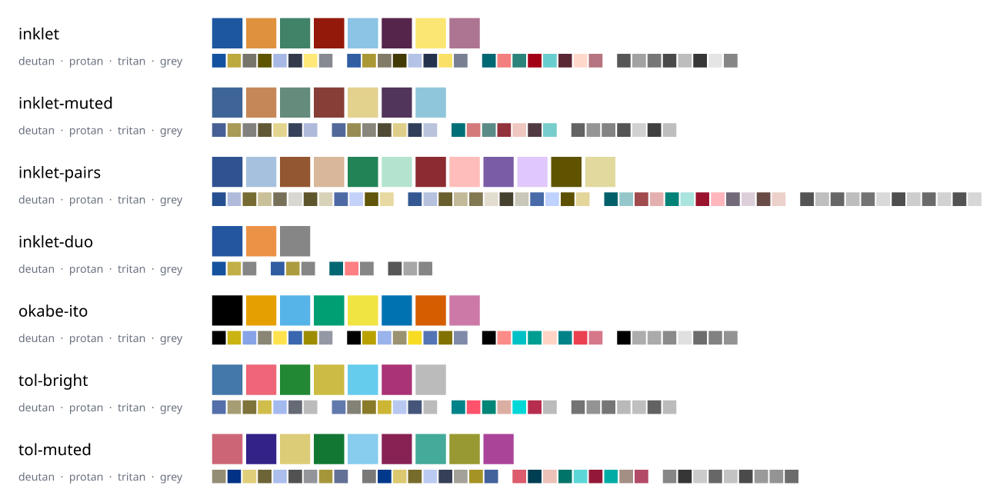
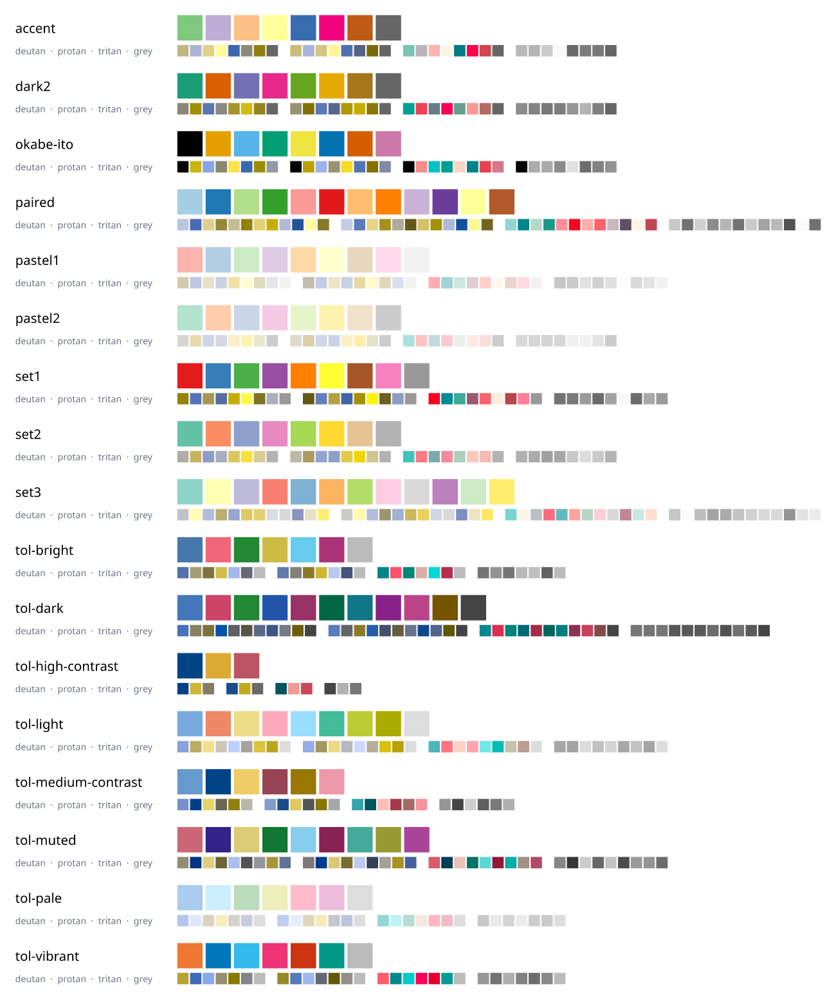
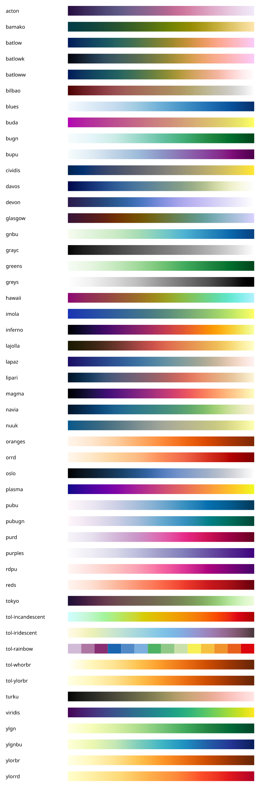
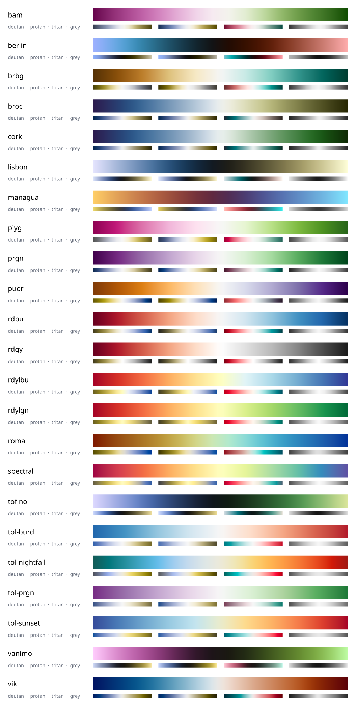
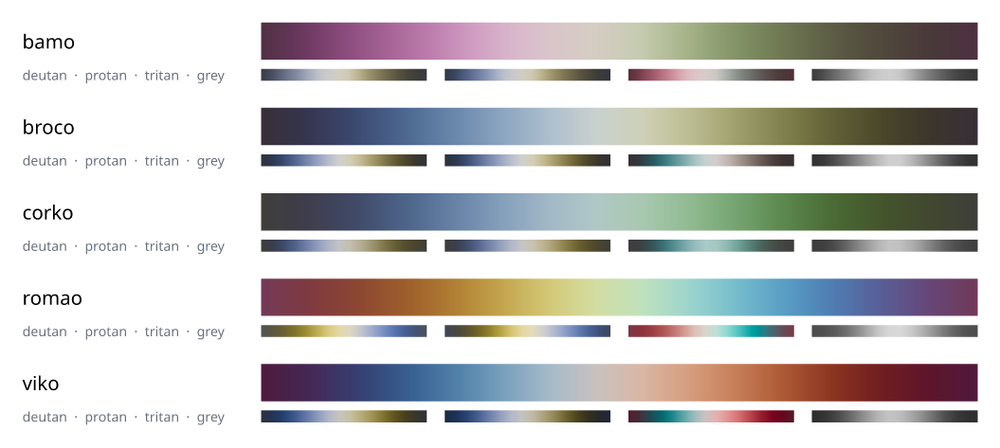

# Colour palettes

Inklet ships 98 palettes: 21 categorical sets, 49 sequential maps, 23
diverging maps and 5 cyclic maps. Each one records where its values come
from and under what licence, and each has been measured. Every swatch on
this page was drawn by Inklet itself with `tools/palette_sheet.py`.

The small strips under each palette show how it looks under the three
dichromacies (simulated with Machado et al. 2009 at full severity) and in
greyscale. Use them to check that the colours you rely on still separate
for every reader.

## Inklet's own palettes

These four were designed for Inklet in OKLCH. Each was optimised against the
smallest CIEDE2000 distance (ΔE00) between any two colours, both in normal
vision and in the worse of two simulations (Machado 2009 and Viénot 1999)
for each dichromacy. The categorical set is also kept apart in greyscale.
The numbers below are asserted in `tests/test_palettes.py`. Okabe-Ito and
two Tol sets are shown below them for comparison. In the table, the CVD columns are the worse of the two simulations; `report()` gives the Machado figures alone.



| Palette | Colours | min ΔE00 normal | deutan | protan | tritan | min greyscale gap (L*) |
|---|---|---|---|---|---|---|
| `inklet` | 8 | 25.9 | 12.4 | 17.6 | 12.4 | 5.5 |
| `inklet-muted` | 7 | 23.5 | 13.4 | 13.9 | 12.9 | 6.5 |
| `inklet-pairs` | 12 | 15.1 | 6.0 | 5.6 | 5.8 | – |
| `inklet-duo` | 3 | 27.8 | 27.7 | 24.1 | 25.0 | 12.7 |
| `okabe-ito` | 8 | 21.7 | 11.5 | 12.3 | 0.6 | 0.8 |

- **`inklet`** has eight colours: cobalt, amber, teal, brick, sky, plum,
  butter and rose. Every pair stays at least 12 ΔE00 apart for all three
  dichromacies, and at least 5 L* apart in greyscale. Okabe-Ito's vermillion
  and reddish purple come within 0.6 of each other for a tritanope (Viénot
  simulation). Its orange and sky blue fall within 1 L* of each other in
  greyscale.
- **`inklet-muted`** uses the same recipe at lower chroma: slate, clay,
  sage, rust, straw, dusty plum and mist. It suits print journals, and
  figures where colour should support the data rather than dominate it.
- **`inklet-pairs`** has six hues, each with a dark and a light member (colours
  `2k` and `2k+1`). Use it for grouped data such as control/treated within
  each condition. Twelve colours in pairs cannot all stay far apart under
  CVD: ColorBrewer's `paired` drops to 1.3 ΔE00 for a protanope. Let the
  pairing carry the meaning, and use direct labels.
- **`inklet-duo`** is for two conditions (or sexes) plus a neutral reference.
  Blue and orange are the hue pair that every dichromat keeps apart, and the
  lightness step keeps them apart in greyscale too.

```python
import inklet as i
from inklet.themes import NATURE, palette

theme = NATURE.with_palette("inklet")        # a theme with Inklet's colours
print(theme.color(0), theme.color(1))        # #1d57a0 #df913e
print(palette("inklet").report())
```

## Categorical sets

This section includes Okabe-Ito, Paul Tol's qualitative schemes (`tol-bright`,
`tol-vibrant`, `tol-muted`, `tol-medium-contrast`, `tol-high-contrast`,
`tol-light`, `tol-pale` and `tol-dark`) and ColorBrewer's qualitative sets.
Brewer's `set1`, `set2`, `set3`, `pastel*`, `dark2`, `accent` and `paired`
were designed before CVD simulation was routine, and several of their pairs
collapse under it: `set2` drops to 1.6 ΔE00 for a protanope. The previews show
which pairs are affected.



## Sequential maps

The perceptually uniform maps are matplotlib's viridis, inferno, plasma and
magma, cividis (built to look almost the same to a deuteranope), and 21 of
Fabio Crameri's Scientific colour maps. Each is stored with enough of its
published 256 entries that interpolating in OKLab, CIELAB or sRGB reproduces
the full table within ΔE00 1. The collection also includes Tol's `tol-ylorbr`,
`tol-whorbr`, `tol-iridescent` and `tol-incandescent`, and ColorBrewer's
sequential schemes. Every sequential map except one is monotonic in
lightness: it reads correctly in greyscale and to every reader. The
exception is `tol-rainbow`, a discrete 14-step sequence of hues for ordered
classes. Use its colours as given; do not interpolate them.



## Diverging maps

A diverging map has a single lightness extreme at its centre, with lightness
changing monotonically along both arms; the tests check every diverging map
for this. `report().asymmetry` gives the largest L* difference between
mirrored stops. Tol's `tol-sunset`, `tol-nightfall` and `tol-burd`, and
Crameri's `roma` and `managua`, mirror within 5 L*. Some published maps are
lopsided: ColorBrewer's `puor` is off by 24 L*. `berlin`, `lisbon`,
`tofino` and `vanimo` are dark in the middle. They suit dark backgrounds, or
data where the centre should recede.



## Cyclic maps

These are Crameri's `bamO`, `brocO`, `corkO`, `romaO` and `vikO`, stored as
`bamo` and so on. Their ends meet, so use them for phase, direction or time
of day.



## Choosing a palette

- **Unordered categories:** use `inklet`, `okabe-ito` or `tol-bright`, with
  no more colours than you have categories. Past eight categories, use direct
  labels or faceting instead of more hues.
- **Ordered quantities:** use a sequential map. `viridis`, `cividis` and
  `batlow` are safe choices. Avoid rainbow maps for continuous data: they
  create boundaries that are not in the data.
- **Deviations from a meaningful centre:** use a diverging map, with `center=`
  set on the matrix so the lightness extreme sits at that value.
- **Angles and phases:** use a cyclic map.
- **Greyscale printing:** check `report().min_lightness_gap` for categorical
  sets. A sequential map passes if it is monotonic in lightness.

## Using palettes

Look up any palette by name, case-insensitively. A trailing `_r` reverses it,
as in matplotlib. Ramps accept names directly:

```python
import inklet as i
from inklet.plot import panel
from inklet.themes import palette, palette_names

print(len(palette_names("diverging")))       # 23
viridis = palette("viridis")
five = viridis.resampled(5)                  # 5 colours, OKLab-interpolated
dark_first = palette("batlow_r")

p = panel(40, 30).matrix([[0.1, 0.5], [0.9, 0.3]], ramp="viridis")
p.colorbar()
shade = i.ramp("vik", space="oklab")         # a callable ramp, 0..1 -> colour
```

The same names work for `scatter(..., ramp="batlow")`, for
`Theme.with_palette(...)`, and for `preset(...).customize(palette="inklet-muted")`.
A theme's series colours must be categorical, so for a theme take a ramp's
colours explicitly: `palette("viridis").resampled(6)`.

## Measuring a palette

`Palette.report()` returns a `PaletteReport` with the following fields:

- `min_delta_e`: the smallest pairwise ΔE00.
- `min_delta_e_cvd` and `worst_pairs`: the smallest ΔE00 under each simulated
  dichromacy, and which pair sets it.
- `lightness`: the CIE L* of each colour.
- `min_lightness_gap`: the smallest gap between the sorted L* values.
- `monotonic` and `symmetric`: whether a ramp is monotonic in lightness, and
  whether a diverging map is symmetric.

`Palette.cvd(kind)` returns the palette as a reader with that deficiency sees
it. `Palette.greyscale()` returns the palette at the same L* with no colour.
The colour science is in `inklet.themes.color`. It includes OKLab and OKLCH
(`to_oklab`, `from_oklch`, `interpolate_oklab`), CIEDE2000 (`delta_e_2000`,
checked against Sharma et al. 2005) and `simulate_cvd(color, kind,
method="machado", severity=...)`. The default simulation remains Viénot's.

```python
from inklet.themes import palette

r = palette("set2").report()
print(round(r.min_delta_e_cvd["protanopia"], 1), r.worst_pairs["protanopia"])
```

## Sources and licences

| Palettes | Source | Licence |
|---|---|---|
| viridis, inferno, plasma, magma | Smith & van der Walt (matplotlib 3.9.2 tables) | CC0 1.0 |
| cividis | Nuñez, Anderton & Renslow, *PLoS ONE* 2018 | BSD-style, Battelle Memorial Institute |
| Crameri maps | Crameri, Scientific colour maps 8.0, doi:10.5281/zenodo.8035877 | MIT |
| ColorBrewer | Brewer, Harrower & Penn State, colorbrewer2.org | Apache-2.0 |
| `tol-*` | Paul Tol, SRON/EPS/TN/09-002 and his web page | no licence stated; published for general use |
| `okabe-ito` | Okabe & Ito, Color Universal Design (2008) | no licence stated; published as a recommendation |
| `inklet*` | Inklet | MIT |

The full notices are in
[THIRD_PARTY_NOTICES.md](https://github.com/Mapika/inklet/blob/master/THIRD_PARTY_NOTICES.md).
Journal-branded sets are not included. ggsci's are GPL, and Tableau's are
proprietary. `inklet-muted` offers the restrained journal look under
Inklet's own licence.
