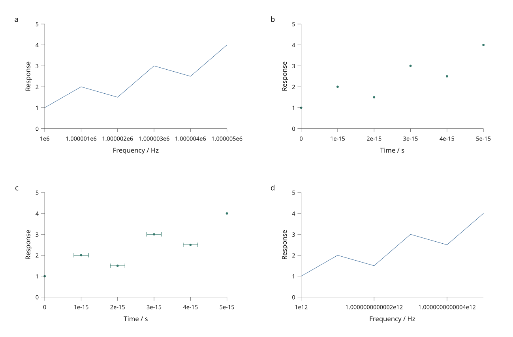

# Shared plotting quality

Available in **4.0.0.dev1**. See the [development-preview installation guide](development-preview.md).

The development preview improves numeric ticks in the common scale engine.
These fixes apply to ordinary plots, color scales and measured browser axes.
They are included in 4.0.0.dev1 and are not part of 3.1.0.



[Complete Python recipe](../examples/plot_quality_review.py) ·
[Earlier output for comparison](assets/guides/plot-quality-before.png)

The figure uses original simulated values by Mark Marosi, released under MIT.
Panel a varies by five units around one million; panel b spans five femtoseconds;
panel c adds supplied 0.2-femtosecond error distances; panel d varies by half a
unit around one trillion. Captions stay outside the artwork.

## What changed

| Case | Earlier behavior | Current behavior |
| --- | --- | --- |
| Narrow range around a large baseline | Distinct ticks could all read `1e6` | Scientific labels preserve the tick spacing |
| Very small magnitudes | Rounding could collapse femtosecond ticks to zero | Small-scale positions and labels are retained |
| Narrow but representable ranges | A relative tolerance could collapse the range to one tick | Distinct positions remain available to measured layout |
| Near floating-point resolution | Lattice arithmetic could repeat ticks or move them outside the domain | Returned ticks are distinct and inside the domain |

Labels are measured before thinning, so added precision participates in layout.
Checks cover all four axis sides, reversed domains, negative and tiny values,
and one-representable-step ranges. Ordinary formatting retains its behavior.

Very narrow ranges around large offsets can still need long labels, as panel d
shows. The engine thins labels to fit. Authors can plot a meaningful relative
quantity and state its reference in the axis label when a shorter representation
is appropriate; automatic additive-offset notation is not introduced here.

## Reproduce the review

```sh
python examples/plot_quality_review.py --output out/plot-quality
```

The command writes SVG, PNG and an external caption using `scientific.general`
and shared measured margins. PNG export requires the optional `render` extra.
Tick formatting does not change the coordinates or supplied uncertainty.

The new [distribution and interval guide](statistical-views.md) demonstrates
physical caps and center markers, shared facet scales and explicit populations.
The [axes guide](axes-and-scales.md) covers custom tick formats and typography.
