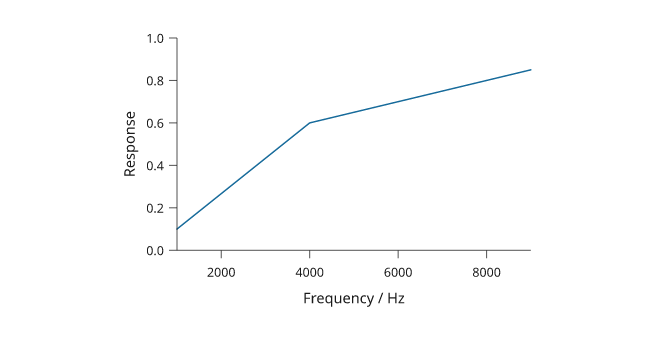
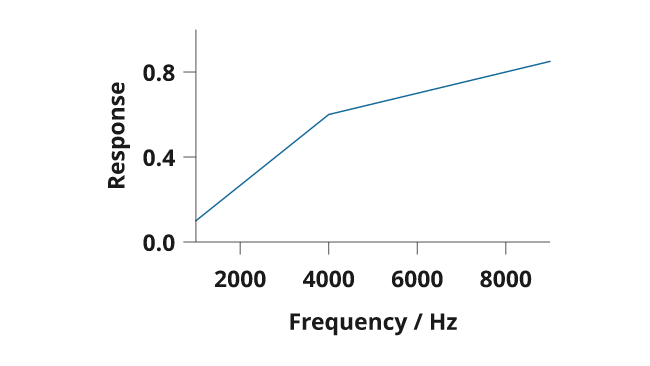

# Plot rendering review

The 3.1.0.dev12 development preview adds optional vector-line reduction with a
physical error tolerance and measures explicit axis typography before layout.
It also lets gridlines use the same tick-selection options as their axes.

[Full-size figure](../gallery/plot-engine-review.png) ·
[Executable recipe](../examples/plot_engine_review.py) ·
[LaTeX caption](assets/research-preview/plot-engine-review-caption.tex)


All data are simulated. The figure uses panel letters and axis labels, with its
explanation in a separate caption. It does not infer statistical quantities.

## Reproduce the figure

These features are on the development branch; stable PyPI remains 3.0.

```bash
git clone https://github.com/Mapika/inklet.git
cd inklet
python -m pip install -e '.[render]'
python examples/plot_engine_review.py
```

The output directory `out/plot-engine-review/` contains SVG, PDF, PNG, captions
and a diagnostic report with the reduction's input and output vertex counts.
The recipe rejects diagnostic errors and warnings.

## Dense vector lines

`line(..., simplify=0.02)` applies a 0.02 mm tolerance in mapped plot coordinates.
It retains endpoints and global extrema, recomputes when a live plot is resized,
and records its tolerance and point counts in diagram notes. The input dataset
is unchanged. The enlarged peak in panel b is reduced again at that panel's
scale, rather than enlarging a previously reduced drawing.

Reduction is optional. It may remove sub-tolerance details and change dash phase;
curved and closed paths are unsupported. A work limit retains additional points
on difficult paths instead of weakening the error bound. See [Dense data](dense-data.md)
for usage and limitations.

### Measurements

The [benchmark tool](../tools/benchmark_lines.py) builds a 100,001-point signal
and exports SVG and PDF in fresh Python processes. Values are medians of three
runs on the same Linux/WSL2 workstation with Python 3.12.3; imports
and input preparation are excluded. The old checkout is `cf73d63`.

| Measurement | Previous exact | Current exact | Current reduced |
| --- | ---: | ---: | ---: |
| Compile | 1.691 s | 1.711 s | 1.278 s |
| First SVG export | 0.156 s | 0.159 s | 0.093 s |
| First PDF export | 0.274 s | 0.271 s | 0.010 s |
| Compile + both exports | 2.116 s | 2.147 s | 1.382 s |
| SVG size | 980,481 bytes | 980,481 bytes | 27,002 bytes |
| PDF size | 461,067 bytes | 461,067 bytes | 6,491 bytes |
| Line vertices | 100,001 | 100,001 | 347 |

At 0.02 mm tolerance, the complete build and two exports were
**1.55× faster** than the current exact mode. SVG size fell
**97.2%** and PDF size **98.6%**. Exact-mode export sizes match
the previous engine. These results describe this smooth signal with a narrow
peak. No reduction or speedup is guaranteed for noisy or complex paths.

[Previous measurements](assets/research-preview/lines-before.json) ·
[Current measurements](assets/research-preview/lines-after.json)

```bash
python tools/benchmark_lines.py --repeat 3 --output out/lines-after.json
python tools/benchmark_lines.py --source /path/to/previous-checkout \
  --mode exact --repeat 3 --output out/lines-before.json
```

## Axis typography before and after

Both images use the same request for 11 pt bold axis text. The previous engine
(commit `cf73d63`) keeps its smaller default measurement; the current engine
measures the requested text before deciding which ticks fit.

**Previous:**



**Current:**



Use `python examples/plot_engine_review.py --axes-only` to reproduce the specimen.
For the old engine, set `PYTHONPATH` to that checkout's `src` directory.

Explicit font family, weight, italic style and size now participate in measuring
and thinning tick labels. `tick_font_size` and `label_font_size` control those
roles independently, including colorbars. `font_size` sets the base text and
spacing size. Prebuilt label diagrams retain their own typography.

Pass corresponding tick options through `grid(x_options=..., y_options=...)`
to match an axis's custom selection. [Axes, scales and text](axes-and-scales.md)
contains a complete example.

## Checks

Geometric tests compare every removed vertex with its replacement segment and
check endpoints, extrema, log-scale mapping and deterministic output. Other
regressions check measured font faces, label clearance, grid alignment and
colorbar sizes. SVG and PDF review remains part of the complete-figure tests.
