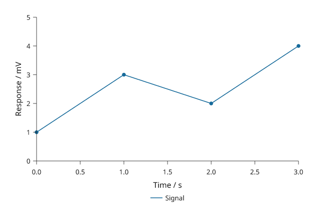
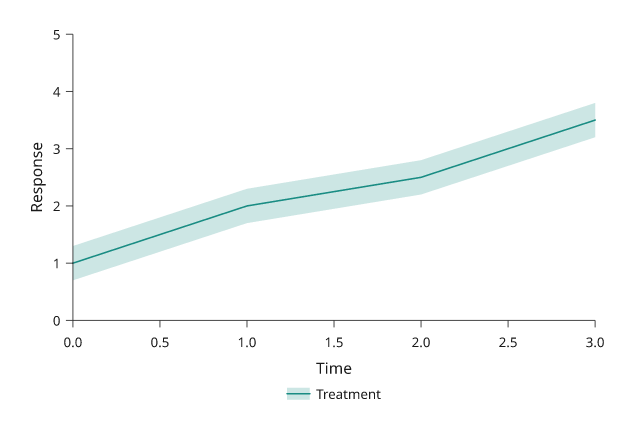

# Plotting

Use `plot_spec()` inside a live document. Its methods record the same marks and
furniture as the direct `Panel` API; the compiler then fits the plot to its cell.
The examples use only the core package. Save SVG/PDF with `doc.compile().save(...)`
or `doc.save(...)`; add the `render` extra when you need PNG output.

Start with [Choose a plot type](plot-types.md) if you are selecting a mark.
Use [Axes, scales and text](axes-and-scales.md) for coordinate and typography
controls, or [Dense data](dense-data.md) for raster layers and vector reduction.
This page covers how those pieces work together in a live plot.

## Scales and coordinates

Pass numeric domains such as `x=(0, 10)`, explicit scales such as
`x=i.log((1, 1000))`, or category lists such as `x=['Control', 'Treatment']`.
Cartesian y increases upward. A categorical y scale places its first category
at the bottom; reverse the category list for top-to-bottom reading.

```python
import inklet as i

p = i.plot_spec(x=(0, 3), y=(0, 5), clip=True)
p.line([(0, 1), (1, 3), (2, 2), (3, 4)], name='Signal', stroke='#176b9b')
p.scatter([(0, 1), (1, 3), (2, 2), (3, 4)], size=1.2, color='#176b9b')
p.axes(x='Time / s', y='Response / mV').legend(side='bottom')
doc = i.document(width=100)
doc.add('response', p, min_height=60)
doc.compile().save('plot.svg')
```



*Rendered from the code above.*

`clip=True` clips data marks at the plot area. It does not suppress axes or
outside legends. Inklet does not clip out-of-domain marks unless requested, so
use clipping when an extrapolated segment or annotation would be misleading.
Logarithmic domains and values must be positive; use `symlog` for data that
crosses zero.

## Select a mark

| What you need to show | Start with | Check before drawing |
| --- | --- | --- |
| A response along an ordered coordinate | Line or step | A line connects samples in supplied order; a step states how values persist between samples |
| Individual observations | Scatter or swarm | Marker overlap can hide repeated observations |
| Category magnitudes or composition | Bars or stacked areas | Baselines and category order affect comparisons |
| A sample distribution | Histogram, boxplot or violin | Bins and smoothing are explicit choices; a summary does not show every observation |
| Supplied uncertainty | Band or error bars | Label what the interval means and distinguish bounds from error magnitudes |
| A value at each row/column position | Matrix | State orientation, missing values and the shared colour scale |
| A directional response | Polar curve or rose | State angular orientation; rose heights encode radius rather than area |


See the [visual plot gallery](plot-types.md) for mark families and input conventions.

## Uncertainty and legends

```python
import inklet as i

x = [0, 1, 2, 3]
mean = [1, 2, 2.5, 3.5]
uncertain = i.plot_spec(x=(0, 3), y=(0, 5))
uncertain.series(i.Series('Treatment', x, mean, '#198c83',
                          [v - .3 for v in mean], [v + .3 for v in mean]))
uncertain.axes(x='Time', y='Response').legend(side='bottom')
doc = i.document(width=100)
doc.add('response', uncertain, min_height=60)
assert 'Treatment' in doc.compile().to_svg()
```



*Rendered from the code above.*

`Series.lower` and `Series.upper` are absolute y coordinates, not error sizes.
For `errorbars(points, yerr=...)`, values are distances from each point.
Name a series with `name=` to create a legend entry; a per-point colour array
does not describe a single legend category. Use [category definitions](data.md)
when filtering should preserve category colours and labels.

Top/bottom legends choose a measured number of
columns to fit the plot width. Pass `columns=1` to stack explicitly, or
`columns='auto', max_width=...` to control the available space. An entry that
cannot fit is reported rather than clipped or reduced in type size.
`font_size=` is measured before layout. The [general plotting example](general-plots.md)
shows these changes together with lighter default axis rules.

## Insets and secondary axes

```python
detail = i.plot_spec(20, 14, x=(2, 3), y=(2, 4), clip=True)
detail.line(list(zip(x, mean)), stroke='#198c83').axes(count=3)
uncertain.inset(detail, corner='se', width=None, zoom=(2, 3, 2, 4), pad=2)
assert doc.compile().root.width == 100
```

`width=None` preserves the inset's physical dimensions and typography. `zoom`
marks a source rectangle; choose its limits to match the inset domains.
`side='right'` places an inset outside the parent and requires room in the cell.
See [publication plot controls](publication-plots.md) for external insets.

`p.twin_y((0, 100), label='Efficiency / %', color='#176b9b')` returns a live
handle with an independent y scale. Add marks through that handle and compile
the parent. Colour the secondary axis to identify the corresponding series.

For reusable layers, independently styled copies and per-axis options, see
[reusable plot recipes](plot-recipes.md).

## Instruction order and edits

The compiler resolves marks first, then axes, keys, group labels/insets,
brackets, callouts and titles. Declaration order is preserved within a phase.
A bracket can be declared before its bars and still clear their current values.

Name an instruction with `key='signal'` to revise it with
`replace('signal', ...)`, or remove it with `remove('signal')`. Calling a mark
method again adds another instruction. A callout given a literal coordinate
keeps that coordinate when data change; update it explicitly or use an explicit
derived dependency.

## Dense data and polar plots

The development engine automatically uses [packed vector markers](marker-batches.md)
for scatter layers with at least 256 points. It retains every observation and
keeps SVG/PDF output vector, with substantially lower construction overhead.

`scatter(..., raster=True, dpi=300)` rasterizes just the marker layer.
`matrix(..., raster=True)` provides a raster field; use `raster=False` for vector
cells. Matrix raster output uses the standard-library encoder; raster scatter
requires the `images` extra. PDF export of either raster layer also needs Pillow
(`images` or `render`). Axes and labels stay vector. Raster
scatter uses shared marker prototypes; see the
[rendering measurements](rendering-engine.md) for its construction cost.
For dense vector lines, the `simplify` option reduces geometry at
an explicit physical tolerance; see [Dense data](dense-data.md).

For polar plots, use `i.polar(radius, r=(0, 30), zero='up', winding='cw')`, then
its `line`, `band`, grid and axis methods, and return `build()` from a component
factory. The [polar example](../examples/polar.py) and
[stress test](../examples/stress20.py) show complete integrations.
