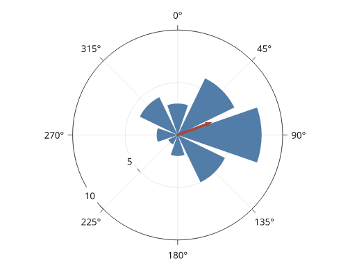
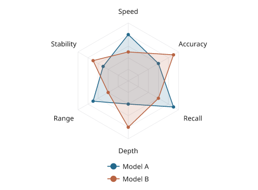
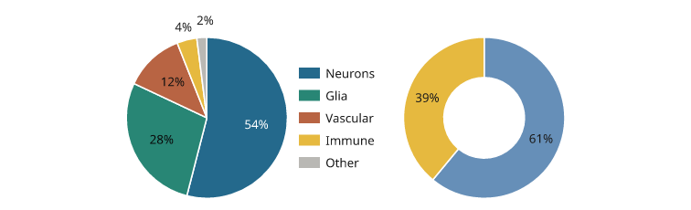
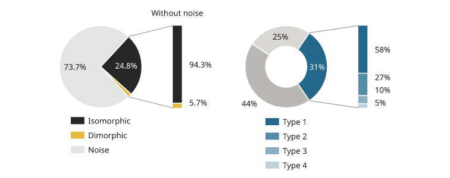

# Polar and directional plots

Polar plots use angle and radius instead of Cartesian x and y. Angles are
degrees by default; `zero` and `winding` make the orientation explicit. These
examples use the direct polar panel, which can be placed in a document as
`p.build()`. See the [complete tuning example](../examples/polar.py) for an
explanation of circular and axial summaries.

All values below are illustrative. Each snippet can be run independently with
core Inklet; PNG preview generation additionally uses the `render` extra.

## Polar curves

Show a response as a function of angle.
The band contains supplied absolute radial bounds; the curve and observations
share the same angle/radius mapping. `closed=True` joins the final sample back
to the first around the circle.

Closed curves complete the turn in sample order. Use `closed=False` for partial
curves, and unwrap interior angles when the data crosses the 0°/360° seam.
Small white backgrounds behind radial tick labels keep them readable over the
grid and data; `r_axis(..., plate=False)` removes those backgrounds.

```python
import inklet as i
import math
angles = list(range(0, 360, 30))
values = [3 + 1.4 * math.cos(math.radians(a - 60)) for a in angles]
p = i.polar(24, r=(0, 6), zero='up', winding='cw')
p.grid(r_count=3, theta_count=8)
p.band(angles, [v - .4 for v in values], [v + .4 for v in values],
       closed=True, fill='#bfd6cc', stroke='none')
p.line(list(zip(angles, values)), closed=True, stroke='#34735f')
p.scatter(list(zip(angles, values)), size=1.2, color='#34735f')
p.theta_axis(count=8)
p.r_axis(at=225, count=3)
fig = i.figure(width=80)
fig.add(p.build())
fig.save('polar-curve.svg', 'polar-curve.pdf')
```


*Rendered from the code above.*

## Rose plots

A rose draws radial bars at supplied angles.
Heights are radii, so wedge area grows nonlinearly with the value. The optional
mean vector below is the count-weighted circular mean of the bin centres; its
length represents resultant concentration, not a mean count.

```python
import inklet as i
angles, counts = list(range(0, 360, 45)), [3, 6, 8, 5, 2, 1, 2, 4]
p = i.polar(24, r=(0, 10), zero='up', winding='cw')
p.grid(r_count=2, theta_count=8)
p.rose(counts, at=angles, width=.85, color='#527da8')
p.mean_vector(angles, counts, stroke='#a64736', stroke_width=.6)
p.theta_axis(count=8)
p.r_axis(at=225, count=2)
fig = i.figure(width=80)
fig.add(p.build())
fig.save('rose.svg', 'rose.pdf')
```



*Rendered from the code above.*

## Radar charts

A radar chart places one spoke per category, equally spaced round the turn,
and draws each series as a closed polygon through its value on each spoke.
`radar_grid` draws the rings, the spokes and the category names.
Rings are polygons by default; `shape='circle'` draws circles. The panel's
theta domain must be a whole turn.

```python
import inklet as i
axes = ['Speed', 'Accuracy', 'Recall', 'Depth', 'Range', 'Stability']
p = i.polar(18, r=(0, 1), zero='up', winding='cw')
p.radar_grid(axes)
p.radar([.8, .6, .9, .4, .7, .5], name='Model A', color='#24698c')
p.radar([.5, .9, .6, .8, .4, .7], name='Model B', color='#b86443')
p.legend(side='bottom')
fig = i.figure(width=80)
fig.add(p.build())
fig.save('radar.svg', 'radar.pdf')
```



*Illustrative scores between 0 and 1. The rings are at 0.2 steps.*

## Pie and donut charts

`pie` divides the turn in proportion to the values, starting at the start
of the theta domain and following the panel's winding. A panel made with
`hole=` draws a donut. Each label is set inside its slice when it fits and
outside the rim when it does not. `labels=` takes `'percent'` (default),
`'value'`, `None`, a format such as `'{share:.1%}'`, a function of
`(value, share)` or one string per slice.

```python
import inklet as i
pie = i.polar(14, zero='up', winding='cw')
pie.pie([54, 28, 12, 4, 2],
        colors=['#24698c', '#288675', '#b86443', '#e6b93f', '#b9b8b4'],
        names=['Neurons', 'Glia', 'Vascular', 'Immune', 'Other'])
pie.legend(side='right')
donut = i.polar(14, hole=7, zero='up', winding='cw')
donut.pie([61, 39], colors=['#668fb8', '#e6b93f'])
fig = i.figure(width=120)
fig.add(i.row([pie.build(), donut.build()]))
fig.save('pie.svg', 'pie.pdf')
```



*Illustrative shares. The two smallest slices are labelled outside the rim.*

## Pie breakout bars

`breakout` expands one slice, or several adjacent slices, of the pie into a
stacked bar beside the disc. Two connector lines run from the rim at the
slices' outer edges to the top and bottom of the bar. Without `parts`, the
bar shows the chosen slices as shares of their sum, in their own colours.
With `parts`, it shows the composition of the slice: those values, in
`colors=` or in shades of the slice colour. Each part is labelled with its
share of the bar; labels that would overlap are moved apart.

Call `breakout` after `pie`. The pie turns so the middle of the chosen
slices faces the bar, with the first slice uppermost. A `zero` or `winding`
given to `i.polar` is kept, so `i.polar(11, zero='up', winding='cw')` draws
the pie as given; then put the chosen slices on the side that faces the bar,
or the connectors cross the pie. The pie turns only when nothing else is
drawn on the panel before `breakout`.

Pie labels set outside the rim move within their slice, or further out, to
keep clear of the connectors and the bar. A label that cannot is listed under
`crossing` in the pie's `pie_labels` note; leave it out (`labels=` with
`None` for that slice) or pass `zero=`.

```python
import inklet as i
ink, yellow, grey = '#262626', '#e6b93f', '#e4e4e4'
share = i.polar(11)
share.pie([24.8, 1.5, 73.7], colors=[ink, yellow, grey],
          labels=['24.8%', None, '73.7%'],
          names=['Isomorphic', 'Dimorphic', 'Noise'])
share.breakout([0, 1], labels='{share:.1%}', title='Without noise')
share.legend(side='bottom')
parts = i.polar(11, hole=5.5)
parts.pie([31, 44, 25], colors=['#24698c', '#b9b8b4', '#d9d8d4'])
parts.breakout(0, [58, 27, 10, 5], names=['Type 1', 'Type 2', 'Type 3', 'Type 4'])
parts.legend(side='bottom')
fig = i.figure(width=120)
fig.add(i.row([share.build(), parts.build()], gap=8, align='top'))
fig.save('breakout.svg', 'breakout.pdf')
```



*Illustrative shares. Left: the isomorphic and dimorphic slices as shares of
their sum. Right: one donut slice divided into four parts.*

## Next steps

[Compare plot types](plot-types.md), configure [axes and scales](axes-and-scales.md),
or [arrange several panels](layout.md). For exact options, see the [API](api.md).
