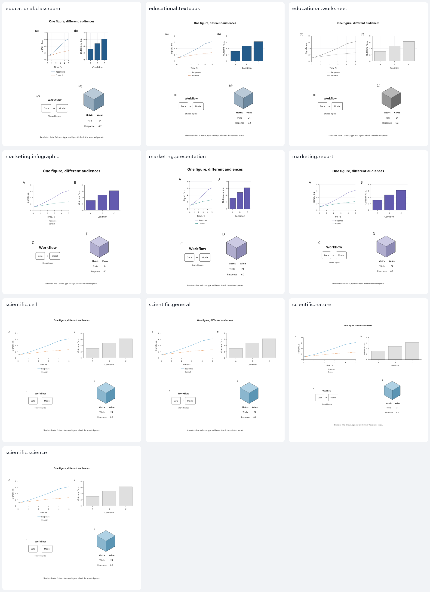

# Presets

Presets are part of **2.6 development** and are not included in PyPI 2.5.0.
Install the current [checkout](installation.md#from-a-checkout) to use them.

A preset combines typography, colours, spacing, plot defaults, panel lettering,
physical page dimensions and export settings. Live content is measured again
when you switch presets; explicit plot colours and component styles stay intact.

## Start with a preset

```python
import inklet as i

doc = i.preset('scientific.nature', format='double-column').document()
plot = i.plot_spec(x=(0, 3), y=(0, 5))
plot.line([(0, 1), (1, 2.5), (2, 3), (3, 4.2)], name='Response')
plot.axes(x='Time / s', y='Signal / a.u.').legend()
doc.add('response', plot)
doc.save('response.svg', 'response.pdf')
```

## Choose a family

| Preset | Default format | Intended use |
| --- | --- | --- |
| `scientific.general` | Double column | Papers and technical reports |
| `scientific.nature` | Double column | Nature main figures; source guidance below |
| `scientific.science` | Double column | Provisional style; guidelines not verified |
| `scientific.cell` | Double column | Provisional style; guidelines not verified |
| `educational.textbook` | Report | Larger labels and horizontal guides |
| `educational.classroom` | Slide | Projected text and both grid directions |
| `educational.worksheet` | A4 | Monochrome figures and grids for printed exercises |
| `marketing.report` | Report | Accent colours, stronger headings and horizontal guides |
| `marketing.presentation` | Slide | Large headings and labels for presentations |
| `marketing.infographic` | Square | Roomy compositions with prominent headings |

```python
print(i.preset_names())
print(i.preset_names('educational'))
print(i.format_names())
```

The same data, workflow, table and native 3D object rendered in each preset:



Run the [gallery builder](../tools/preset_gallery.py) for an interactive family
filter, SVG/PDF downloads, both rendered previews, and per-figure diagnostics:

```sh
python tools/preset_gallery.py --output out/presets
```

Open `out/presets/index.html`. This requires the [visual review dependencies](installation.md#visual-review).
The comparison uses each default width and overrides height to fit all content.
Its [source](../examples/presets.py) uses simulated data and built-in geometry.

## Keep style and format separate

| Format | Width × height, mm |
| --- | --- |
| `single-column` | 89 × content height |
| `double-column` | 183 × content height |
| `report` | 180 × content height |
| `slide` | 254 × 142.875 (16:9) |
| `a4` | 210 × 297 |
| `square` | 180 × 180 |
| `poster` | 594 × 841 (A1) |

Slide formats double the base typography and spacing; posters use four times
the base sizes. This sets actual physical sizes before measurement. It does
not scale a completed figure. A scientific slide uses presentation sizes,
so its text sizes do not follow the journal's print guidance.

```python
teaching = i.preset('educational.textbook', format='slide')
banner = i.preset('marketing.report', format=i.FigureFormat('banner', 240, 80))
custom = banner.customize(width=260, height=None)
```

Fixed formats retain their aspect ratio unless you override dimensions.
If content does not fit, layout raises an error. Increase the available space,
use `height=None` to fit vertically, or simplify the content; text is not shrunk.

## Customize and switch

```python
brand = i.preset('marketing.report', accent='#635bff',
                 font_family='DejaVu Sans', font_pt=10,
                 title_font_pt=16, gap=8, dpi=240)
doc.use_preset(brand)
doc.save('branded.svg', 'branded.pdf')

# An explicit content style survives later switches.
plot.line([(0, 4), (3, 4)], stroke='#a12b35', name='Reference')
doc.configure(width=195, height=None)
doc.use_preset('educational.textbook')
assert doc.width == 195
doc.save('teaching.svg', 'teaching.pdf')
```

`Preset` values are immutable. `customize()` returns a new value and validates
its options. It accepts:

- Theme: `font_family`, `font_mono`, `accent`, `palette`, `paper`, `ink`, `muted`,
  `grid_color`, `radius` and `line_height`.
- Type sizes in points: `font_pt`, `small_font_pt`, `title_font_pt`.
- Page geometry in millimetres: `width`, `height`, `margin`, `gap`, `stroke_mm`.
- Plot furniture: `grid` (`none`, `x`, `y`, `both`), `legend_side`, `tick_count`.
- Single-series bars: `bar_fill` (`neutral` or `accent`). Educational and
  marketing presets use the accent; scientific and worksheet presets use neutral.
- Lettering: `letter_style` (`bold-lower`, `lower`, `upper`, `bold-upper`, `paren`).
- Export and checks: `dpi`, `text` (`embed` or `outline`), `min_font_pt`,
  `min_stroke_mm`, `min_dpi`.

An `accent` override updates the first automatic series colour unless you
supply a `palette`. Explicitly coloured series and data-bound category encodings
keep their colours. Fonts are resolved using installed families; manifests
record the actual files and hashes, including substituted fonts.

Explicit page options from `preset.document()` or `doc.configure()` survive
`use_preset()`. Use `keep_overrides=False` to reset those page choices; column
structure and content are retained. Direct assignments to document attributes
are not recorded as explicit overrides. To change preset style settings during
a switch, pass a customized `Preset` value.

## Inheritance rules

- Use `plot_spec`, `module`, `component`, and nested `subfigure` objects for live
  styling. Existing `Diagram` objects and already drawn `Panel` objects retain
  their measured geometry and authored styles.
- Call `.letters()` on the document or subfigure to enable letters. The preset
  supplies their style; explicit `style=` and `size=` win.
- Call `.axes()` and `.legend()` to request them. Presets do not invent axes,
  titles, legends, data, annotations or statistical claims.
- Educational and marketing grids are added behind requested axes. Explicit
  `.grid(...)` takes precedence; `.grid(x=False, y=False)` disables the default.
  Explicit tick lists and axes through data values do not get automatic grids.
- An explicit `.legend(side=...)` or `.legend(corner=...)` overrides placement.
- Explicit bar `fill`, `colors` and `bar_colors` override the preset. Grouped
  and stacked series retain their categorical palette.
- Switching a preset invalidates affected measurement caches. Previously
  compiled figures remain immutable snapshots. Data provenance is retained.

## Journal guidance and checks

The Nature preset's widths and typography were reviewed against the
[Nature research figure guide](https://research-figure-guide.nature.com/figures/building-and-exporting-figure-panels/)
on **2026-09-05**: 89/183 mm columns, standard sans-serif text at 5–7 pt, and
editable embedded text. Inklet chooses 7 pt body/title text and 6 pt labels.
The guide also specifies a maximum figure height of 170 mm; that limit and the
maximum font size are documented guidance, not automatic checks in this version.
Palettes, spacing, line weights and the default 300 DPI are Inklet design choices.

The [Science author instructions](https://www.science.org/content/page/instructions-preparing-initial-manuscript)
and [Cell figure guidelines](https://www.cell.com/figureguidelines) could not be
accessed for review. Those presets are explicitly provisional: their dimensions,
typography and uppercase lettering are authoring defaults, not verified journal
requirements. They use the general 89/183 mm formats. Their source records have
`status='unverified'` and no review date.

All presets use the existing minimum text-size, stroke-width and raster-DPI
checks at final export size. A preset is not a submission certification.
`compiled.metadata['preset']` records resolved settings, source provenance and
overridden page fields. The manifest's top-level dimensions and `publication`
record describe the actual document/export settings.

The 2.5 `theme()` and `publication()` defaults continue to work unchanged.
Publication profiles can now also accept `base_theme=` and `title_font_pt=`.
