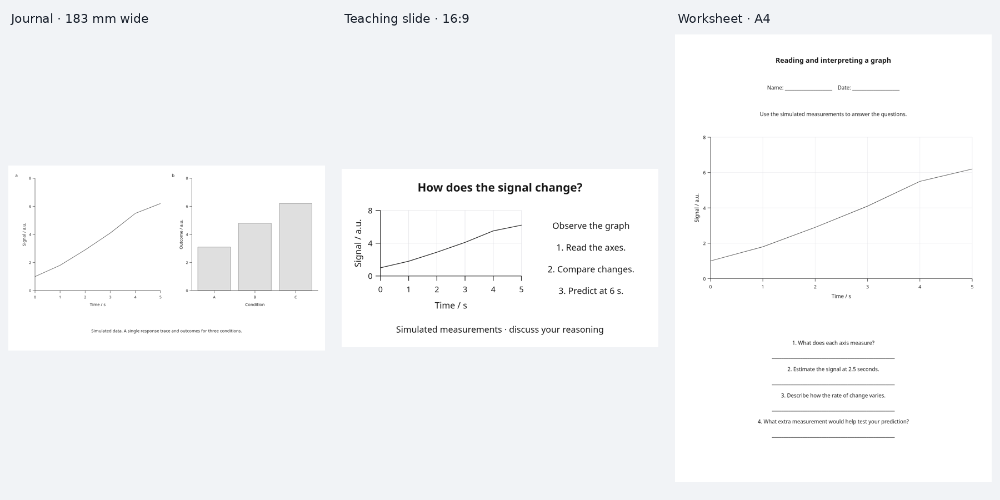
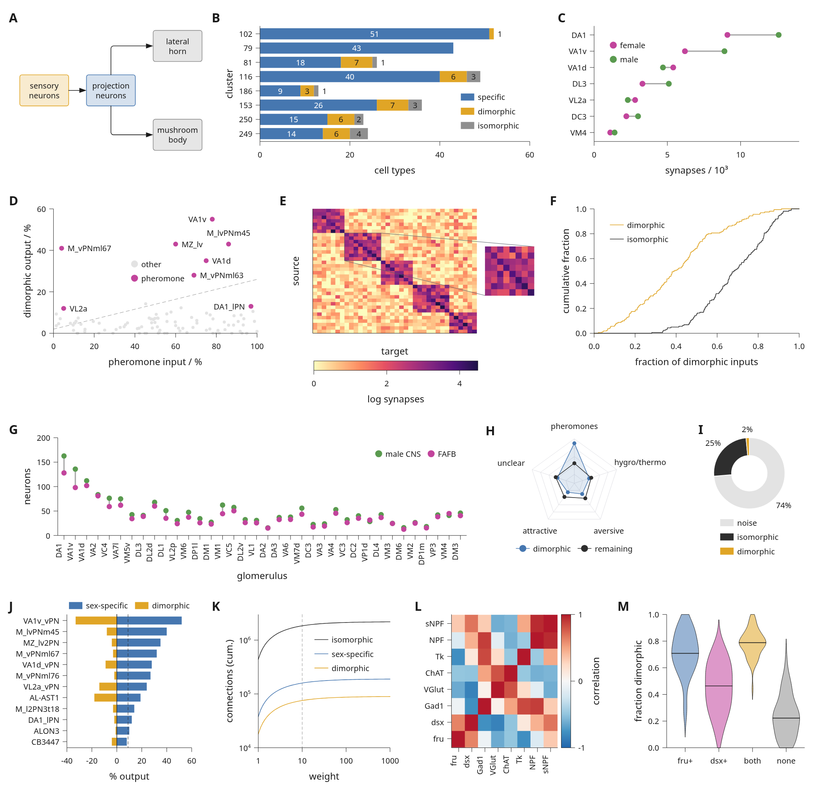

# Presets

A preset combines typography, colours, spacing, plot defaults, panel lettering,
physical page dimensions and export settings. Live content is measured again
when you switch presets; explicit plot colours and component styles stay intact.

## Start with a preset

```python
import inklet as i

doc = i.preset('scientific.nature', format='double-column').document()
plot = i.plot_spec(x=(0, 3), y=(0, 5))
plot.line([(0, 1), (1, 2.5), (2, 3), (3, 4.2)], name='Response')
plot.axes(x='Time / s', y='Signal / a.u.').legend()
doc.add('response', plot)
doc.save('response.svg', 'response.pdf')
```

For scientific manuscript figures, use panel letters and necessary scientific
labels in the artwork; place titles, descriptions and methods in the manuscript
caption. Presets style the content you author and do not automatically remove
text. See [publication figure composition](publication-plots.md).

## Choose a family

| Preset | Default format | Intended use |
| --- | --- | --- |
| `scientific.general` | Double column | Papers and technical reports |
| `scientific.nature` | Double column | Nature main figures; source guidance below |
| `scientific.science` | Double column | Provisional style; guidelines not verified |
| `scientific.cell` | Double column | Dense multi-panel pages; guidelines not verified |
| `educational.textbook` | Report | Larger labels and horizontal guides |
| `educational.classroom` | Slide | Projected text and both grid directions |
| `educational.worksheet` | A4 | Monochrome figures and grids for printed exercises |
| `marketing.report` | Report | Accent colours, stronger headings and horizontal guides |
| `marketing.presentation` | Slide | Large headings and labels for presentations |
| `marketing.infographic` | Square | Roomy compositions with prominent headings |

```python
print(i.preset_names())
print(i.preset_names('educational'))
print(i.format_names())
```

The same data, workflow, table and native 3D object rendered in each preset:


Run the [gallery builder](../tools/preset_gallery.py) for an interactive family
filter, SVG/PDF downloads, both rendered previews, and per-figure diagnostics:

```sh
python tools/preset_gallery.py --output out/presets
```

Open `out/presets/index.html`. This requires the [visual review dependencies](installation.md#visual-review).
The comparison uses each default width and overrides height to fit all content.
Its [source](../examples/presets.py) uses simulated data and built-in geometry.

The gallery also includes complete [destination examples](../examples/preset_formats.py):
a two-panel journal figure, a 254 × 142.875 mm teaching slide and a 210 × 297 mm
worksheet. Select **formats** in the gallery to review their SVG and PDF exports.
Fixed pages use `min_height=` on document cells to reserve space for plots and
keep headings and captions compact.



## Dense pages

`scientific.cell` is for figure pages with many small panels, such as a
twelve-panel page at 183 mm. It sets:

| Setting | Value |
| --- | --- |
| Axis names and body text | 6 pt |
| Tick labels, legend keys | 5 pt |
| Panel letters | 8 pt bold capitals, 0.5 mm from the panel |
| Axis and default strokes | 0.4 pt (0.14 mm) |
| Hairlines | 0.25 pt (0.088 mm) |
| Page margin, gap between panels | 2 mm, 3.5 mm |
| Spacing scale (label pads, legend gaps) | 0.8 × the scientific scale |
| Tick count | 4 |
| Legends | Inside the data area |
| Palette | muted blue, amber, magenta, grey, green, dark grey |

`legend_side='inside'` places each `.legend()` without an explicit `side=` or
`corner=` in empty data space, found after the marks are drawn. If no position
clears the marks, the legend goes above the data area instead, using the
whole panel width when it needs more than the data width. The legend is
never shrunk.

The checks are tuned for this density. The minimum text size is 5 pt, and the
minimum stroke width is 0.25 pt (0.088 mm) instead of the 0.1 mm used by the
other presets. 0.25 pt is Inklet's `HAIRLINE_FLOOR`, the thinnest line it
treats as printable, and the default of the lint stroke check. With the
0.1 mm floor, every 0.25 pt hairline in a dense page would be reported.

The blue (`#4677b0`) and magenta (`#c2449c`) are dark enough for white bar
labels at 4.5:1 contrast; amber, grey and green take dark labels.

```python
dense = i.preset('scientific.cell')
doc = dense.document(columns=12).letters()
doc.add('response', plot, row=0, column=0, colspan=4)
```

For a complete example with thirteen panels, see
[`examples/dense_figure.py`](../examples/dense_figure.py):



## Keep style and format separate

| Format | Width × height, mm |
| --- | --- |
| `single-column` | 89 × content height |
| `double-column` | 183 × content height |
| `report` | 180 × content height |
| `slide` | 254 × 142.875 (16:9) |
| `a4` | 210 × 297 |
| `square` | 180 × 180 |
| `poster` | 594 × 841 (A1) |

Slide formats double the base typography and spacing; posters use four times
the base sizes. This sets actual physical sizes before measurement. It does
not scale a completed figure. A scientific slide uses presentation sizes,
so its text sizes do not follow the journal's print guidance.

```python
teaching = i.preset('educational.textbook', format='slide')
banner = i.preset('marketing.report', format=i.FigureFormat('banner', 240, 80))
custom = banner.customize(width=260, height=None)
```

Fixed formats retain their aspect ratio unless you override dimensions.
If content does not fit, layout raises an error. Increase the available space,
use `height=None` to fit vertically, or simplify the content; text is not shrunk.

## Customize and switch

```python
brand = i.preset('marketing.report', accent='#635bff',
                 font_family='DejaVu Sans', font_pt=10,
                 title_font_pt=16, gap=8, dpi=240)
doc.use_preset(brand)
doc.save('branded.svg', 'branded.pdf')

# An explicit content style survives later switches.
plot.line([(0, 4), (3, 4)], stroke='#a12b35', name='Reference')
doc.configure(width=195, height=None)
doc.use_preset('educational.textbook')
assert doc.width == 195
doc.save('teaching.svg', 'teaching.pdf')
```

`Preset` values are immutable. `customize()` returns a new value and validates
its options. It accepts:

- Theme: `font_family`, `font_mono`, `accent`, `palette`, `paper`, `ink`, `muted`,
  `grid_color`, `radius` and `line_height`.
- Type sizes in points: `font_pt`, `small_font_pt`, `title_font_pt`.
- Page geometry in millimetres: `width`, `height`, `margin`, `gap`, `stroke_mm`.
- Plot furniture: `grid` (`none`, `x`, `y`, `both`), `legend_side`
  (`bottom`, `top`, `left`, `right`, `inside`), `tick_count`.
- Single-series bars: `bar_fill` (`neutral` or `accent`). Educational and
  marketing presets use the accent; scientific and worksheet presets use neutral.
- Lettering: `letter_style` (`bold-lower`, `lower`, `upper`, `bold-upper`, `paren`)
  and `letter_pad`, the distance in millimetres between a letter and its panel.
- Export and checks: `dpi`, `text` (`embed` or `outline`), `min_font_pt`,
  `min_stroke_mm`, `min_dpi`, `max_font_pt` and `max_height_mm`.

An `accent` override updates the first automatic series colour unless you
supply a `palette`. Explicitly coloured series and data-bound category encodings
keep their colours. Fonts are resolved using installed families; manifests
record the actual files and hashes, including substituted fonts.

Explicit page options from `preset.document()` or `doc.configure()` survive
`use_preset()`. Use `keep_overrides=False` to reset those page choices; column
structure and content are retained. Direct assignments to document attributes
are not recorded as explicit overrides. To change preset style settings during
a switch, pass a customized `Preset` value.

## Inheritance rules

- Use `plot_spec`, `module`, `component`, and nested `subfigure` objects for live
  styling. Existing `Diagram` objects and already drawn `Panel` objects retain
  their measured geometry and authored styles.
- Call `.letters()` on the document or subfigure to enable letters. The preset
  supplies their style; explicit `style=` and `size=` win.
- Call `.axes()` and `.legend()` to request them. Presets do not invent axes,
  titles, legends, data, annotations or statistical claims.
- Educational and marketing grids are added behind requested axes. Explicit
  `.grid(...)` takes precedence; `.grid(x=False, y=False)` disables the default.
  Explicit tick lists and axes through data values do not get automatic grids.
- An explicit `.legend(side=...)` or `.legend(corner=...)` overrides placement.
- Explicit bar `fill`, `colors` and `bar_colors` override the preset. Grouped
  and stacked series retain their categorical palette.
- Switching a preset invalidates affected measurement caches. Previously
  compiled figures remain immutable snapshots. Data provenance is retained.

## Journal guidance and checks

The Nature preset's widths and typography were reviewed against the
[Nature research figure guide](https://research-figure-guide.nature.com/figures/building-and-exporting-figure-panels/)
on **2026-09-05**: 89/183 mm columns, standard sans-serif text at 5–7 pt, and
editable embedded text. Inklet chooses 7 pt body/title text and 6 pt labels.
For Nature single- and double-column formats, compilation checks the 170 mm
maximum page height (`PAGE_TOO_TALL`) and the 7 pt maximum effective text size
(`LARGE_TEXT`). These checks include enclosing transforms and automatic page
heights, and are retained by `compiled.lint()`. They report errors without
silently resizing artwork. Slides, posters and other destinations omit these
print limits. Set `max_font_pt=None` or `max_height_mm=None` on a custom preset
to disable the corresponding maximum.
Palettes, spacing, line weights and the default 300 DPI are Inklet design choices.

The [Science author instructions](https://www.science.org/content/page/instructions-preparing-initial-manuscript)
and [Cell figure guidelines](https://www.cell.com/figureguidelines) could not be
accessed for review. Those presets are explicitly provisional: their dimensions,
typography and uppercase lettering are authoring defaults, not verified journal
requirements. The dense `scientific.cell` settings follow printed Cell figure
pages, not the publisher's written guidance. They use the general 89/183 mm
formats. Their source records have `status='unverified'` and no review date.

All presets use the existing minimum text-size, stroke-width and raster-DPI
checks at final export size. A preset is not a submission certification.
`compiled.metadata['preset']` records resolved settings, source provenance and
overridden page fields. The manifest's top-level dimensions and `publication`
record describe the actual document/export settings.

Use `theme()` for drawing defaults, `publication()` for a physical page and
export policy, or `preset()` for a named combination of both with lettering and
destination-specific checks. Publication profiles also accept `base_theme=`, `title_font_pt=`,
`max_font_pt=` and `max_height_mm=`.
