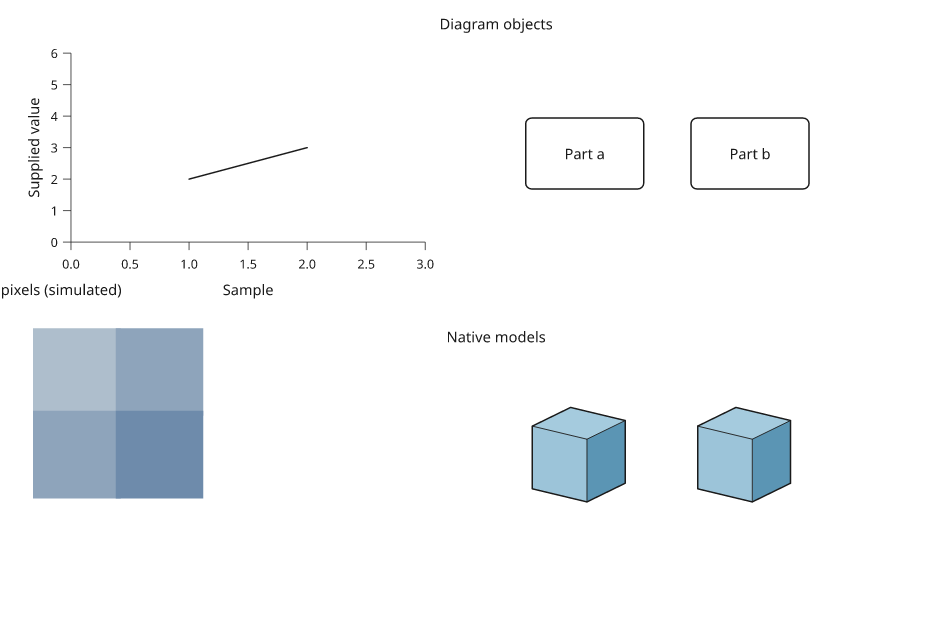

# Reusable figure projects

Available on **master for dev16**, under `inklet.experimental.project`. A project
combines a Python composition, verified input files, explicit entity mappings
and the editor's current choices. It reuses the existing editor and linked-view
state contracts. Project schemas remain experimental until the RC compatibility
policy is settled.



[Complete runnable example](../examples/project_workflow.py) ·
[Acceptance workflow](acceptance.md)

## Capture sources and author choices

Choose files explicitly and record their provenance. A manifest stores relative
paths, byte counts, SHA-256 hashes, source, license, role and optional units.
URLs are descriptive metadata; verification does not download anything.

```python
import json
from pathlib import Path
import inklet as i
from inklet.experimental.project import AssetManifest, EntityMap, FigureProject

inputs = Path('project-inputs')
inputs.mkdir(exist_ok=True)
(inputs / 'measurements.json').write_text(json.dumps([2, 4]))
assets = AssetManifest.capture(inputs, [{
    'id': 'measurements', 'path': 'measurements.json',
    'source': 'Original simulated example', 'license': 'MIT',
    'role': 'measurements', 'unit': 'arbitrary',
}])
identities = EntityMap(['a', 'b'], {
    'measurements': {'sample-7': 'a', 'sample-9': 'b'},
    'composition': {'/left': 'a', '/right': 'b'},
})

def recipe(root):
    values = json.loads((root / 'measurements.json').read_text())
    result = i.composition(100, 50)
    result.add('left', i.module(f'A: {values[0]}'), x=10, y=15)
    result.add('right', i.module(f'B: {values[1]}'), x=60, y=15)
    return result

study = FigureProject('Supplied measurements', recipe(inputs),
                      assets=assets, identities=identities)
study.editor.command('edit', {'path': '/left', 'placement': {'x': 14}})
targets = study.select('measurements', ['sample-7'])
assert targets['composition'] == ('/left',)
bundle = study.save('saved-study', asset_root=inputs)
reopened = FigureProject.open(bundle, recipe)
assert reopened.selected == ('a',)
assert reopened.editor.figure.to_svg() == study.editor.figure.to_svg()
```

The bundle contains the declared files plus `.inklet/project.json`, `figure.svg`
and `figure.pdf` inside `.inklet/`. Existing destinations are refused. Files are
verified before and after copying; failed staging is cleaned up. Extra files in
the source directory are not copied.

Reopening verifies input hashes **before calling the supplied factory**. It never
imports bundled Python automatically. The factory reconstructs the composition;
saved layout, labels, styles and native-camera choices are then applied. The
reconstructed SVG must match its recorded digest. A different recipe, font setup
or Inklet version can fail this check. Use `verify_export=False` only when
intentionally accepting and reviewing that reconstruction difference; asset
verification still runs. Hashes establish consistency, not trust in a recipe.

## Connect different local IDs

Entity IDs represent authored correspondence. Local IDs may be row keys, named
composition paths, image-region IDs or mesh-face IDs. Display text and row order
never establish identity. Maps are immutable and copied on construction.

`selected(source, local_ids)` returns canonical entities; `targets(entities)`
returns every mapped local target. Several local objects may refer to one entity.
Use `validate_source(source, local_ids)` to reject stale or incomplete inventories.
The reserved `composition` source validates paths against the actual recipe.

```python
from inklet.experimental.selection import KeyedTable
from inklet.experimental.browser import BrowserFigure, ScatterView

measurements = KeyedTable('measurements', {
    'id': ['sample-9', 'sample-7'], 'value': [4, 2], 'position': [2, 1],
})
joined = identities.joined_table('study', {'measurements': measurements})
assert joined.row_ids == ('a', 'b')
assert joined.columns['measurements__value'] == (2, 4)
scene = BrowserFigure(joined, [ScatterView(
    'values', 'measurements__position', 'measurements__value', (0, 3), (0, 5),
)])
state = reopened.state_for(scene)
Path('linked-study.html').write_text(scene.to_html(state=state))
reopened.select_state(scene, state)
```

Joined columns are named `source__column`. Missing source entities yield nulls;
multiple source rows for one entity are rejected as an ambiguous join. Aggregate
those values explicitly before joining. Source reordering does not change the
canonical row order or reassign selections.

`identities.view(source, table, view)` adapts a `DrawingView`, `LabelImageView`,
`MeshFieldView` or `GridFieldView` to the same joined table. It preserves source
geometry, units and measurement validation while mapping picking/highlighting
IDs to entities. Source IDs and mappings remain in the exported layer's
correspondence metadata. This adapter currently requires an unambiguous entity
join; arbitrary many-face aggregation is not inferred. Field legends remain
measured furniture. The [complete example](../examples/project_workflow.py)
connects calibrated pixel picking, native drawing targets and plotted values.

## Revise without silently discarding decisions

Call `study.revise(new_recipe, assets=new_manifest, identities=new_map)` to create
an independent revised project. Capture new input bytes explicitly. The default
rejects removed entities, reassigned local IDs and orphaned editor choices.
`missing='drop'` permits reconciliation and returns the removed entities, changed
bindings, removed selection and the existing layout reconciliation report. Old
project snapshots remain unchanged.

Project selection is canonical entity selection. The bundle does not save browser
viewport/filter state or editor undo history; save a linked view's own state when
those choices matter. Selection does not silently restyle a native composition:
use returned targets for authored highlights, or the mapped linked views for
interactive highlighting. Exact image picking and mesh XY picking retain their
existing geometry limits; this does not add depth-aware 3D selection.

For a complete saved/revised example, run:

```sh
python examples/project_workflow.py --output out/project-workflow
python -m pytest -m acceptance
```

Use a new output directory for another run. The native project export keeps text
and geometry editable; linked image views embed their actual source pixels.
