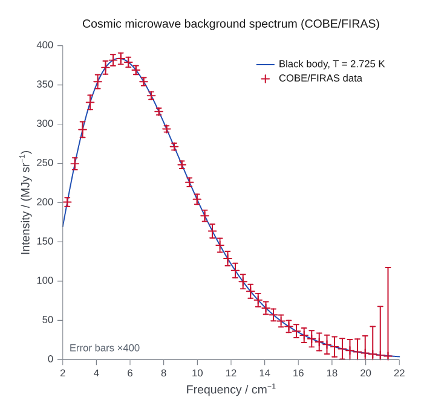
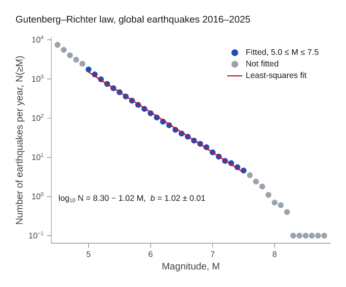
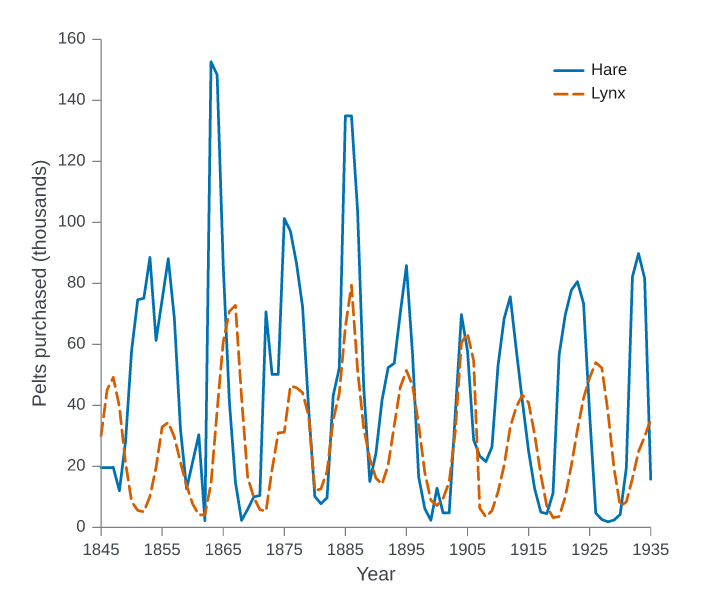
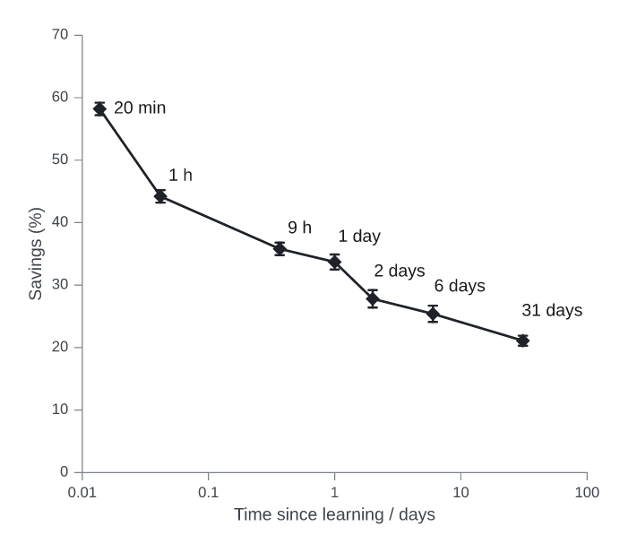
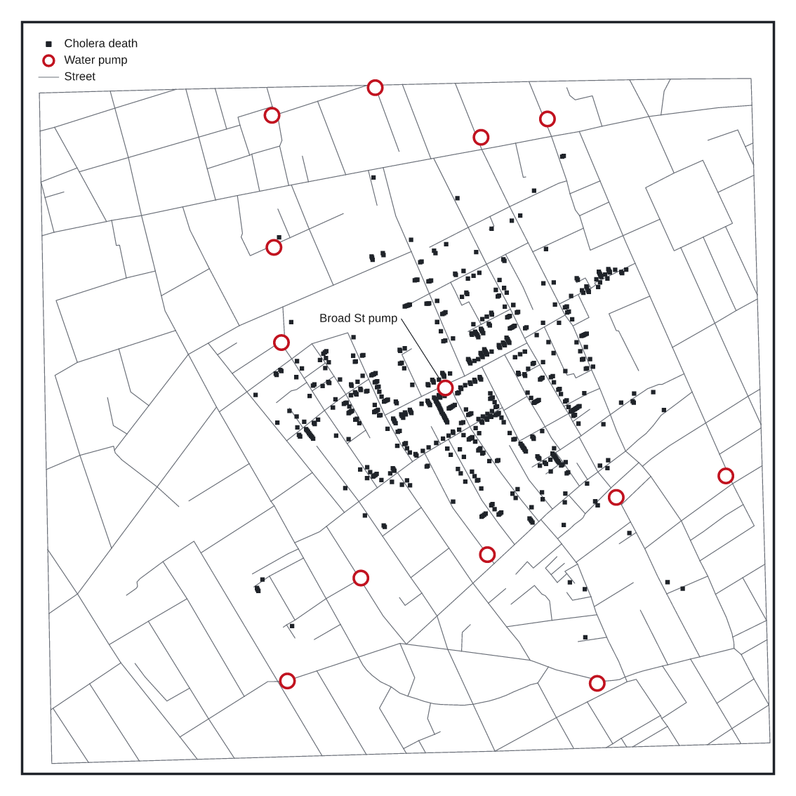
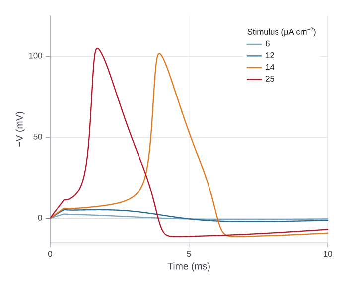

# Published figures, recreated

Fourteen well-known figures from a dozen fields, rebuilt in Inklet from the data
behind them. Each lives in
[`examples/published/`](../examples/published/) with its data, a `SOURCE.md`
(full citation, data URL, licence, retrieval date and any processing) and a
`NOTES.md` that says what matches the original and what differs. Each script
runs in under a second and its lint report is clean.

Original figure images are not reproduced here; follow the citations to see
them. The recreations are restyled in Inklet's default look, not copied
pixel for pixel. Where a published figure needed data that is not public, the
notes say what was left out.

## Physics: the first gravitational-wave detection


Abbott et al. (LIGO and Virgo Collaborations), "Observation of Gravitational
Waves from a Binary Black Hole Merger", *Phys. Rev. Lett.* 116, 061102 (2016),
[doi:10.1103/PhysRevLett.116.061102](https://doi.org/10.1103/PhysRevLett.116.061102), Figure 1.
Data: the GWOSC Figure 1 release (CC BY 4.0), unmodified. The three strain
rows are recreated; the spectrogram row and the 90% waveform bands are not
published as data. [Script](../examples/published/ligo_gw150914/figure.py) ·
[notes](../examples/published/ligo_gw150914/NOTES.md)

## Astronomy: Hubble's velocity–distance relation


E. Hubble, "A relation between distance and radial velocity among
extra-galactic nebulae", *PNAS* 15, 168–173 (1929),
[doi:10.1073/pnas.15.3.168](https://doi.org/10.1073/pnas.15.3.168), Figure 1.
Data: Table 1 of the paper (public domain), with velocities corrected for solar
motion using Hubble's own solution; the refit reproduces his K = 465 km/s/Mpc.
Five of the nine group means are read from the printed figure.
[Script](../examples/published/hubble_1929/figure.py) ·
[notes](../examples/published/hubble_1929/NOTES.md)

## Climate: the Keeling curve


C. D. Keeling et al., "Atmospheric carbon dioxide variations at Mauna Loa
Observatory, Hawaii", *Tellus* 28, 538–551 (1976), and the NOAA GML / Scripps
record as published at gml.noaa.gov. Data: NOAA GML monthly means (public
domain), March 1958 to August 2026.
[Script](../examples/published/keeling_curve/figure.py) ·
[notes](../examples/published/keeling_curve/NOTES.md)

## Ecology: Palmer penguins


K. B. Gorman, T. D. Williams & W. R. Fraser, "Ecological sexual dimorphism and
environmental variability within a community of Antarctic penguins (genus
*Pygoscelis*)", *PLoS ONE* 9, e90081 (2014),
[doi:10.1371/journal.pone.0090081](https://doi.org/10.1371/journal.pone.0090081),
as packaged and plotted by Horst, Hill & Gorman (palmerpenguins, CC0). Panel a
shows Simpson's paradox: the pooled slope is negative, every species' slope
positive. [Script](../examples/published/palmer_penguins/figure.py) ·
[notes](../examples/published/palmer_penguins/NOTES.md)

## Medicine: survival in advanced lung cancer


Loprinzi et al., "Prospective evaluation of prognostic variables from
patient-completed questionnaires", *J. Clin. Oncol.* 12, 601–607 (1994),
[doi:10.1200/JCO.1994.12.3.601](https://doi.org/10.1200/JCO.1994.12.3.601).
The trial's data are R's `survival::lung`; this Kaplan–Meier plot by sex is
their standard published presentation (R `survival` and survminer
documentation), not a figure printed in the paper. Medians, at-risk counts and
the log-rank P = 0.0013 match R.
[Script](../examples/published/ncctg_lung/figure.py) ·
[notes](../examples/published/ncctg_lung/NOTES.md)

## Genomics: glucocorticoid response in airway smooth muscle


Himes et al., "RNA-Seq transcriptome profiling identifies CRISPLD2 as a
glucocorticoid responsive gene that modulates cytokine function in airway
smooth muscle cells", *PLoS ONE* 9, e99625 (2014),
[doi:10.1371/journal.pone.0099625](https://doi.org/10.1371/journal.pone.0099625), Figure 1A.
Data: the authors' Cuffdiff results deposited with the paper (GEO GSE52778);
316 genes at q < 0.05, as in the caption. Gene labels are added.
[Script](../examples/published/rnaseq_volcano/figure.py) ·
[notes](../examples/published/rnaseq_volcano/NOTES.md)

## Development: health and wealth of nations


Hans Rosling's Gapminder chart (Gapminder Foundation; Rosling, Rosling &
Rosling Rönnlund, *Factfulness*, 2018), with the `gapminder` data excerpt
(CC0; Gapminder data CC BY 4.0). Bubble area is population; 1952 and 2007
share their axes. [Script](../examples/published/gapminder/figure.py) ·
[notes](../examples/published/gapminder/NOTES.md)

## Statistics: Anscombe's quartet


F. J. Anscombe, "Graphs in Statistical Analysis", *The American Statistician*
27, 17–21 (1973),
[doi:10.1080/00031305.1973.10478966](https://doi.org/10.1080/00031305.1973.10478966),
Figures 1–4. Data: the paper's table, checked value by value.
[Script](../examples/published/anscombe_1973/figure.py) ·
[notes](../examples/published/anscombe_1973/NOTES.md)

## Cosmology: the cosmic microwave background spectrum



Mather et al., *ApJ* 420, 439 (1994), [doi:10.1086/173574](https://doi.org/10.1086/173574),
and Fixsen et al., *ApJ* 473, 576 (1996), [doi:10.1086/178173](https://doi.org/10.1086/178173).
Data: the FIRAS monopole spectrum from NASA LAMBDA (public domain); the
blackbody is Planck's law at 2.725 K. Error bars are drawn at 400σ, as in the
well-known version of the figure.
[Script](../examples/published/cobe_firas_cmb/figure.py) ·
[notes](../examples/published/cobe_firas_cmb/NOTES.md)

## Seismology: the Gutenberg–Richter law



B. Gutenberg & C. F. Richter, "Frequency of earthquakes in California",
*BSSA* 34, 185–188 (1944), [doi:10.1785/BSSA0340040185](https://doi.org/10.1785/BSSA0340040185).
The 1944 paper has tables but no figure; this is the law's standard plot, built
from the USGS global catalogue for 2016–2025 (public domain). The fit over
5.0 ≤ M ≤ 7.5 gives b = 1.02.
[Script](../examples/published/gutenberg_richter/figure.py) ·
[notes](../examples/published/gutenberg_richter/NOTES.md)

## Population ecology: hare and lynx cycles



MacLulich (1937) and C. Elton & M. Nicholson, "The ten-year cycle in numbers
of the lynx in Canada", *J. Anim. Ecol.* 11, 215–244 (1942),
[doi:10.2307/1358](https://doi.org/10.2307/1358), as plotted in Odum's
*Fundamentals of Ecology*. Data: the yearly pelt counts, checked against two
independent transcriptions. [Script](../examples/published/hare_lynx/figure.py) ·
[notes](../examples/published/hare_lynx/NOTES.md)

## Psychology: Ebbinghaus's forgetting curve



H. Ebbinghaus, *Über das Gedächtnis* (1885; English translation 1913), the
savings table, checked against the German text and against Murre & Dros,
*PLoS ONE* 10, e0120644 (2015), [doi:10.1371/journal.pone.0120644](https://doi.org/10.1371/journal.pone.0120644).
[Script](../examples/published/ebbinghaus_1885/figure.py) ·
[notes](../examples/published/ebbinghaus_1885/NOTES.md)

## Epidemiology: John Snow's cholera map



J. Snow, *On the Mode of Communication of Cholera*, 2nd ed. (1855), Map 1.
Data: the digitization in the R package HistData (GPL; 578 deaths, 13 pumps),
drawn at equal scale on both axes.
[Script](../examples/published/snow_cholera_1854/figure.py) ·
[notes](../examples/published/snow_cholera_1854/NOTES.md)

## Physiology: the Hodgkin–Huxley action potential



A. L. Hodgkin & A. F. Huxley, "A quantitative description of membrane current
and its application to conduction and excitation in nerve", *J. Physiol.* 117,
500–544 (1952), [doi:10.1113/jphysiol.1952.sp004764](https://doi.org/10.1113/jphysiol.1952.sp004764).
Unlike the others, this figure is **computed** from the paper's equations and
constants at 6.3 °C (RK4, 1 µs steps), in the paper's sign convention; it was
not checked against the printed figure, which could not be accessed.
[Script](../examples/published/hodgkin_huxley_1952/figure.py) ·
[notes](../examples/published/hodgkin_huxley_1952/NOTES.md)

## Rebuild them

```sh
for script in examples/published/*/figure.py; do python "$script"; done
```

The scripts write to `gallery/published/`. They need pandas and NumPy for
reading the data files.
