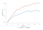
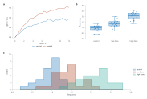

# Charts in one call

Make a publication-sized chart from a table in one line, then save it as SVG,
PDF or PNG. Each chart is a regular Inklet plot in a preset document, so
layout, typography and diagnostics work exactly as they do elsewhere, and
you can move to the [full document model](quickstart.md) when a figure
needs more.

```python
import inklet as i

chart = i.line(df, x='time', y='signal', color='condition')
chart.save('signal.pdf', 'signal.png')
```



`df` can be a pandas or Polars DataFrame, a mapping of columns, a list of
row dictionaries, or the path of a CSV or TSV file (numbers and ISO dates are
parsed). `x`, `y` and `color` name columns. A `color` value that is
not a column is used as a literal colour (`color='#c1121f'`). Without a table,
pass sequences directly: `i.line(x=[1, 2, 3], y=[2, 4, 3])`.

Axes fit the data, axis titles default to the column names, and a legend
appears when there is more than one group. Charts are drawn in colour from the
start: a single series takes the palette's lead blue, bars and boxes have no
outlines, boxes and violins are a pale tint with edges in the same hue, and the
axes are a quiet grey so the data is the darkest thing on the page. Category labels that would collide
are turned 45 degrees to fit.

## Chart types

| Function | What it draws |
|---|---|
| `i.line(df, x, y, color=)` | Lines joined in x order; `y` may be a list of columns, and without `y` every numeric column is drawn. `markers=True`, `error_y=` (band), `dash=`, `linewidth=` |
| `i.scatter(df, x, y, color=, size=)` | Points; a numeric `color` column with many values uses a colour ramp and a colour bar. `text='col'` labels points clear of the marks |
| `i.bar(df, x, y, color=)` | Bars per category, grouped or `stacked=True`; rows are summed, or `agg='mean'`/`'median'` with `error_y='sem'`, `'sd'` or `'ci95'` and `points=True`. Without `y`, counts rows. `orient='h'` |
| `i.hist(df, x, color=, bins=)` | Histogram, overlaid per group; `density=`, `cumulative=` |
| `i.kde(df, x, color=)` | Kernel density curves; `fill=True` |
| `i.ecdf(df, x, color=)` | Empirical cumulative distributions |
| `i.boxplot(df, x, y)` | Box plots per category; `points=True` overlays the samples |
| `i.violin(df, x, y)` / `i.strip(df, x, y)` | Violins and jittered points per category |
| `i.area(df, x, y, color=)` | Stacked areas (`stacked=False` overlays) |
| `i.regression(df, x, y, color=)` | Points with a fitted line and confidence band |
| `i.heatmap(rows, x=, y=)` | Colour matrix with a colour bar, or a long table with `z=` |
| `i.survival(df, time=, event=, color=)` | Kaplan-Meier curves, one per group, with censor ticks, confidence bands, a number-at-risk table and a log-rank P. `event` is 1 or True for an event and 0 or False for a censored subject |
| `i.volcano(df, x=, y=)` | Volcano plot: `x` the log2 fold change, `y` the raw p-value. `label=` names the features, `highlight=` names chosen ones, and `q=` classes the points by adjusted p |
| `i.quick.forest(df, label=, estimate=, lower=, upper=)` | Forest plot, one row per study with its interval; `weight=` sizes the squares, `summary=` draws diamonds, and `right=` adds text columns. It is `inklet.quick.forest` because `inklet.forest(rows)` is the rows-list diagram |

## Chart options

Every function takes these:

| Option | Values |
|---|---|
| `width` | `'single'` (89 mm, default), `'double'` (183 mm), `'slide'`, or millimetres |
| `height` | Millimetres. The default is about 0.62 × width, kept between 45 and 75 mm |
| `style` | A [preset](presets.md); default `'scientific.modern'`: marks in the `inklet-vivid` palette on grey axes |
| `palette` | A [palette name](palettes.md) such as `'okabe-ito'` or `'tol-muted'`, or a list of colours |
| `title`, `xlabel`, `ylabel` | Text; [markup](axes-and-scales.md) such as `x^{2}` works |
| `xlim`, `ylim` | `(low, high)`. Explicit limits zoom, and marks beyond them are clipped |
| `xscale`, `yscale` | `'linear'` or `'log'` |
| `legend` | `'auto'`, `'direct'` (names at the ends of the lines instead of a key), a side (`'bottom'`), a corner (`'ne'`) or `False` |
| `facet_col`, `facet_row` | Columns to split into a grid of charts on shared axes; `facet_col_wrap=` sets charts per row |
| `grid` | `True`, `False`, `'x'` or `'y'` |
| `xticks`, `yticks` | The tick values to show, such as `xticks=[0, 5, 10, 15, 20]` |

## Layer, annotate and refine

Chart methods share names and arguments with the functions, and every
[plot method](api.md) works on a chart too. Each call returns the chart:

```python
chart = i.scatter(df, x='dose', y='response', color='strain', xscale='log')
chart.line(fit, x='dose', y='predicted', color='#444444', name='model')
chart.hline(0.5, label='EC50', stroke_dash=(1.0, 0.8))
chart.annotate(30, 0.9, 'saturation')
chart.labels(x='Dose / mg kg^{-1}', y='Response')
```

A series name keeps its colour across calls, so a line and the points it
was fitted to match.

## Small multiples

`facet_col=` and `facet_row=` draw one chart per value of a column, in a grid:

```python
i.line(df, x='time', y='signal', color='drug', facet_col='cell_line')
i.scatter(df, x='dose', y='response', facet_row='replicate', facet_col='strain')
```

Facets share both axes, so panels can be compared at a glance. A group keeps
its colour in every panel, a single key serves the grid, and inner panels drop
the tick numbers and axis titles their neighbours already show. Numeric facet
values are titled with their column (`rep = 2`).

## Multi-panel figures

`|` places charts side by side and `/` stacks them. Each chart gets a panel
letter, and two levels of nesting share one grid:

```python
figure = (trace | spread) / histogram
figure.save('figure1.pdf')
```



A row defaults to double-column width.

## Check before you submit

`save()` returns the compiled figure. `figure.report()` lists overlapping or
clipped text, type below the print minimum and similar problems, with the
change that would fix each one. If there are errors or warnings, `save()`
also raises a `LayoutWarning` with the report, so problems are visible even
when no one prints it.

In Jupyter and VS Code notebooks a chart displays itself. Outside a notebook,
`chart.show()` writes an SVG and returns its path; nothing opens a window.

## Grow into the document model

`chart.spec` is the underlying `PlotSpec`, and `chart.document()` returns a
`Document` with the chart in its `'chart'` cell. Add diagrams, images or other
plots to that document as described in [Figures and layout](figures.md).
