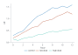
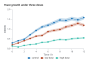
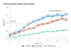
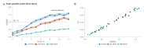
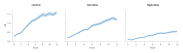
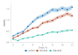
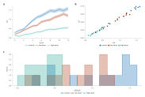

# Charts in one call

Make a publication-sized chart from a table in one line, then save it as SVG,
PDF or PNG. Each chart is a regular Inklet plot in a preset document, so
layout, typography and diagnostics work exactly as they do elsewhere, and
you can move to the [full document model](quickstart.md) when a figure
needs more. The [chart gallery](quick-gallery.md) shows every chart type
with the code that drew it. The [reference](#reference) below lists every option.

## Your first chart in five minutes

This walkthrough builds one figure in eight steps. Every step uses the same
table, [growth-assay.csv](assets/data/growth-assay.csv). Save it beside your
script or notebook, because the snippets read it by name.

The table is a made-up but plausible assay: a yeast culture grown with three
drug doses, read every hour for 12 hours. Each row is the mean of three wells.

| Column | Meaning |
|---|---|
| `condition` | `control`, `low dose` or `high dose` |
| `hour` | hours since the culture was started, 0 to 12 |
| `od` | mean optical density at 600 nm (OD600) |
| `sd` | standard deviation of the three wells |

Each step adds to the one before it. Run them in order.

### 1. One call and save

`i.line` draws one line for each value of `color=`, which names a column. A
CSV path is read as the table, and its numbers are parsed.

```python
import inklet as i

df = 'growth-assay.csv'
chart = i.line(df, x='hour', y='od', color='condition')
chart.save('growth.pdf', 'growth.png')
```

<!-- figure: chart -->


Axes fit the data, the axis titles come from the column names, and a legend
appears because there is more than one group. Each group is drawn in colour
from the start.

### 2. Add error bands

`error_y` names the column of half-widths. Each line gets a translucent band
either side of it, and `markers=True` marks each reading.

```python
chart = i.line(df, x='hour', y='od', color='condition', error_y='sd', markers=True)
```

<!-- figure: chart -->


### 3. Titles, labels and limits

Titles and labels are keywords. `xlim` and `ylim` set the range, and marks
outside it are cut off. Markup such as `OD^{600}` works in labels too.

```python
chart = i.line(df, x='hour', y='od', color='condition', error_y='sd', markers=True,
               title='Yeast growth under three doses', xlabel='Time / h', ylabel='OD600',
               xlim=(0, 12), ylim=(0, 2))
```

<!-- figure: chart -->


### 4. Layer a reference line

Chart methods add marks to the same chart and return it. `hline` draws a rule
at one data value, and `annotate` writes a note at one data point.

```python
chart.hline(1.0, label='OD 1.0', stroke_dash=(1.0, 0.8))
chart.annotate(9.5, 1.65, 'control plateaus')
```

<!-- figure: chart -->


### 5. Two charts side by side

`|` places charts in a row and `/` stacks them. Each chart gets a panel letter.
The second chart shows how the spread grows with the signal.

```python
spread = i.scatter(df, x='od', y='sd', color='condition', xlabel='OD600', ylabel='SD')
figure = chart | spread
```

<!-- figure: figure -->


### 6. Facets

`facet_col=` makes one panel for each value of a column. The panels share
their axes, so they can be compared directly.

```python
figure = i.line(df, x='hour', y='od', error_y='sd', facet_col='condition')
```

<!-- figure: figure -->


### 7. Check the chart

`report()` lists layout problems: overlapping or clipped text, type below the
print minimum, and similar. Each finding names the object and the change that
fixes it. A clean chart reports nothing.

```python
print(chart.report())
```

A finding looks like this. The report below is from the same chart drawn with
`font_pt=4`, which makes its type too small to print:

```text
inklet lint: 17 errors, 1 info

ERROR
  TINY_TEXT       the tick-label '8' (cell-chart/0/3/0/0/10/0) renders at 3.5pt, below the 6.0pt minimum  -> set font_size to at least 6.0pt (pt(6.0)), or stop scaling the group down
  TINY_TEXT       the axis-label 'hour' (cell-chart/0/3/0/0/15/0) renders at 4.0pt, below the 6.0pt minimum  -> set font_size to at least 6.0pt (pt(6.0)), or stop scaling the group down
  ...
```

`inklet check` prints the same report for a script, and exits with status 1
when there are errors:

```bash
inklet check growth.py
```

### 8. Save for a journal

`width='single'` sets the 89 mm single-column width. That is the default for
one chart, and writing it in the call keeps the size fixed when the call
changes. `save()` writes the format named by the file's extension, so a PDF
stays vector.

```python
journal = i.line(df, x='hour', y='od', color='condition', error_y='sd', markers=True,
                 width='single', xlabel='Time / h', ylabel='OD600')
journal.save('growth-journal.pdf')
```

<!-- figure: journal -->


## Reference

Every option of the one-call functions, with the rules that apply to them.

### Tables and defaults

`df` can be a pandas or Polars DataFrame, a mapping of columns, a list of
row dictionaries, or the path of a CSV or TSV file (numbers and ISO dates are
parsed). `x`, `y` and `color` name columns. A `color` value that is
not a column is used as a literal colour (`color='#c1121f'`). Without a table,
pass sequences directly: `i.line(x=[1, 2, 3], y=[2, 4, 3])`.

Axes fit the data, axis titles default to the column names, and a legend
appears when there is more than one group. Charts are drawn in colour from the
start: a single series takes the palette's lead blue, bars and boxes have no
outlines, boxes and violins are a pale tint with edges in the same hue, and the
axes are a quiet grey so the data is the darkest thing on the page. Category labels that would collide
are turned 45 degrees to fit.

### Chart types

| Function | What it draws |
|---|---|
| `i.line(df, x, y, color=)` | Lines joined in x order; `y` may be a list of columns, and without `y` every numeric column is drawn. A missing y leaves a gap, so the line breaks there; `gaps='bridge'` joins the points either side instead. `markers=True`, `error_y=` (band), `dash=`, `linewidth=`, `secondary_y=` (a right-hand axis, below) |
| `i.scatter(df, x, y, color=, size=)` | Points; a numeric `color` column with many values uses a colour ramp and a colour bar. `text='col'` labels points clear of the marks; blank or missing labels are skipped, so those points get no leader line. `secondary_y=` names a colour group for the right-hand axis |
| `i.bar(df, x, y, color=)` | Bars per category, grouped or `stacked=True`; rows are summed, or `agg='mean'`/`'median'` with `error_y='sem'`, `'sd'` or `'ci95'` and `points=True`. Without `y`, counts rows. `orient='h'` |
| `i.hist(df, x, color=, bins=)` | Histogram, overlaid per group; `density=`, `cumulative=` |
| `i.kde(df, x, color=)` | Kernel density curves; `fill=True` |
| `i.ecdf(df, x, color=)` | Empirical cumulative distributions |
| `i.boxplot(df, x, y)` | Box plots per category; `points=True` overlays the samples |
| `i.violin(df, x, y)` / `i.strip(df, x, y)` | Violins and jittered points per category |
| `i.area(df, x, y, color=)` | Stacked areas (`stacked=False` overlays) |
| `i.regression(df, x, y, color=)` | Points with a fitted line and confidence band; `equation=True` writes each group's fit on the plot. `method='lowess'` draws a smoother instead. See [regression fits](#regression-fits) |
| `i.heatmap(rows, x=, y=)` | Colour matrix with a colour bar, or a long table with `z=` |
| `i.survival(df, time=, event=, color=)` | Kaplan-Meier curves, one per group, with censor ticks, confidence bands, a number-at-risk table and a log-rank P. `event` is 1 or True for an event and 0 or False for a censored subject |
| `i.volcano(df, x=, y=)` | Volcano plot: `x` the log2 fold change, `y` the raw p-value. `label=` names the features, `highlight=` names chosen ones, and `q=` classes the points by adjusted p |
| `i.quick.forest(df, label=, estimate=, lower=, upper=)` | Forest plot, one row per study with its interval; `weight=` sizes the squares, `summary=` draws diamonds, and `right=` adds text columns. It is `inklet.quick.forest` because `inklet.forest(rows)` is the rows-list diagram |
| `i.pie(df, names=, values=)` | Pie chart, one slice per row in palette order, labelled with its share and keyed by `names=`. `hole=0.5` makes a donut (the hole is a fraction of the radius); `legend=` takes a side or False, since a corner key would sit on the slices |
| `i.lollipop(df, x=, y=)` | One dot per category on a stem from zero. `orient='h'` lays the stems across, with the rows read from the top |
| `i.dumbbell(df, y=, x=['before', 'after'])` | Two dots per category joined by a line, for before and after or any pair of values. `y` names the categories and `x` the two value columns; the legend names the dots |
| `i.waterfall(df, x=, y=)` | Changes as bars floating on a running total. `totals=` names the steps that stand from zero; a missing change on a total shows the running total, and `labels=True` writes each change |
| `i.slope(df, x=, y=, group=)` | Each group's values at two or more time points, joined by a line, with the name and value written at the ends. `x` is the time column, `group=` the series |

### Regression fits

`i.regression` fits each group by least squares, and `chart.fits` holds the
result, keyed by the group's `color=` value (an ungrouped chart is keyed by
`name=`, or `None` without it). The fits are made when the call is, so they
are there before `save()`. Here the spread is fitted against the optical
density, for each condition of the walkthrough table:

```python
chart = i.regression(df, x='od', y='sd', color='condition', equation=True)
fit = chart.fits['control']
fit.slope, fit.intercept, fit.r2, fit.p   # p: two-sided, against a slope of 0
fit.slope_interval(0.95)                  # the 95% confidence interval of the slope
```

A `LinearFit` also has `r` (Pearson's, signed), `n`, `slope_se` and
`sigma`. `method='lowess'` has no line to report, so it adds no entry.

`equation=True` writes each group's line on the plot, in the group's colour,
as `y = 0.500x + 3.00, R^{2} = 0.667`, three significant figures each. The
text goes in the first clear spot of the plot area, found once every mark is
drawn, so a crowded plot gets a `LABEL_UNPLACED` warning from lint rather
than text laid over the data. On a log x axis the fit is of y on log10(x),
and the equation writes `log_{10}(x)`. `equation=` also takes a template
filled from `slope`, `intercept`, `r`, `r2`, `n` and `p`, such as
`equation='slope {slope:.2f}'`; literal braces are doubled.

### Chart options

Every function takes these:

| Option | Values |
|---|---|
| `width` | `'single'` (89 mm), `'double'` (183 mm), `'slide'` (254 mm), or millimetres. Unset, a row defaults to double and a Preset keeps its own page; see [multi-panel figures](#multi-panel-figures) |
| `height` | Millimetres. The default is about 0.62 × width, kept between 45 and 75 mm. With `aspect=`, the default follows the width instead |
| `style` | A [preset](presets.md) name; default `'scientific.modern'`: marks in the `inklet-vivid` palette on grey axes. Or a Preset object, such as `i.preset('scientific.modern').customize(font_pt=12)` |
| `font_pt` | The main type size in points. Ticks and the key are 6/7 of it, titles 9/7 |
| `palette` | A [palette name](palettes.md) such as `'okabe-ito'` or `'tol-muted'`, or a list of colours |
| `title`, `xlabel`, `ylabel` | Text; [markup](axes-and-scales.md) such as `x^{2}` works |
| `xlim`, `ylim` | `(low, high)`. Explicit limits zoom, and marks beyond them are clipped |
| `xscale`, `yscale` | `'linear'` or `'log'` |
| `legend` | `'auto'`, `'direct'` (names at the ends of the lines instead of a key), a side (`'bottom'`), a corner (`'ne'`) or `False` |
| `facet_col`, `facet_row` | Columns to split into a grid of charts on shared axes; `facet_col_wrap=` sets charts per row |
| `facet_order` | The facet values in draw order: a list for every facet, or a dict from column name to list. Numbers and dates default to ascending, text to first appearance; a list must name every value |
| `grid` | `True`, `False`, `'x'` or `'y'` |
| `xticks`, `yticks` | The tick values to show, such as `xticks=[0, 5, 10, 15, 20]` |
| `xminor`, `yminor` | `True` for unlabelled minor ticks between the major ones, or an integer: the number of pieces each step divides into |
| `xformat`, `yformat` | How the tick numbers are written, as the axis `format=` takes it: a `'{}'` spec such as `'{:.0%}'` or `'{:,.0f}'`, a suffix such as `'%'`, or a callable. Not for `forest`, which draws its own axis |
| `aspect` | `'equal'` makes one data unit the same length on x and y, as maps need; a number is the plot area's height over its width. The plot is the largest of that shape that fits its cell, and `height` caps it. `'equal'` needs linear scales. Not for `forest` |

### Layer, annotate and refine

Chart methods share names and arguments with the functions, and every
[plot method](api.md) works on a chart too. Each call returns the chart. The
model here is a logistic curve fitted by hand to the control condition:

```python
import math

hours = list(range(13))
model = {'hour': hours,
         'od': [0.06 + 1.55 / (1 + math.exp(-0.5 * (h - 3.6))) for h in hours]}
chart = i.scatter(df, x='hour', y='od', color='condition')
chart.line(model, x='hour', y='od', color='#444444', name='control model')
chart.hline(0.5, label='half of control', stroke_dash=(1.0, 0.8))
chart.annotate(9, 1.6, 'saturation')
chart.labels(x='Time / h', y='OD600')
```

A series name keeps its colour across calls, so a line and the points it
was fitted to match.

### A second y axis

`secondary_y=` names the series to draw against a right-hand y axis: a column,
a list of them, or for `scatter` a `color=` group. The monthly table here is
its own; the walkthrough table has no column on a second scale.

```python
weather = {'month': ['Jan', 'Feb', 'Mar', 'Apr', 'May', 'Jun', 'Jul', 'Aug',
                     'Sep', 'Oct', 'Nov', 'Dec'],
           'rain': [62, 51, 58, 49, 61, 55, 40, 44, 57, 70, 74, 68],
           'temp': [1.2, 2.0, 4.8, 8.9, 13.1, 16.4, 18.7, 18.2, 14.3, 9.8, 5.1, 2.3]}
i.line(weather, x='month', y=['rain', 'temp'], secondary_y='temp')

chart = i.bar(weather, x='month', y='rain')                       # rain as bars, left
chart.line(weather, x='month', y='temp', secondary_y='temp')      # temperature line, right
chart.labels(y='Rainfall / mm', y2='Mean temperature / °C')
```

The right axis is titled with its column (or `labels(y2=)`), takes the series
colour when one series is on it, and fits its own data; the left axis fits
only the rest. The legend lists every series. Two charts or small multiples
are often clearer than two y scales, so use this when the quantities must
share one x axis. `chart.twin_y()` is refused on a quick chart; this is its
replacement.

### Small multiples

`facet_col=` and `facet_row=` draw one chart per value of a column, in a grid.
`facet_col_wrap=` sets the charts per row, and `facet_order=` the order of the
panels. The wells table here is its own, with a replicate column for the rows:

```python
wells = {'strain': [], 'replicate': [], 'dose': [], 'response': []}
for strain, ec50 in (('wild type', 4.0), ('mutant', 12.0)):
    for replicate in (1, 2, 3):
        for dose in (0.5, 1, 2, 4, 8, 16):
            wells['strain'].append(strain)
            wells['replicate'].append(replicate)
            wells['dose'].append(dose)
            wells['response'].append(round(100 - 80 * dose / (dose + ec50) + 2 * replicate, 1))

i.scatter(wells, x='dose', y='response', facet_row='replicate', facet_col='strain')
i.line(df, x='hour', y='od', facet_col='condition', facet_col_wrap=3,
       facet_order=['control', 'low dose', 'high dose'])
```

Facets share both axes, so panels can be compared at a glance. A group keeps
its colour in every panel, a single key serves the grid, and inner panels drop
the tick numbers and axis titles their neighbours already show. Numeric facet
values are titled with their column (`rep = 2`).

### Multi-panel figures

`|` places charts side by side and `/` stacks them. Each chart gets a panel
letter, and two levels of nesting share one grid:

```python
trace = i.line(df, x='hour', y='od', color='condition', error_y='sd')
spread = i.scatter(df, x='od', y='sd', color='condition')
histogram = i.hist(df, x='od', color='condition', bins=12, xlabel='OD600')
figure = (trace | spread) / histogram
figure.save('figure1.pdf')
```

<!-- figure: figure -->


A row defaults to double-column width. When every chart in a row sets its
width in millimetres, the row is as wide as they are together, with the gaps
between them, and each panel keeps its own width. A width the layout cannot
use raises a `UserWarning`; set the width on the layout instead.

`style`, `font_pt` and `grid` describe the whole figure. Set them on the
layout, or after the fact, where `options()` returns the layout:

```python
figure = (trace | spread).options(style='scientific.nature', grid=True)
```

Left unset, the charts decide. Charts that agree on one of these use their
value. Charts that disagree raise one `UserWarning` per setting, naming the
values, and the first chart's value is used.

Palettes are per panel. Each chart's own `palette=` colours its own series, so
`i.line(..., palette='tol-bright') | i.bar(..., palette='okabe-ito')` draws each
panel in its own palette. A palette set on the layout overrides them all, and a
chart without one takes the figure's. A series name keeps its palette slot
across the panels, so a series called `control` is one colour in every panel
that shares a palette.

### Large data

Big tables need no options. Two defaults keep the figure small:

- **Scatter points are rasterised past 20,000 per panel.** A panel with more
  points is drawn as one image of its markers at the preset's dpi (300 for
  print, 150 for slides). A vector point is about 125 bytes of SVG, so 20,000
  points is 2.5 MB; the image is about 0.7 MB whatever the count. Axes, labels,
  the key and every other mark stay vector, so the file is still editable apart
  from the points. `raster=True` rasterises a smaller panel and `raster=False`
  keeps a large one vector. A dashed marker outline stays vector, since an image
  cannot draw one. Facets count each panel on its own.
- **Lines thin themselves.** `simplify='auto'` is the default: a line with more
  than 40 points per millimetre of chart width drops points that stay within
  0.02 mm of the line through the kept points, about a quarter of a pixel at
  300 dpi. A smooth 100,000-point trace drops to a few hundred or a few
  thousand points and looks the same. `simplify=None` keeps every point, and a number sets the tolerance in
  millimetres. Smooth lines are never thinned.

```python
i.scatter(df, x='od', y='sd', color='condition')              # raster when past 20,000 points
i.scatter(df, x='od', y='sd', color='condition', raster=False)  # keep every point as vector
i.line(df, x='hour', y='od', color='condition', simplify=None)  # keep every point
```

### Check and save

`save()` returns the compiled figure. `figure.report()` lists overlapping or
clipped text, type below the print minimum and similar problems, with the
change that would fix each one. If there are errors or warnings, `save()`
also raises a `LayoutWarning` with the report, so problems are visible even
when no one prints it.

`save()` writes PNG at the preset's resolution: 300 dpi for print presets and
150 for slides. Pass `dpi=600` for a higher resolution. SVG and PDF are vector
and ignore `dpi`, except that a rasterised scatter layer ([large data](#large-data))
is embedded at the preset's dpi.

In Jupyter and VS Code notebooks a chart displays itself. Outside a notebook,
`chart.show()` writes an SVG and returns its path; nothing opens a window.

### Grow into the document model

`chart.spec` is the underlying `PlotSpec`, and `chart.document()` returns a
`Document` with the chart in its `'chart'` cell. Add diagrams, images or other
plots to that document as described in [Figures and layout](figures.md).
