---
{
  "layout": "section",
  "title": "Chart gallery",
  "groups": [
    {
      "title": "Lines and trends",
      "text": "Series followed along an axis, with their bands and right-hand scales.",
      "cards": [
        {
          "title": "Lines with an error band",
          "text": "Three curves with standard-error bands, one per condition.",
          "image": "assets/quick-gallery/line.png",
          "page": "quick-gallery.md#lines-with-an-error-band"
        },
        {
          "title": "Names at the line ends",
          "text": "The same curves, named where each line ends.",
          "image": "assets/quick-gallery/direct-legend.png",
          "page": "quick-gallery.md#names-at-the-line-ends"
        },
        {
          "title": "Lines on a right-hand axis",
          "text": "Solar on a right-hand axis beside three sources on the left.",
          "image": "assets/quick-gallery/line-secondary.png",
          "page": "quick-gallery.md#lines-on-a-right-hand-axis"
        },
        {
          "title": "Stacked areas",
          "text": "Four sources stacked over fifteen years.",
          "image": "assets/quick-gallery/area.png",
          "page": "quick-gallery.md#stacked-areas"
        },
        {
          "title": "Slope chart",
          "text": "Each country's support in two years, joined by a line.",
          "image": "assets/quick-gallery/slope.png",
          "page": "quick-gallery.md#slope-chart"
        }
      ]
    },
    {
      "title": "Relationships",
      "text": "Points against points, with fitted lines.",
      "cards": [
        {
          "title": "Scatter with groups",
          "text": "Percent response against dose for two strains.",
          "image": "assets/quick-gallery/scatter-groups.png",
          "page": "quick-gallery.md#scatter-with-groups"
        },
        {
          "title": "Scatter coloured by a number",
          "text": "Points coloured by a numeric column, with a colour bar.",
          "image": "assets/quick-gallery/scatter-colour.png",
          "page": "quick-gallery.md#scatter-coloured-by-a-number"
        },
        {
          "title": "Regression with a confidence band",
          "text": "A fitted line with its 95 per cent confidence band.",
          "image": "assets/quick-gallery/regression.png",
          "page": "quick-gallery.md#regression-with-a-confidence-band"
        },
        {
          "title": "Regression with its equation",
          "text": "The same fit, with its equation written on the plot.",
          "image": "assets/quick-gallery/regression-equation.png",
          "page": "quick-gallery.md#regression-with-its-equation"
        }
      ]
    },
    {
      "title": "Distributions",
      "text": "The spread of values, as histograms, curves and dots.",
      "cards": [
        {
          "title": "Overlaid histograms",
          "text": "Overlaid histograms of body length by sex.",
          "image": "assets/quick-gallery/hist.png",
          "page": "quick-gallery.md#overlaid-histograms"
        },
        {
          "title": "Filled density curves",
          "text": "Smoothed density curves of expression for two genotypes.",
          "image": "assets/quick-gallery/kde.png",
          "page": "quick-gallery.md#filled-density-curves"
        },
        {
          "title": "Cumulative distributions",
          "text": "Cumulative proportion of latency for two groups.",
          "image": "assets/quick-gallery/ecdf.png",
          "page": "quick-gallery.md#cumulative-distributions"
        },
        {
          "title": "Box plots with points",
          "text": "Box plots of crop yield, with each plot as a dot.",
          "image": "assets/quick-gallery/boxplot.png",
          "page": "quick-gallery.md#box-plots-with-points"
        },
        {
          "title": "Violins",
          "text": "Violins of grip force across three age cohorts.",
          "image": "assets/quick-gallery/violin.png",
          "page": "quick-gallery.md#violins"
        },
        {
          "title": "Strip plot",
          "text": "Jittered dots of soil pH at three sites.",
          "image": "assets/quick-gallery/strip.png",
          "page": "quick-gallery.md#strip-plot"
        }
      ]
    },
    {
      "title": "Categories and shares",
      "text": "Bars, dots and wedges for counts and totals.",
      "cards": [
        {
          "title": "Bars counting rows",
          "text": "Bars counting specimens in each species.",
          "image": "assets/quick-gallery/bar-count.png",
          "page": "quick-gallery.md#bars-counting-rows"
        },
        {
          "title": "Grouped bars",
          "text": "Biomass at four sites, with bars side by side by season.",
          "image": "assets/quick-gallery/bar-grouped.png",
          "page": "quick-gallery.md#grouped-bars"
        },
        {
          "title": "Mean bars with error bars and points",
          "text": "Mean response with error bars and a dot for each animal.",
          "image": "assets/quick-gallery/bar-mean.png",
          "page": "quick-gallery.md#mean-bars-with-error-bars-and-points"
        },
        {
          "title": "Grouped mean bars with error bars and points",
          "text": "Mean response by group, one bar per sex, with error bars and dots.",
          "image": "assets/quick-gallery/bar-grouped-mean.png",
          "page": "quick-gallery.md#grouped-mean-bars-with-error-bars-and-points"
        },
        {
          "title": "Lollipop chart",
          "text": "Pathway scores as dots on stems from zero.",
          "image": "assets/quick-gallery/lollipop.png",
          "page": "quick-gallery.md#lollipop-chart"
        },
        {
          "title": "Dumbbell chart",
          "text": "Soil moisture before and after a dry season, at four sites.",
          "image": "assets/quick-gallery/dumbbell.png",
          "page": "quick-gallery.md#dumbbell-chart"
        },
        {
          "title": "Waterfall chart",
          "text": "A budget from its opening balance to its closing balance.",
          "image": "assets/quick-gallery/waterfall.png",
          "page": "quick-gallery.md#waterfall-chart"
        },
        {
          "title": "Pie chart",
          "text": "Cell types in one tissue sample as a pie.",
          "image": "assets/quick-gallery/pie.png",
          "page": "quick-gallery.md#pie-chart"
        },
        {
          "title": "Donut chart",
          "text": "The same cell types as a donut.",
          "image": "assets/quick-gallery/donut.png",
          "page": "quick-gallery.md#donut-chart"
        }
      ]
    },
    {
      "title": "Matrices",
      "text": "Values in a grid of coloured cells.",
      "cards": [
        {
          "title": "Heatmap with a diverging colour bar",
          "text": "Log2 fold change of six genes, centred on zero.",
          "image": "assets/quick-gallery/heatmap.png",
          "page": "quick-gallery.md#heatmap-with-a-diverging-colour-bar"
        }
      ]
    },
    {
      "title": "Studies and survival",
      "text": "Statistics from experiments, trials and cohorts.",
      "cards": [
        {
          "title": "Volcano plot",
          "text": "Fold change against p-value for 200 genes, with two named.",
          "image": "assets/quick-gallery/volcano.png",
          "page": "quick-gallery.md#volcano-plot"
        },
        {
          "title": "Forest plot",
          "text": "Odds ratios from four studies and their pooled estimate.",
          "image": "assets/quick-gallery/forest.png",
          "page": "quick-gallery.md#forest-plot"
        },
        {
          "title": "Survival curves",
          "text": "Kaplan-Meier curves for two arms, with a number-at-risk table.",
          "image": "assets/quick-gallery/survival.png",
          "page": "quick-gallery.md#survival-curves"
        }
      ]
    },
    {
      "title": "Panels",
      "text": "Several charts in one figure, with shared axes or lettered panels.",
      "cards": [
        {
          "title": "Facet panels",
          "text": "Viability in one panel per cell line, sharing axes.",
          "image": "assets/quick-gallery/facets.png",
          "page": "quick-gallery.md#facet-panels"
        },
        {
          "title": "Combined panels",
          "text": "Lettered panels placed side by side and stacked.",
          "image": "assets/quick-gallery/layout.png",
          "page": "quick-gallery.md#combined-panels"
        }
      ]
    }
  ]
}
---

<!-- Generated by tools/quick_gallery.py. Edit the script and run it; this page is written from it. -->

# Chart gallery

Every one-call chart type, drawn from simulated data. Each card shows a chart;
selecting it opens the section below with the code that drew it and the
full-size figure. The examples assume `import inklet as i`. `df` is a table of
simulated measurements, and each figure names its columns. Options such as
`width`, `palette` and `legend` are described in [Charts in one call](quick-charts.md).

<!-- cards -->

## Lines and trends

Series followed along an axis, with their bands and right-hand scales.

### Lines with an error band

`df` has `condition`, `time (h)`, `signal (a.u.)` and `se (a.u.)`. The band spans one `se (a.u.)` either side of each point.


```python
chart = i.line(df, x='time (h)', y='signal (a.u.)', color='condition',
               error_y='se (a.u.)', markers=True)
```

### Names at the line ends

`df` is the growth table from the first example.


```python
chart = i.line(df, x='time (h)', y='signal (a.u.)', color='condition',
               legend='direct')
```

### Lines on a right-hand axis

`df` is the generation table from the stacked-area example. `secondary_y=` puts the named series on a right-hand axis with its own scale.

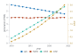

```python
chart = i.line(df, x='year', y='generation (TWh)', color='source',
               secondary_y=['solar'], markers=True)
```

### Stacked areas

`df` has `year`, `source` and `generation (TWh)`. Areas stack unless `stacked=False`.


```python
chart = i.area(df, x='year', y='generation (TWh)', color='source')
```

### Slope chart

`df` has `year`, `country` and `support (%)`: two time points per country. `format=` writes the values as percentages.

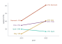

```python
chart = i.slope(df, x='year', y='support (%)', group='country', format='{:.0f}%')
```

## Relationships

Points against points, with fitted lines.

### Scatter with groups

`df` has `strain`, `dose (mg/kg)` and `response (%)`.


```python
chart = i.scatter(df, x='dose (mg/kg)', y='response (%)', color='strain')
```

### Scatter coloured by a number

`df` has `temperature (°C)`, `oxygen (mg/L)` and `chlorophyll (µg/L)`. A numeric `color` column with many values is drawn as a ramp.


```python
chart = i.scatter(df, x='temperature (°C)', y='oxygen (mg/L)',
                  color='chlorophyll (µg/L)')
```

### Regression with a confidence band

`df` has `concentration (µM)` and `absorbance (AU)`, two readings per standard.


```python
chart = i.regression(df, x='concentration (µM)', y='absorbance (AU)')
```

### Regression with its equation

`df` is the calibration table from the regression example. `equation=True` writes the fitted line on the plot.

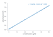

```python
chart = i.regression(df, x='concentration (µM)', y='absorbance (AU)', equation=True)
```

## Distributions

The spread of values, as histograms, curves and dots.

### Overlaid histograms

`df` has `sex` and `length (mm)`, one row per specimen.


```python
chart = i.hist(df, x='length (mm)', color='sex', bins=20)
```

### Filled density curves

`df` has `genotype` and `expression (log2)`, 80 samples per genotype.


```python
chart = i.kde(df, x='expression (log2)', color='genotype', fill=True)
```

### Cumulative distributions

`df` has `group` and `latency (ms)`, 50 animals per group.


```python
chart = i.ecdf(df, x='latency (ms)', color='group')
```

### Box plots with points

`df` has `treatment` and `yield (t/ha)`, 15 plots per treatment.


```python
chart = i.boxplot(df, x='treatment', y='yield (t/ha)', points=True)
```

### Violins

`df` has `cohort` and `grip force (N)`, 40 people per cohort.


```python
chart = i.violin(df, x='cohort', y='grip force (N)')
```

### Strip plot

`df` has `site` and `soil pH`.


```python
chart = i.strip(df, x='site', y='soil pH')
```

## Categories and shares

Bars, dots and wedges for counts and totals.

### Bars counting rows

`df` has one row per specimen in a `species` column. Without `y`, a bar counts its rows.


```python
chart = i.bar(df, x='species')
```

### Grouped bars

`df` has `site`, `season` and `biomass (g/m2)`, one row per site and season.


```python
chart = i.bar(df, x='site', y='biomass (g/m2)', color='season')
```

### Mean bars with error bars and points

`df` has `group` and `response (a.u.)`, one row per animal. `agg=` takes the mean of each group, and `error_y=` takes its standard error.


```python
chart = i.bar(df, x='group', y='response (a.u.)', agg='mean',
              error_y='sem', points=True)
```

### Grouped mean bars with error bars and points

`df` has `group`, `sex` and `response (a.u.)`, one row per animal. `color=` puts the bars side by side, and `agg=`, `error_y=` and `points=` work as they do for a single series.

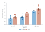

```python
chart = i.bar(df, x='group', y='response (a.u.)', color='sex', agg='mean',
              error_y='sem', points=True)
```

### Lollipop chart

`df` has `pathway` and `score`, one row per pathway. `orient='h'` lays the stems across the page.

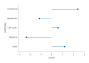

```python
chart = i.lollipop(df, x='pathway', y='score', orient='h')
```

### Dumbbell chart

`df` has `site`, `before (%)` and `after (%)`, one row per site. `x=` names the two value columns.

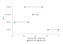

```python
chart = i.dumbbell(df, y='site', x=['before (%)', 'after (%)'])
```

### Waterfall chart

`df` has `step` and `change (k$)`. The two `totals=` steps stand from zero; a missing change on a total shows the running total.

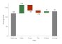

```python
chart = i.waterfall(df, x='step', y='change (k$)', totals=['Opening', 'Closing'])
```

### Pie chart

`df` has `cell type` and `cells (n)`, one row per type. The slices are sized by `values=`, labelled with their shares, and keyed by `names=`.

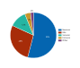

```python
chart = i.pie(df, names='cell type', values='cells (n)')
```

### Donut chart

`df` is the cell-type table from the pie chart. `hole=0.5` leaves a hole half the radius of the disc.

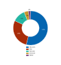

```python
chart = i.pie(df, names='cell type', values='cells (n)', hole=0.5, legend='bottom')
```

## Matrices

Values in a grid of coloured cells.

### Heatmap with a diverging colour bar

`df` is a long table with `gene`, `condition` and `log2 fold change`. A diverging `palette=` with `center=0` puts zero at the middle of the colour bar.


```python
chart = i.heatmap(df, x='condition', y='gene', z='log2 fold change',
                  palette='rdbu', center=0)
```

## Studies and survival

Statistics from experiments, trials and cohorts.

### Volcano plot

`df` has one row per gene: `log2 fold change`, a raw `p-value` and an adjusted `fdr`. `q=` classes each point by its adjusted p-value, and `highlight=` names the genes to label.

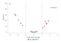

```python
chart = i.volcano(df, x='log2 fold change', y='p-value', label='gene', q='fdr',
                  highlight=['Il6', 'Cxcl10'])
```

### Forest plot

`df` has `study`, `odds ratio`, `lower` and `upper`, one row per study. `summary=` draws a flagged row as a diamond, and `right=` lists the text beside the plot: here the estimate with its interval.

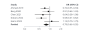

```python
chart = i.quick.forest(df, label='study', estimate='odds ratio', lower='lower',
                       upper='upper', summary='pooled', log=True, measure='OR',
                       right=['ci'])
```

### Survival curves

`df` has `arm`, `months` and `died`. `died` is 1 where the patient died and 0 where follow-up ended first, which is a censored observation.

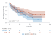

```python
chart = i.survival(df, time='months', event='died', color='arm')
```

## Panels

Several charts in one figure, with shared axes or lettered panels.

### Facet panels

`df` has `cell line`, `drug`, `time (h)` and `viability (%)`. `facet_col=` makes one panel per value of a column.


```python
chart = i.line(df, x='time (h)', y='viability (%)', color='drug',
               facet_col='cell line')
```

### Combined panels

`df` is the growth table, and `outcomes` is the response table. `|` places panels side by side and `/` stacks them.


```python
trace = i.line(df, x='time (h)', y='signal (a.u.)', color='condition',
               error_y='se (a.u.)')
spread = i.boxplot(outcomes, x='group', y='response (a.u.)', points=True)
chart = (trace | spread) / i.hist(outcomes, x='response (a.u.)', color='group', bins=14)
```
