<!-- Generated by tools/quick_gallery.py. Edit the script and run it; this page is written from it. -->

# Chart gallery

Every one-call chart type, drawn from simulated data, with the code that drew it.
The examples assume `import inklet as i`. `df` is a table of simulated
measurements, and each figure names its columns. Options such as `width`,
`palette` and `legend` are described in [Charts in one call](quick-charts.md).

## Lines with an error band

`df` has `condition`, `time (h)`, `signal (a.u.)` and `se (a.u.)`. The band spans one `se (a.u.)` either side of each point.

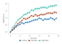

```python
chart = i.line(df, x='time (h)', y='signal (a.u.)', color='condition',
               error_y='se (a.u.)', markers=True)
```

## Scatter with groups

`df` has `strain`, `dose (mg/kg)` and `response (%)`.

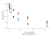

```python
chart = i.scatter(df, x='dose (mg/kg)', y='response (%)', color='strain')
```

## Scatter coloured by a number

`df` has `temperature (°C)`, `oxygen (mg/L)` and `chlorophyll (µg/L)`. A numeric `color` column with many values is drawn as a ramp.

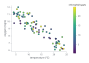

```python
chart = i.scatter(df, x='temperature (°C)', y='oxygen (mg/L)',
                  color='chlorophyll (µg/L)')
```

## Bars counting rows

`df` has one row per specimen in a `species` column. Without `y`, a bar counts its rows.

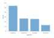

```python
chart = i.bar(df, x='species')
```

## Grouped bars

`df` has `site`, `season` and `biomass (g/m2)`, one row per site and season.

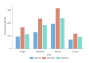

```python
chart = i.bar(df, x='site', y='biomass (g/m2)', color='season')
```

## Mean bars with error bars and points

`df` has `group` and `response (a.u.)`, one row per animal. `agg=` takes the mean of each group, and `error_y=` takes its standard error.

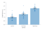

```python
chart = i.bar(df, x='group', y='response (a.u.)', agg='mean',
              error_y='sem', points=True)
```

## Overlaid histograms

`df` has `sex` and `length (mm)`, one row per specimen.

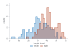

```python
chart = i.hist(df, x='length (mm)', color='sex', bins=20)
```

## Filled density curves

`df` has `genotype` and `expression (log2)`, 80 samples per genotype.

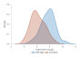

```python
chart = i.kde(df, x='expression (log2)', color='genotype', fill=True)
```

## Cumulative distributions

`df` has `group` and `latency (ms)`, 50 animals per group.

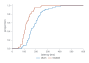

```python
chart = i.ecdf(df, x='latency (ms)', color='group')
```

## Box plots with points

`df` has `treatment` and `yield (t/ha)`, 15 plots per treatment.

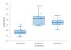

```python
chart = i.boxplot(df, x='treatment', y='yield (t/ha)', points=True)
```

## Violins

`df` has `cohort` and `grip force (N)`, 40 people per cohort.

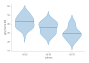

```python
chart = i.violin(df, x='cohort', y='grip force (N)')
```

## Strip plot

`df` has `site` and `soil pH`.

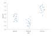

```python
chart = i.strip(df, x='site', y='soil pH')
```

## Stacked areas

`df` has `year`, `source` and `generation (TWh)`. Areas stack unless `stacked=False`.

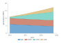

```python
chart = i.area(df, x='year', y='generation (TWh)', color='source')
```

## Regression with a confidence band

`df` has `concentration (µM)` and `absorbance (AU)`, two readings per standard.

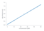

```python
chart = i.regression(df, x='concentration (µM)', y='absorbance (AU)')
```

## Heatmap with a diverging colour bar

`df` is a long table with `gene`, `condition` and `log2 fold change`. A diverging `palette=` with `center=0` puts zero at the middle of the colour bar.

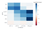

```python
chart = i.heatmap(df, x='condition', y='gene', z='log2 fold change',
                  palette='rdbu', center=0)
```

## Panels with facet_col

`df` has `cell line`, `drug`, `time (h)` and `viability (%)`. `facet_col=` makes one panel per value of a column.

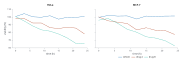

```python
chart = i.line(df, x='time (h)', y='viability (%)', color='drug',
               facet_col='cell line')
```

## Panels with | and /

`df` is the growth table, and `outcomes` is the response table. `|` places panels side by side and `/` stacks them.

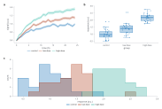

```python
trace = i.line(df, x='time (h)', y='signal (a.u.)', color='condition',
               error_y='se (a.u.)')
spread = i.boxplot(outcomes, x='group', y='response (a.u.)', points=True)
chart = (trace | spread) / i.hist(outcomes, x='response (a.u.)', color='group', bins=14)
```

## Names at the line ends

`df` is the growth table from the first example.

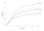

```python
chart = i.line(df, x='time (h)', y='signal (a.u.)', color='condition',
               legend='direct')
```
