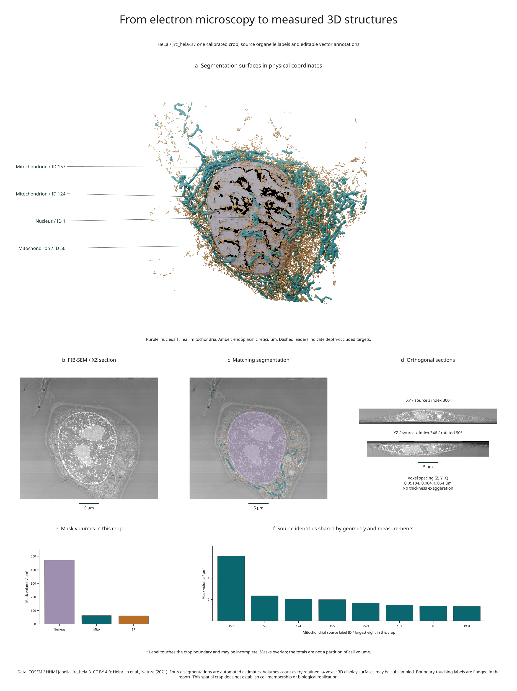

# Real microscopy, annotated structures and measurements

This figure combines FIB-SEM microscopy, source organelle segmentations, calibrated
orthogonal sections and quantitative summaries from one fixed spatial crop of
**jrc_hela-3**. The data are real; the labels are the source's automated estimates.



[Full-size figure](../gallery/real-biology.png) ·
[Executable recipe](../examples/real_biology.py) ·
[Measurements and render evidence](assets/research-preview/real-biology.json) ·
[Source checksums](../examples/biology/organelle.lock.json)

## Reproduce it

Use a development checkout and Blender 4.2 or 4.5 LTS:

```sh
python -m pip install -e '.[volume,render]'
python -m pip install -r examples/biology/requirements.txt
python examples/real_biology.py --blender /path/to/blender
```

The recipe downloads approximately **56.6 MB** of hash-locked source objects.
It reads N5 through the separately pinned example dependencies, extracts meshes,
builds a Blender scene and renders with an available GPU by default. CPU fallback
occurs during device discovery. The core volume API itself performs no downloads.

Outputs in `out/real-biology/` include the source cache, meshes, `.blend` scene,
SVG/PDF/PNG figure, review HTML and `measurements.json`. The source reader checks
that all four arrays have matching shapes and physical transforms. Every
available downloaded object must match its recorded size and SHA-256. Absent
N5 background chunks are recorded explicitly. Meshes and the scene recipe are
fingerprinted so a data or geometry change rebuilds the scene before rendering.

## Coordinates and provenance

The source level is `s4`, shape **750 × 62 × 775** in ZYX order. Spacing is
**51.84 × 64 × 64 nm**, with a centre-origin translation of **24.3 × 30 × 30 nm**
in ZYX order. The recipe converts these coordinates to micrometres without
stretching any dimension.

The half-open crop is `Z[40:640], Y[0:62], X[80:630]`. Its physical extent is
**31.104 × 3.968 × 35.2 µm** in ZYX order. The original world origin is retained.
The field includes source labels around the central nucleus; the crop does not
infer which cell owns each organelle or establish complete cell coverage.

- Panel a renders source segmentation surfaces. Callouts use original IDs and
  actual mesh surface points. Occluded anchors use dashed leaders.
- Panels b and c show the same XZ section at source Y index 31. They share the
  explicit intensity window `[17000, 26000]`. The overlay uses 55% mask color.
- Panel d shows physical XY and YZ sections. YZ is rotated 90° for layout; its
  geometry is not stretched. Scale bars show 5 µm.
- Panels e and f count every retained source-level voxel. They use the same
  segmentation arrays as the displayed geometry.

## Recorded measurements

| Mask | Foreground voxels in crop | Voxel-count volume |
| --- | ---: | ---: |
| Nucleus, ID 1 | 2,218,929 | 471.1599 µm³ |
| Mitochondria, all retained IDs | 296,336 | 62.9230 µm³ |
| Endoplasmic reticulum, all retained IDs | 289,154 | 61.3980 µm³ |

The crop retains 209 mitochondrial label IDs and 58 ER label IDs. These are
source labels, not verified counts of independent biological organelles. Of the
eight largest retained mitochondrial labels, **252 and 193 touch the crop
boundary**; their bars carry a dagger. Their volumes may be incomplete.

The masks are not disjoint: the nucleus/ER pair overlaps at 80,697 voxels, and
the nucleus/mitochondria and mitochondria/ER pairs overlap at 14 and 13 voxels.
The recipe preserves and reports these overlaps instead of modifying the source
to make a partition. Do not sum the bars into a cell volume.

## What the rendering establishes

The [oblique-section example](oblique-biology.md) extends this dataset with two
angled physical planes shared by 3D annotations, image panels, label-area
comparisons and marked intensity profiles.

The example checks that source IDs, physical coordinates, slices and reported
values remain connected through the figure pipeline. It is not a reanalysis
of the paper's biological findings or a validation of its segmentation models.
The source `s4` level is already coarse relative to acquisition resolution.

The three individually annotated mitochondrial meshes use every `s4` sample.
The nucleus, remaining mitochondria and ER use display stride 2, which can lose
thin structures. Measurements still use every retained voxel. Boundary-touching
aggregate surfaces explicitly permit artificial caps. The report records mesh
sizes, stride, cap status and the actual Blender device and camera-plan evidence.

## Attribution and reuse

Data: **COSEM Project Team / HHMI Janelia Research Campus**, accessed 7 September
2026 through the [COSEM data registry](https://registry.opendata.aws/janelia-cosem/),
which declares **CC BY 4.0**. Publication: Heinrich et al.,
[Whole-cell organelle segmentation in volume electron microscopy](https://doi.org/10.1038/s41586-021-03977-3),
*Nature* 599, 141–146 (2021).

The figure changes the presentation through cropping, windowing, overlays,
surface extraction, rendering, labels and quantitative summaries. The derived
figure retains [CC BY 4.0](https://creativecommons.org/licenses/by/4.0/); the example
code is MIT. Raw data and generated meshes are downloaded locally and are not
bundled with Inklet. See [third-party notices](../THIRD_PARTY_NOTICES.md).
