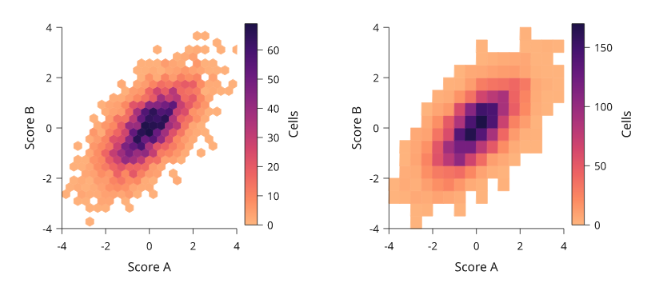
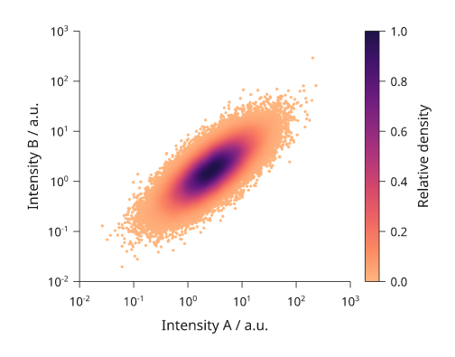
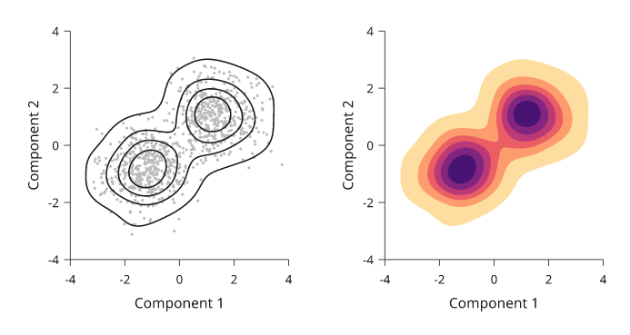
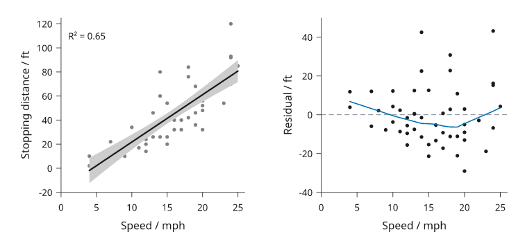
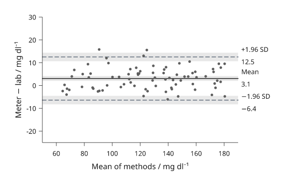
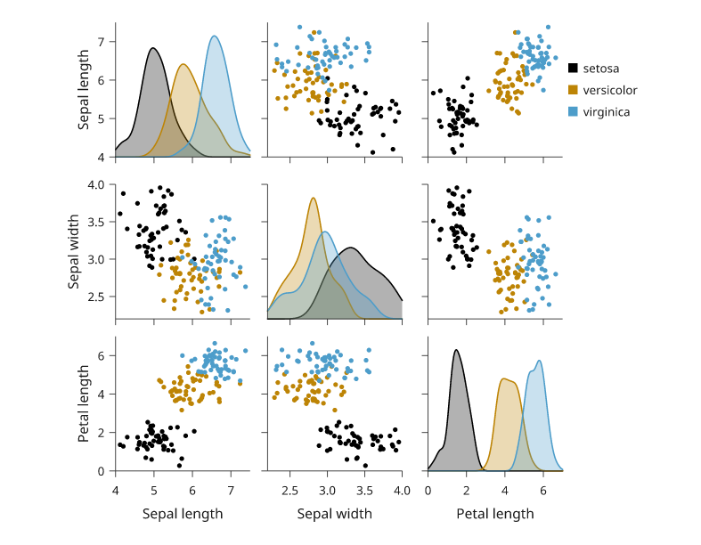
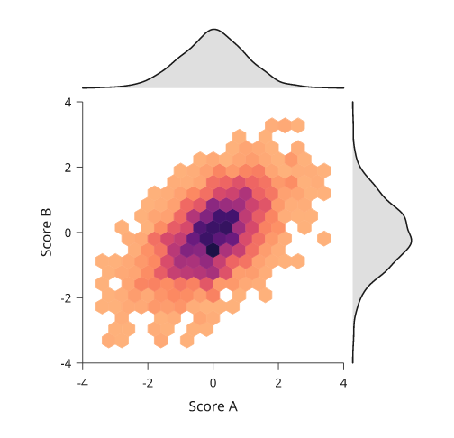

# Relationships between variables

Two measured variables per observation call for a different set of plots:
densities of many points, fitted lines, agreement between two methods, and
grids of every pair. All of them compute in standard-library Python; numpy is
not needed.

All values below are illustrative simulated observations. Each snippet can be
run independently with core Inklet and writes an SVG and a PDF. The fits and
limits are descriptive: no test is run beyond what each section states, and
the numbers are there to report, not to replace a statistical analysis.

## 2D histograms and hexbins

When points overlap, count them. `hist2d` counts points in rectangular bins
on continuous axes; `hexbin` counts them in hexagons that are regular on the
page, on log axes too. Both colour each bin by its count through a magma
ramp without its palest end, so a bin of one still shows, and
`colorbar()` explains the colours. `log=True` colours by log count, and
`min_count` leaves sparse bins empty. `inklet.plot.histogram2d` returns
the edges and counts without drawing.

```python
import inklet as i
import random
rng = random.Random(501)
points = []
for _ in range(4000):
    x = rng.gauss(0, 1.1)
    points.append((x, .6 * x + rng.gauss(0, .8)))
hexes = i.plot_spec(x=(-4, 4), y=(-4, 4), height=40)
hexes.hexbin(points, gridsize=22)
hexes.axes(x='Score A', y='Score B')
hexes.colorbar(label='Cells')
cells = i.plot_spec(x=(-4, 4), y=(-4, 4), height=40)
cells.hist2d(points, bins=18)
cells.axes(x='Score A', y='Score B')
cells.colorbar(label='Cells')
doc = i.document(width=130, columns=[1, 1], gap=8)
doc.add('hexes', hexes, row=0, column=0)
doc.add('cells', cells, row=0, column=1)
doc.save('hexbin.svg', 'hexbin.pdf')
```



*Rendered from the code above: the same 4,000 simulated points counted in
hexagons (left) and rectangles (right).*

## Density-coloured scatter

`density_scatter` keeps every point and colours it by how crowded its
neighbourhood is. It estimates the density on the page, so it behaves the
same on log axes and follows where the marks actually overlap. The densest
points are drawn last. With `raster=True` the markers are one embedded
image, which keeps 100,000 points small in SVG and PDF while the axes and
text stay vector. Colours run from 0 to the densest point, so the colour bar
reads as relative density.

```python
import inklet as i
import math
import random
rng = random.Random(502)
points = []
for _ in range(100_000):
    u = rng.gauss(0, 1)
    points.append((math.exp(1 + u), math.exp(.5 + .7 * u + .6 * rng.gauss(0, 1))))
p = i.plot_spec(x=i.plot.log((.01, 1000)), y=i.plot.log((.01, 1000)), height=44)
p.density_scatter(points, raster=True, size=.5)
p.axes(x='Intensity A / a.u.', y='Intensity B / a.u.')
p.colorbar(label='Relative density')
doc = i.document(width=80)
doc.add('density', p)
doc.save('density.svg', 'density.pdf')
```



*Rendered from the code above: 100,000 simulated log-normal intensities in
one embedded image.*

## 2D density contours

`kde2d` draws contours of a Gaussian kernel density. Each contour encloses a
share of the estimated probability: `levels=(.5, .8, .95)` draws the
smallest regions that hold 50%, 80% and 95% of it, and `levels=5` draws
five evenly spaced shares up to 95%. `fill=True` fills the regions between
them from the density ramp, palest outside. The bandwidth per axis follows
Scott's rule (`sd * n^-1/6`) unless given. `inklet.plot.kde2d` returns the
density lattice.

```python
import inklet as i
import random
rng = random.Random(503)
points = []
for _ in range(900):
    centre = (-1.2, -.8) if rng.random() < .55 else (1.4, 1.1)
    points.append((rng.gauss(centre[0], .8), rng.gauss(centre[1], .7)))
lines = i.plot_spec(x=(-4, 4), y=(-4, 4), height=40)
lines.scatter(points, size=.5, color='#bbbbbb')
lines.kde2d(points, levels=(.25, .5, .75, .95))
lines.axes(x='Component 1', y='Component 2')
filled = i.plot_spec(x=(-4, 4), y=(-4, 4), height=40)
filled.kde2d(points, levels=6, fill=True)
filled.axes(x='Component 1', y='Component 2')
doc = i.document(width=110, columns=[1, 1], gap=8)
doc.add('lines', lines, row=0, column=0)
doc.add('filled', filled, row=0, column=1)
doc.save('kde2d.svg', 'kde2d.pdf')
```



*Rendered from the code above. The contours hold 25%, 50%, 75% and 95% of
the estimated density of 900 simulated points from two clusters.*

## Regression and residuals

`regression` draws the points, a least-squares line and its 95% confidence
band for the mean response, from Student's t on n - 2 degrees of freedom.
`prediction=True` shades the wider interval for a new observation instead.
`method='lowess'` draws R's `lowess()` smoother. The line's node carries a
`regression` note with the slope, intercept, R² and p-value; compute them
with `inklet.plot.linear_fit`, which matches R's `lm` on the `cars` data. On a
log x axis the fit is of y on log10 x, so the line stays straight. `residuals`
draws what the fit left, against x, with a zero line. `smooth=True` adds a
LOWESS trend.

```python
import inklet as i
from inklet.plot import linear_fit
speed = [4, 4, 7, 7, 8, 9, 10, 10, 10, 11, 11, 12, 12, 12, 12, 13, 13, 13, 13,
         14, 14, 14, 14, 15, 15, 15, 16, 16, 17, 17, 17, 18, 18, 18, 18, 19,
         19, 19, 20, 20, 20, 20, 20, 22, 23, 24, 24, 24, 24, 25]
dist = [2, 10, 4, 22, 16, 10, 18, 26, 34, 17, 28, 14, 20, 24, 28, 26, 34, 34,
        46, 26, 36, 60, 80, 20, 26, 54, 32, 40, 32, 40, 50, 42, 56, 76, 84, 36,
        46, 68, 32, 48, 52, 56, 64, 66, 54, 70, 92, 93, 120, 85]
cars = list(zip(speed, dist))
fit = linear_fit(cars)
line = i.plot_spec(x=(0, 26), y=(-20, 125), height=40)
line.regression(cars)
line.axes(x='Speed / mph', y='Stopping distance / ft')
line.text(1, 110, f'R² = {fit.r2:.2f}', anchor='w')
left = i.plot_spec(x=(0, 26), y=(-40, 50), height=40)
left.residuals(cars, smooth=True)
left.axes(x='Speed / mph', y='Residual / ft')
doc = i.document(width=120, columns=[1, 1], gap=8)
doc.add('fit', line, row=0, column=0)
doc.add('residuals', left, row=0, column=1)
doc.save('regression.svg', 'regression.pdf')
```



*Rendered from R's `cars` data (Ezekiel, 1930). The residuals widen with
speed, which the straight fit does not model.*

## Bland-Altman agreement

`bland_altman` compares two methods that measure the same subjects. Each
pair is drawn at its mean and its difference. A solid line marks the bias
(the mean difference) and dashed lines the limits of agreement,
`bias ± 1.96 SD`, with each value set in the right margin clear of the data.
`confidence=0.95` shades the confidence interval of the bias and of each
limit (Bland and Altman, 1986). `percent=True` plots differences as a
percentage of the mean. `inklet.plot.bland_altman(a, b)` returns the same
numbers, which set the y domain.

```python
import inklet as i
import random
from inklet.plot import bland_altman
rng = random.Random(504)
truth = [rng.uniform(60, 180) for _ in range(80)]
meter = [t + rng.gauss(2.5, 4.5) for t in truth]
lab = [t + rng.gauss(0, 3.0) for t in truth]
agreement = bland_altman(meter, lab)
p = i.plot_spec(x=(50, 190), y=(-25, 30), height=40)
p.bland_altman(meter, lab, confidence=.95, format='{:.1f}')
p.axes(x='Mean of methods / mg dl⁻¹', y='Meter − lab / mg dl⁻¹')
doc = i.document(width=90)
doc.add('bland-altman', p)
doc.save('bland-altman.svg', 'bland-altman.pdf')
```



*Rendered from the code above: 80 simulated paired glucose readings.*

## Pair plots

`inklet.pairplot` draws every pair of variables in one aligned grid. Each
column shares an x scale and each row a y scale, and only the outer panels
write numbers and names. The diagonal shows each variable's distribution.
The lower and upper triangles draw `'scatter'`, `'kde2d'`, `'hexbin'`,
`'hist2d'`, `'regression'` or nothing. `groups=` colours observations by
label and keys them. The diagonal then shows per-group densities, which
overlap more legibly than histograms. `corner=True` drops the upper triangle.
The result is a diagram, so it goes into `row`, `column` or a document like
a panel.

```python
import inklet as i
import random
rng = random.Random(505)
species, data = [], {'Sepal length': [], 'Sepal width': [], 'Petal length': []}
for name, (a, b, c) in {'setosa': (5.0, 3.4, 1.5), 'versicolor': (5.9, 2.8, 4.3),
                        'virginica': (6.6, 3.0, 5.5)}.items():
    for _ in range(50):
        species.append(name)
        data['Sepal length'].append(rng.gauss(a, .4))
        data['Sepal width'].append(rng.gauss(b, .3))
        data['Petal length'].append(rng.gauss(c, .45))
grid = i.pairplot(data, groups=species, cell=24)
doc = i.document(width=125)
doc.add('pairs', grid)
doc.save('pairs.svg', 'pairs.pdf')
```



*Rendered from the code above: simulated measurements in the spirit of
Anderson's iris data, 50 per group.*

## Joint plots

`inklet.jointplot` draws one pair with both marginal distributions along
the top and right edges, on the main panel's own scales. The main panel
draws `kind` (`'scatter'`, `'kde2d'`, `'hexbin'`, `'hist2d'` or
`'regression'`) and the margins `marginal='hist'` or `'kde'`. `width` is the
main panel's side and `ratio` its size relative to the margins. The margins
carry no count axis, since only their shape is read.

```python
import inklet as i
import random
rng = random.Random(506)
points = []
for _ in range(3000):
    x = rng.gauss(0, 1)
    points.append((x, .55 * x + rng.gauss(0, .85)))
joint = i.jointplot(points, kind='hexbin', marginal='kde', width=46,
                    x_label='Score A', y_label='Score B')
doc = i.document(width=80)
doc.add('joint', joint)
doc.save('joint.svg', 'joint.pdf')
```



*Rendered from the code above.*

## Next steps

See [distributions](distributions.md) for one variable at a time and
[uncertainty](uncertainty.md) for supplied intervals. For exact options,
see the [API](api.md).
