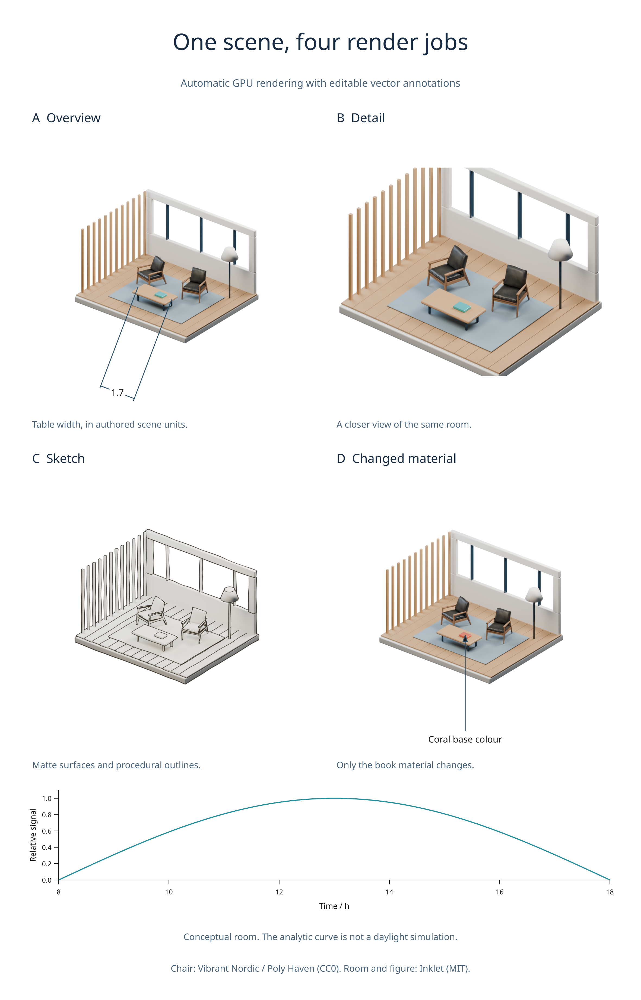

# GPU rendering and jobs

Available in **3.0 development**. Cycles scene renders now default to
`device='AUTO', fallback='cpu'`: use an available GPU, otherwise CPU.
Blender stays optional for ordinary plots and vector exports.

## Discover and select devices

```python
import inklet as i

inventory = i.render_devices()
for backend, info in inventory['backends'].items():
    print(backend, info['devices'], info['error'])
```

The CLI equivalent is `inklet doctor --devices`. Discovery lists devices
enumerated by Blender; it does not establish that a render will succeed.
Results are cached for 60 seconds. Use `refresh=True` after changing hardware or
drivers. `blender=` selects the same executable used by the scene renderer.

Automatic selection tries OptiX, CUDA, HIP, oneAPI and Metal in that order,
choosing the first backend with available devices. The order is a preference,
not a claim that one backend is fastest for every scene. All available GPUs on
that backend are enabled unless you select exact IDs. CPU and GPU are not mixed.

These examples require your own `.blend` scene:

```python
result = i.render_blend('room.blend', width=120, engine='CYCLES')
print(result.metadata['execution'])  # requested policy, actual backend, IDs, fallback reason

cpu = i.render_blend('room.blend', width=120, engine='CYCLES', device='CPU')
gpu = i.render_blend('room.blend', width=120, engine='CYCLES',
                     device='CUDA', fallback='error')
```

Use `devices=[...]` with exact IDs from the inventory to select specific GPUs.
Names and backend spellings are distinct: API backend values are `OPTIX`,
`CUDA`, `HIP`, `ONEAPI` and `METAL`. `AUTO` and `CPU` are also accepted.

CPU fallback applies when discovery finds no matching device or cannot probe
the driver. An explicit GPU request that falls back emits a warning; automatic
fallback is recorded in progress and metadata. `fallback='error'` disables it.
Render failures, out-of-memory errors and timeouts raise an error; they do not
silently retry on CPU. Blender is checked for active selected GPU devices before
rendering, preventing its own implicit CPU fallback when no GPU was activated.

The selected backend and device IDs participate in the disk-cache key. Changing
between CPU and GPU does not reuse the other device's cache entry. EEVEE chooses
its own graphics context; these device controls apply to Cycles.

The default render timeout is 900 seconds. Initial GPU kernel compilation can
take several minutes even for a small scene; later renders reuse Blender's
compiled kernels. `timeout=` sets an explicit limit. Device discovery has a
separate maximum of 30 seconds.

## Observe and cancel a render

```python
import threading

cancel = threading.Event()
def report(event):
    print(event.phase, event.message, event.fraction)

result = i.render_blend('room.blend', width=120, progress=report, cancel=cancel)
```

Another thread can call `cancel.set()`. Inklet terminates the Blender process
and raises `RenderCancelled`. Temporary output is removed; incomplete pixels
and passes are never committed to the cache. A previously completed cache entry
remains usable. Cancellation is cooperative around input validation and hashing,
and is polled while Blender runs and while waiting for an identical render.

`RenderProgress` is immutable. Phases include preparation, discovery, device
selection, kernel loading, rendering, pass extraction, cache reuse and completion.
`fraction` is optional and applies to the current phase, not the entire job.
Callbacks run on the calling render thread. Keep them quick; a callback exception
aborts the render and terminates its subprocess.

## Queue several views

```python
with i.RenderQueue(max_workers=2, max_gpu_jobs=1) as queue:
    overview = queue.submit('room.blend', width=90, camera='Overview', quality='final')
    detail = queue.submit('room.blend', width=90, camera='Detail', quality='final')
    print(overview.progress)
    first = overview.result()
    second = detail.result()

doc = i.document(width=190, columns=2)
doc.add('overview', first.diagram)
doc.add('detail', second.diagram)
```

`job.cancel()` cancels queued or running work. `job.result(timeout=...)` limits
how long the caller waits; it does not cancel the job. `job.done()` reports
completion. The context manager waits for all jobs; an exception inside the block
cancels outstanding work. Use `queue.shutdown(cancel=True)` to stop all jobs.

Limits apply per queue. `max_workers` bounds active worker threads, and
`max_gpu_jobs` bounds jobs requesting GPUs, including `AUTO`. The default GPU
limit is one, avoiding several Blender processes competing for the same GPU
memory. Auto jobs conservatively retain that limit even if discovery selects CPU.
`threads=` still controls each Blender process's CPU threads.

Submission copies the render options. Later changes to a bindings dictionary
do not change a queued request. Concurrent identical calls in the same Python
process wait for one render and reuse its validated cache entry. This also works
across queues and direct calls. Separate Python processes still validate their
own cached files, but are not scheduled or deduplicated together.

The document compiler remains synchronous. Queue expensive views explicitly,
then compose their returned diagrams with vector plots and annotations. Changing
one view's camera or bindings invalidates that request; unchanged views reuse
their caches.

## Reproduce the example



First create the architecture scene with the [showcase builder](showcase.md):

```sh
python tools/showcase_gallery.py --only architecture --download-assets
python examples/v3_render_jobs.py --quality final
```

The [example source](../examples/v3_render_jobs.py) queues multiple camera views,
a sketch, and one changed material binding, then exports a figure and job report.
Use `--blender /path/to/blender` to choose another installation.

CPU integration is tested with Blender 4.2.23 and 4.5.13 LTS. Real GPU renders,
including numeric passes, are tested with CUDA on an RTX 5090 Laptop GPU.
Other GPU backends share the selection API but have not been validated on real
hardware here. GPU support is determined by the Blender build and drivers; see
Blender's [GPU rendering documentation](https://docs.blender.org/manual/en/4.5/render/cycles/gpu_rendering.html).
