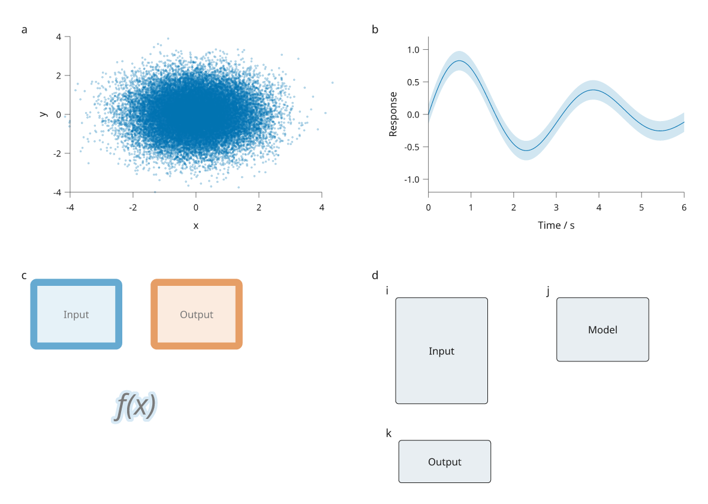
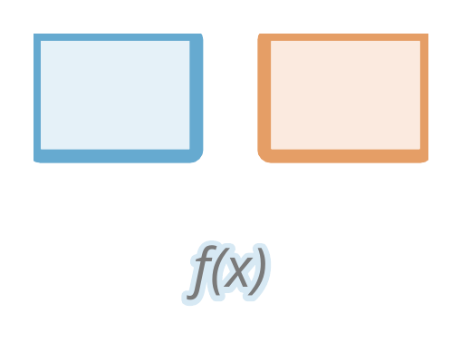
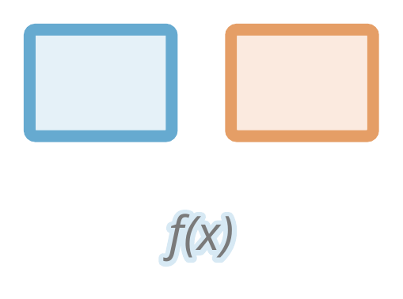

# Rendering and layout review

Inklet 3.1 improves dense raster plots, repeated-image
exports, fixed-component reuse and nested layout. It also fixes a PDF clipping
defect: transparency groups now include the full painted stroke and text halo,
even when those extend beyond the drawing's layout envelope.

[Full-size figure](../gallery/engine-review.png) ·
[Executable recipe](../examples/engine_review.py) ·
[LaTeX caption](assets/research-preview/engine-review-caption.tex)



The data are simulated and all artwork is original. Panel a contains 30,000
points; its axes and labels remain vector. Panel b's interval is supplied by
the recipe and has no inferred statistical meaning. Panels c and d exercise
transparency bounds and unequal fixed-size drawings with panel letters.
Descriptions and methods are in the separate caption.

## Reproduce the figure

These changes are included in Inklet 3.1. Check out `v3.1.0` to reproduce this recipe.

```bash
git clone --branch v3.1.0 https://github.com/Mapika/inklet.git
cd inklet
python -m pip install -e '.[render]'
python examples/engine_review.py
```

This writes SVG, PDF, PNG, text/LaTeX captions and a diagnostic report into
`out/engine-review/`. There are no external assets or downloads. The example
allows informational diagnostics and rejects errors and warnings.

## PDF transparency: before and after

Both images below use the same drawing and Poppler rasterizer. The previous
engine uses commit `b07858b`; the current engine includes painted bounds.
SVG artwork already contained these strokes. The defect was specific to the
PDF transparency group's clipping rectangle.

**Previous PDF:** the top and outer sides of the blocks lose part of their strokes.



**Current PDF:** complete strokes and corners remain visible.



To render this specimen separately, use `python examples/engine_review.py
--quality-only`. Its SVG and PDF go to `out/engine-review/`. The same recipe can
run against the previous engine through `PYTHONPATH` pointing to that checkout's
`src` directory. Rasterize both PDFs with `pdftoppm -r 190 -png -singlefile`.

## What changed

- **Dense scatter:** raster plots resolve bounded marker prototypes and paint
  directly, avoiding a temporary drawing tree for every point. Point order,
  per-point sizes/colours, clipping and fill/group opacity keep their meanings.
  All seven marker shapes retain the existing antialiasing and stroke rules.
  Explicit placement options use the established tree renderer.
- **Layout:** ordinary track constraints use a direct projection onto their
  minima; overlapping spans retain the general solver. Plot-margin sharing
  groups cells by row/column instead of comparing every pair. Fixed factories
  reuse their results across measurement and resize passes.
- **Alignment:** `document.add(..., align='nw')` and the other compass points
  place fixed artwork within a cell without scaling. Nested fixed drawings
  retain the measured space required by their panel letters.
- **Geometry and styles:** copies that only change identity or paint reuse
  immutable measured geometry. Style inheritance uses a bounded cache. Anchors
  and annotations on a copy remain separate from the original.
- **Exports:** repeated images encode and hash once per export. File-backed
  images are read again for the next export. PDF font subsets omit shaping
  tables before parsing them, since their glyphs have already been shaped;
  SVG webfonts retain those tables for viewer-side shaping.

## Performance measurements

The [benchmark tool](../tools/benchmark_engine.py) runs three complete workloads
in fresh Python processes. Each repeat measures compilation, cached compilation,
first SVG/PDF export, repeated exports, output size and peak process memory.
Imports and recipe construction are outside the timed phases; peak memory
includes the whole worker process. Repeated exports must be byte-identical and
cached compilation must return the same snapshot.

[Previous engine measurements](assets/research-preview/engine-before.json) ·
[Development engine measurements](assets/research-preview/engine-after.json)

Measurements below use the median of three fresh-process runs on this Linux
WSL2 workstation with Python 3.12.3. They are comparisons on this machine,
not guarantees for other hardware. Raw reports include each repeat, dependency
versions and a source hash. The benchmark raster cloud uses 150 dpi; the review
figure above uses 300 dpi.

| Workload / phase | Previous engine | Development engine | Change |
| --- | ---: | ---: | ---: |
| 30,000-point raster plot: compile | 15.4891 s | 4.8466 s | 3.20× faster |
| 30,000-point raster plot: peak process memory | 350.7 MiB | 100.1 MiB | 71% lower |
| 64 plots: compile | 0.8878 s | 0.6552 s | 1.35× faster |
| 64 plots: first PDF export | 0.1792 s | 0.0597 s | 3.00× faster |
| 64 plots: first SVG export | 0.1215 s | 0.1779 s | 1.46× slower |
| 64 repeated images: SVG export | 0.0233 s | 0.0025 s | 9.47× faster |

```bash
python tools/benchmark_engine.py --output out/engine-after.json
python tools/benchmark_engine.py --source /path/to/previous/inklet \
  --output out/engine-before.json
```

The ordinary grid's first SVG export can vary independently of its compilation
and PDF improvements. Consult the separate phase timings in the raw reports;
the engine does not make every export path faster. Pixel output still depends
on the selected renderer, fonts and DPI. The existing visual tests use pinned
renderer versions and reviewed baselines.
