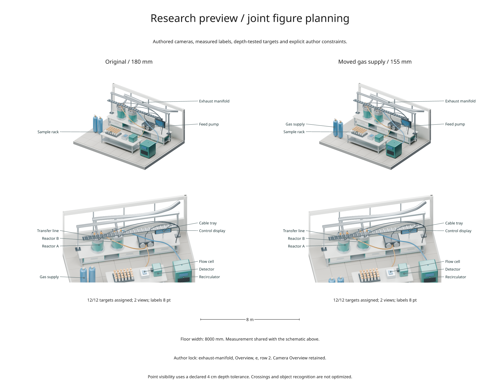

# Research preview: planning a complete figure

Inklet 3.1 includes this opt-in API under `inklet.experimental`.
It selects authored scene views and measured label positions together, preserves
explicit author decisions during revision, and records why a request cannot fit.
It remains a research preview. Signatures and report formats may change;
inclusion in a stable package does not make these APIs stable.



[Full-size comparison](../gallery/research-figure-planner.png) ·
[Executable example](../examples/research_figure_planner.py) ·
[Recorded results](assets/research-preview/comparison.json)

The [second preview](research-study.md) adds sampled regions, optional crossing
reduction and physical label-movement measurements. The recorded comparison on
this page remains the original dev1 baseline. The [third preview](research-revision.md)
adds physical movement costs and hard limits, alongside a [biology example](biology-panels.md).

## What this preview implements

| Direction | Available now | Still to investigate |
| --- | --- | --- |
| Joint figure planning | Enumerate camera subsets and image sizes; assign labels using measured text and saved depth | Generate cameras, cutaways, inset crops, arbitrary panel arrangements and globally optimized leader routing |
| Shared meaning | Stable target IDs and authoritative world points; explicit length conversion shared by a dimension and caption | Typed relationships across plots, scene objects and data; derived-value provenance |
| Author-preserving revision | Required views, locked label slots, penalties for changing earlier choices | Direct manipulation, absolute page-position locks and editing structured figure specifications |

The planner uses saved `SceneRender` snapshots. It needs no Blender process,
NumPy, SciPy or network access. Creating the example snapshots requires Blender;
SVG/PDF export keeps the annotations as vectors.

## Try it

The API is available with `pip install "inklet[render]==3.1.0"`. To run the
repository example, install the release checkout in a separate environment:

```sh
git clone --branch v3.1.0 https://github.com/Mapika/inklet.git
cd inklet
python -m venv .venv
source .venv/bin/activate
python -m pip install -e '.[render]'
python examples/research_figure_planner.py --quality final
```

Use `--blender /path/to/blender` if discovery finds a different installation.
Cycles uses an available GPU by default, with CPU fallback at device discovery.
`--quality preview` is quicker; depth sampling and resulting choices can differ.
`--rebuild` regenerates the original procedural laboratory and its revision.
All geometry in this example is original MIT-licensed procedural content.

The output directory is `out/research-preview/`. It contains the comparison,
individual feasible figures, two authored `.blend` revisions, and
`comparison.json`. Failed cases produce reports without a partial figure.

## Use your own snapshots

The following assumes you have two views of the same scene and a landmark named
`probe`. All candidate snapshots and target coordinates must describe the same
geometry revision and world coordinate system; the planner cannot establish
that semantic correspondence for you.

```python
import inklet as i
from inklet.experimental.figure_planner import Target, View, SlotLock, plan

views = tuple(
    View(camera, i.render_blend(
        "apparatus.blend", camera=camera, width=120, height=90,
        passes=("depth",), landmarks={"probe": "Probe tip"},
    ))
    for camera in ("Overview", "Detail")
)
world = views[0].render.metadata["landmarks"]["probe"]["world"]
targets = [Target("probe", "Temperature probe", world)]
result = plan(targets, views, width=180, max_height=220, font_pt=8,
              required_views=("Overview",))

if result.feasible:
    doc = i.document(width=190, margin=5)
    doc.add("planned-scene", result.diagram())
    doc.compile().save("planned.svg", "planned.pdf")
else:
    print(result.issues)
```

`Target.id` is a stable identity; changing the label must not change that ID.
World points are explicit scene coordinates. By default, every target needs an
in-frame projection with a passing depth sample. Missing depth is unknown,
not visible. `visibility="in_frame"` explicitly permits obscured or unknown
points and draws dashed leaders for them.

The default `depth_bias=0.001` is in **scene units**. The laboratory uses metres
and an explicit 0.04 m tolerance because its transfer landmark is inside a tube
with 0.032 m radius. That is a modelling choice, not a general visibility default.
The demo also corrects an approximate manifold landmark by intersecting its
actual mesh from the Services camera, then reuses that single fixed world point
for every candidate view.

## Preserve decisions during revision

Pass the previous feasible plan to penalize changed label slots and view sets.
Pass a `SlotLock` to make a particular decision mandatory:

```python
first = result.placements[0]
lock = SlotLock(first.target, first.view, first.side, first.row)
revised = plan(
    updated_targets, updated_views, width=155, max_height=220,
    previous=result, required_views=("Overview",), locks=(lock,),
)
print(revised.moved, revised.issues)
```

This snippet requires a feasible `result`, plus targets and renders for your new
geometry. A slot means **view, side and row**, not an absolute page coordinate.
When a panel changes size, that slot can move physically. Conflicting locks,
missing visibility and insufficient space remain failures; locks are never
silently relaxed. Removed target IDs are ignored by the revision penalty, and
new targets have no previous-slot penalty.

## Keep measurements independent of illustration

```python
from inklet.experimental.figure_planner import Length

width = Length.between((0, 0, 0), (8, 0, 0), metres_per_unit=1)
dimension_text = width.label("m")                    # 8 m
caption_text = width.label("mm", precision=6)         # 8000 mm
```

This small immutable value object supports `m`, `cm`, `mm` and `um`. Calculate
it from authoritative geometry before applying illustration transforms. It
never infers units or treats an exploded illustration as a new measurement.
The example shares one such value between a schematic dimension and caption.
This establishes consistency of that value, not the truth of a scientific claim.

## How the search works

1. Measure all labels at the requested font size and reserve two outside columns.
2. Enumerate allowed view subsets and common image widths (`image_scales`).
3. Reject combinations that violate page height or minimum image width.
4. Solve a minimum-cost, one-label-per-slot assignment with a rectangular
   Hungarian algorithm. Visibility and author locks forbid assignment edges.
5. Rank feasible combinations and return the best five alternatives with costs.

The cost is total leader length, plus penalties for view count, reduced image
width, changed prior slots and added/removed prior views. Penalties are in
millimetre-equivalent units, not calibrated measures of human effort. Defaults
are 80 per view, 80 times the fractional width reduction per view, and 25 per
revision change. A size choice may trade larger images for shorter leaders.
`min_image_width` prevents excessive shrinking; font size never shrinks.

All panels stack vertically and share an image width selected from the supplied
finite options. Each label occupies a distinct measured row outside the image.
`max_evaluations` bounds enumeration and raises on overflow; the search does not
quietly truncate and claim an optimum. The optimum is only for this discrete
model and its explicit cost function.

The JSON report includes target identities/world points, snapshot cache keys,
visibility results, constraints, locks, previous slots, chosen placements,
leader lengths, alternative scores and failures. Planning time excludes Blender
rendering and figure export.

## Evaluate it

The executable comparison includes:

- **Overview only:** the camera is fixed before label planning.
- **Coverage first:** choose the fewest covering cameras, break ties by name,
  then place labels. This baseline never revisits its camera choice.
- **Joint:** choose cameras, image width and label slots in one finite search.
- **Revision with a lock:** move the gas assembly by 0.9 m, narrow the page from
  180 to 155 mm, and preserve an explicit slot plus the Overview view.
- **Revision without history:** measure how many choices change without a
  preservation cost.
- **Too narrow / strict depth:** retain failure cases at 70 mm page width and
  0.001 m depth tolerance.

The coverage-first baseline uses the same candidate bank, visibility predicate,
font measurements and assignment algorithm as the joint version. Its name-order
tie-break is deliberately simple; beating it is not evidence of superiority to
expert manual design or more sophisticated planning methods. The recorded JSON
is one scene and one rendering setup, not a general performance claim.

Tests compare the assignment algorithm with exhaustive small solutions, check
real saved-camera projection, and exercise missing depth, author conflicts,
revision stability, text bounds, unit conversion, deterministic ties and search
budgets. A controlled tall-view case checks that the joint search can find a
page-feasible alternative after an independent camera choice fails.

## Recorded result

On the checked Blender 4.5.13 LTS CUDA final-quality run:

| Method | Selected cameras | Assigned targets | Total leader length |
| --- | --- | --- | --- |
| Overview only | No feasible plan | — | — |
| Coverage first | Overview + Process | 12/12 | 401.19 mm |
| Joint search | Overview + Services | 12/12 | 384.75 mm |

The joint result reduces total leader length by 4.1% in this one case.
During revision, the plan with history changes 1 label slot; replanning without
history changes 9. Both satisfy the twelve targets. The preserved plan accepts
longer leaders to keep prior decisions. Slot counts do not measure physical
label displacement, and shorter leaders alone do not establish better figure
quality. The exported comparison has zero Inklet diagnostics.

## Research context and next experiments

Constraint-based diagram generation already exists in
[Penrose](https://penrose.ink/docs/ref/). Programming coupled to output editing is
explored by [Sketch-n-Sketch](https://ravichugh.github.io/sketch-n-sketch/).
These are relevant precedents, not baselines implemented in this preview. We
make no priority or “never done before” claim for this implementation.

Next, use several scenes and compare camera/label planning under controlled page
sizes. Measure object-region visibility, leader crossings, physically displaced
labels, rendering cost and author corrections. Then investigate adaptive camera
sampling, author-approved cutaway candidates and richer semantic relationships.
A larger study should include expert-authored figures and stronger independent
planning baselines before making claims about figure quality or time saved.

## Current limits

- One depth sample tests a point, not whether an entire component is recognizable.
  Glass, silhouettes and points inside geometry require careful interpretation.
- The original comparison uses no crossing penalty or region constraints. The
  [second preview](research-study.md) adds these as explicit options. Labels
  remain single-line and use two external columns.
- There is no continuous camera optimizer, automatic cutaway generator, arbitrary
  panel packing, interactive editor or Python source rewriter.
- Reports explain common failure categories; they do not compute a minimal
  conflicting constraint set or prove feasibility outside the candidate bank.
- Results depend on fonts, snapshots, render resolution and depth tolerance.
  Equal inputs break ties by stable IDs; GPU rendering itself may vary.
