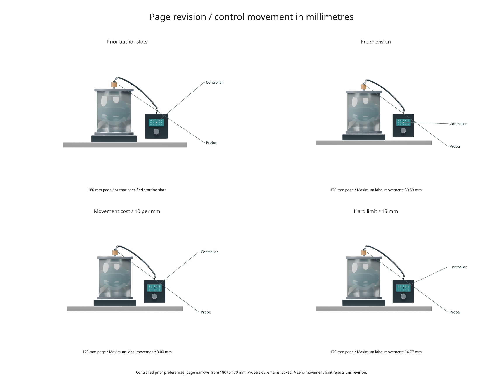

# Controlling label movement during revision

The third research preview adds physical movement costs and hard movement limits
to the experimental figure planner. It is available in the development checkout,
not the stable 3.0 PyPI package.



[Executable study](../examples/research_revision.py) ·
[Recorded reports](assets/research-preview/revision.json) ·
[Full-size figure](../gallery/research-revision.png)

## Physical position versus label slot

A `SlotLock` preserves a view, side and row. Resizing a panel or adding an earlier
panel can still move that slot on the page. The new controls measure the actual
distance between a surviving label's previous and proposed positions.

```python
from inklet.experimental.figure_planner import plan

before = plan(targets, views, width=180)
if not before.feasible:
    raise ValueError(before.issues)

after = plan(targets, views, width=170, previous=before,
             displacement_penalty=10, max_displacement_mm=15)
if after.feasible:
    evidence = after.report()
    print(evidence['constraints']['revision_displacement_mm'])
    print(evidence['score_terms'])
else:
    print(after.issues)
```

- `displacement_penalty=10` adds ten cost units per millimetre of movement,
  summed across labels. It is a soft preference, with default zero.
- `max_displacement_mm=15` is a hard limit for **each surviving target**.
  Its default is `None`. Zero requires the same physical position, within a
  1e-9 mm numerical tolerance; it does not mean unlimited movement.
- Active movement controls require a feasible `previous` plan. Stable target
  IDs establish correspondence. New targets have no old position; removed
  targets are ignored.
- `move_penalty` continues to penalize discrete slot and view changes. It can
  be combined with physical movement controls, or set to zero to isolate them.

Positions are the label's **inner-edge centre in millimetres from its plan's
own top-left corner**. The calculation includes page width, image scale, label
measurements and preceding stacked panels. It precedes document placement,
centering or later transforms. It is not a guarantee of absolute position in
an enclosing PDF page, nor does it bound movement of every glyph after text edits.

Hard limits filter candidate assignments before both the linear solver and
optional crossing refinement. Crossing reduction cannot override them. The
solver still searches only its finite camera/size/slot candidates; an infeasible
answer does not rule out an arbitrary hand-designed layout.

## Recorded experiment

```sh
python examples/research_revision.py --blender /path/to/blender
```

The recipe creates an original laboratory template and renders its Front view
with depth. `--scene existing.blend` reuses a compatible laboratory template.
The controlled prior has two deliberately specified label slots. The page then
narrows from 180 to 170 mm while the probe's slot remains locked. The controller's
surface samples require 70% visibility and 6 mm visible extent throughout.

| Revision | Maximum label movement | Feasible |
| --- | ---: | --- |
| Free, no history costs | 30.59 mm | Yes |
| Movement cost, 10 per mm | 9.00 mm | Yes |
| Hard 15 mm limit | 14.77 mm | Yes |
| Hard zero limit | — | No |

The camera and scene geometry stay fixed. These are controlled author preferences,
not typical-case performance or a perceptual-quality benchmark. Preferring less
movement can retain longer or crossed leaders. The JSON includes all reports,
render provenance and the rejected case; infeasible plans cannot be drawn.

## Evidence and prior work

Report schema `inklet.figure-plan/0.3` adds previous physical positions, movement
controls and `score_terms`. The terms cover leader length, selected views, image
shrinkage, changed slots, changed views, crossings and physical displacement.
Their sum is the reported score. Alternatives include the same decomposition;
infeasible plans have no score terms. The earlier study's saved JSON remains
schema 0.2 as a historical record.

This is an application of established ideas about coherent labeling, not a
claim of a new labeling principle. [Labels on Levels (TVCG 2019)](https://dcgi.fel.cvut.cz/wp-content/wpallimport-dist/publications/pdf/publications-2019-kouril-tvcg-lol-paper.pdf)
biases label placement toward earlier positions in crowded 3D biological scenes.
Inklet applies an explicit millimetre-based cost and optional bound to static
figure revisions; it does not implement that paper's hierarchy, representative
instance selection or animated transitions.

The [biology example](biology-panels.md) provides a separate test of dense plots
and shared measurements. Applying these revision controls to a mixed document
of plots and 3D panels remains future work.
