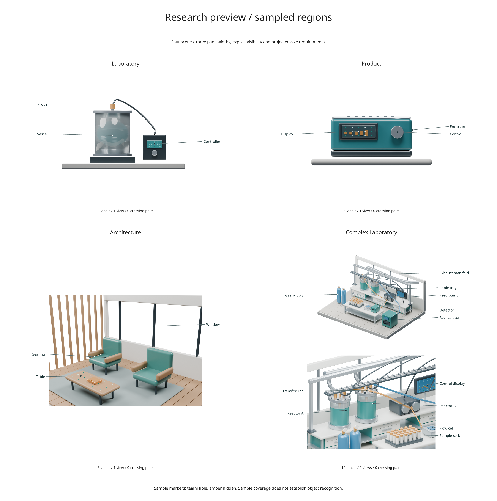
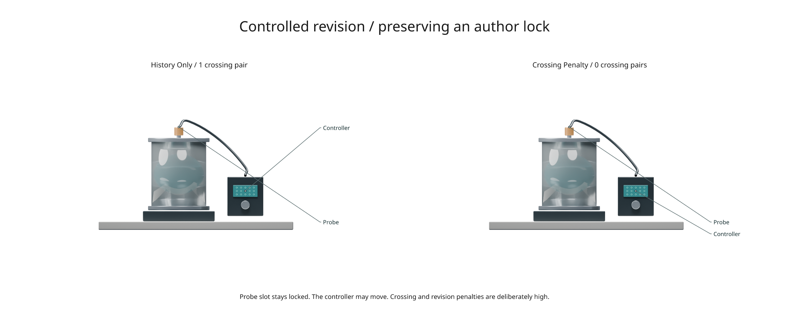

# Research preview: regions and crossings

The second preview adds sampled-region requirements, optional leader-crossing
reduction, and physical label-displacement measurements. It is available from
the development checkout as **3.1.0.dev2** in `inklet.experimental.figure_planner`.
The [first preview](research-preview.md) explains camera selection and author locks.



[Run the study](../examples/research_planner_study.py) ·
[Full recorded results](assets/research-preview/study.json)

## Require more than a visible anchor

A single visible point does not establish that a component can be identified.
`Region` lets an author supply surface samples and require both a visible fraction
and a minimum projected extent:

```python
from inklet.experimental.figure_planner import Region, Target, plan

surface = Region(
    samples=((-0.5, 0, 1), (0, 0, 1), (0.5, 0, 1)),
    min_visible_fraction=0.7,
    min_span_mm=8,
)
target = Target("display", "Display", (0, 0, 1), region=surface)
result = plan([target], views, width=180, crossing_penalty=25)
```

This snippet requires your rendered `views` and surface points in the same scene
coordinate system. Choose samples on the geometry you mean to identify. The
planner does not infer the association between a sample set and an object.

Every supplied sample enters the denominator, including samples outside the
frame or with unknown depth. The visible fraction counts only in-frame samples
that pass the depth test. Missing depth cannot satisfy a region requirement,
even if the target itself uses `visibility="in_frame"`.

The visible extent is the longest side of the visible samples' projected bounding
box, measured **after scaling to the candidate image width**. This can rule out
an image-size choice that would otherwise shorten leaders. The target's own
anchor must also satisfy its visibility policy. Regions require 2–4096 distinct
finite samples, a fraction in `(0, 1]`, and a positive extent.

These are sample-based requirements. They do not measure visible pixel area,
continuous surface coverage, readability of text inside a raster image, or human
object recognition. Sparse or poorly chosen samples can miss occlusion. The
report retains sample counts, unknown/out-of-frame evidence, visible fractions
and the selected projected extent so authors can inspect the decision.

## Reduce crossings without moving locked labels

`crossing_penalty=25` adds 25 mm-equivalent cost per crossing leader pair. The
planner first solves its usual linear assignment, then searches for improving
moves to free slots and swaps between two labels. Every move preserves visibility,
region-size constraints, unique slots and author locks.

The crossing measure counts proper intersections of the actual two-segment
leaders, once per pair and only within a panel. Shared endpoints and collinear
overlaps are excluded. It does not measure stroke clearance or intersections with
scene features.

This pair cost changes the optimization problem. With `crossing_penalty=0`
(the default), the finite linear problem is solved exactly as in the first
preview. With a positive penalty, refinement is a **bounded local search**;
it does not guarantee a global optimum or zero crossings. The total score may
trade longer leaders or changed prior slots for fewer crossings. Hard locks
remain mandatory even when they force a crossing.

`max_refinement_steps` defaults to 12 and may be zero. Each accepted step strictly
reduces the combined cost. Reports include the initial/final crossing counts,
step count, assignment method, and either `local_optimum` or `step_limit`.
A step-limit result is feasible but does not claim convergence. Enumeration of
camera subsets and image sizes still obeys `max_evaluations`.

## Measure actual revision movement

`Plan.label_positions()` returns each label's inner-edge centre in millimetres
from the plan's top-left corner. The report includes those positions and
`constraints.revision_displacement_mm` for IDs shared with the previous plan.

This catches movement that a slot-change count misses: keeping the same view,
side and row can still move a label when the page or image changes size. The
coordinates describe the plan itself, before a document places or transforms it.
Physical movement is reported as evidence; the current preservation cost still
penalizes slot changes rather than distance moved.

The recorded dev2 report schema is `inklet.figure-plan/0.2`.
The [third preview](research-revision.md) adds movement controls and schema 0.3. The added region evidence,
refinement status, crossing pairs and page positions are experimental.

## Reproduce the study

From a development checkout installed with `pip install -e '.[render]'`:

```sh
python examples/research_planner_study.py --quality final
```

Use `--blender /path/to/blender` to select an installation. The script creates
original laboratory, product and architectural templates plus the complex lab,
and renders their authored cameras with depth. Cycles defaults to an available
GPU, with CPU fallback during discovery.

It compares three methods at 120, 180 and 240 mm page width for **36 cases**:

| Method | Point visibility | Sampled region / minimum extent | Crossing penalty |
| --- | --- | --- | --- |
| Point | Required | None | 0 |
| Region | Required | At least 70% / 8 mm | 0 |
| Region + crossings | Required | At least 70% / 8 mm | 25 |

All methods share the same scene snapshots, font size, page-height bound, camera
bank, and maximum of two selected views. Region samples are prescribed on a
controller readout, product display, tabletop or laboratory control display.
Each scene's coordinate-to-metre conversion and depth tolerance are recorded.
The architecture case explicitly chooses exposed table and mullion anchors;
the template's default table anchor is under its book.

Planning time excludes Blender rendering and export. The output contains full
JSON reports, individual feasible figures and a four-scene comparison. A
feasible 180 mm region+crossings plan is preferred for the gallery; otherwise
the script uses another feasible width and retains every failure in the data.

## Recorded results

The checked final-quality run contains **32 feasible plans and four explicit
failures**. The two region methods reject both laboratory scenes at 120 mm
because the sampled readouts cannot reach the required 8 mm projected extent.
Their point-only plans pass. Product and architecture pass at all three widths.

At 180 and 240 mm, the complex lab's point-only plan selects Overview + Services;
adding the region requirement selects Overview + Process. Services exposes only
9 of 15 control-display samples (60%), while Process exposes 14 of 15 (93.3%).
At 180 mm the selected visible extent is 11.69 mm.

All feasible ordinary study cases already have zero proper leader crossings.
The optional crossing penalty therefore makes no changes to those layouts.
Its effect is demonstrated separately in the controlled revision below. These
results are specific to the authored cameras, sample sets and render settings;
they do not establish general superiority over point-only planning.

## What this experiment can establish

The tests check that sampled visibility and projected extent actually constrain
camera/size choices, and that local moves/swaps reduce the stated objective while
preserving hard constraints. They also cover forced crossings, free-slot moves,
zero-step limits, unknown depth and physical movement with unchanged slots.
The linear assignment continues to be checked against exhaustive small problems.

The scene study measures the effect of adding constraints to this planner. It
is not a comparison with expert authors or other visualization systems, and a
lower crossing count alone does not establish better figure quality. The next
experiments should vary sample density and camera candidates, measure object
regions from rendered IDs, and compare author correction effort.

## Controlled crossing revision



The additional controlled case starts with two deliberately crossed author
preferences on the laboratory's Front view. It retains the probe's hard slot
lock and permits the controller label to move. History alone retains one
crossing; a high crossing penalty removes it by moving the controller.

The penalties (1000 per changed slot and 5000 per crossing pair) are deliberately
large to isolate the behavior. The camera, page, geometry and region requirement
are identical in both runs. This is an adversarial solver check, not evidence
that typical figures need those weights. The prior plan and both revised plans
are included under `controlled_revision` in the recorded JSON.

Use `result.diagram(show_regions=True)` to draw sample markers for inspection.
Teal means visible, amber hidden and grey unknown. Out-of-frame samples remain
in the evidence but are not drawn beyond the image boundary.
