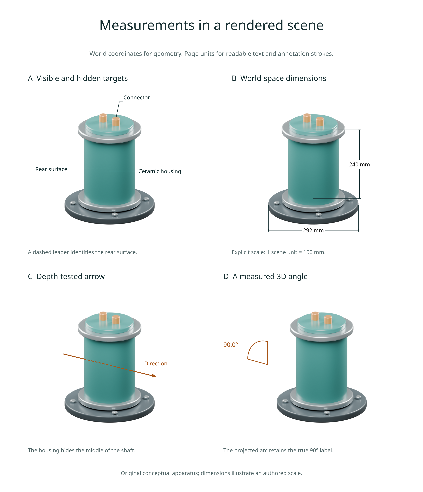

# Scene annotations and measurements

Available in **3.0.0.dev5**. Add labels, arrows, length dimensions and angle
measurements to a rendered scene. Geometry uses world coordinates; text,
leader clearance, offsets and stroke widths use page units. All four helpers
return vector overlay layers without copying the scene image.



## Label a world point

Render your own Blender scene with a depth pass, then compose with its origin:

```python
import inklet as i

scene = i.render_blend('apparatus.blend', width=90, camera='Overview',
    engine='CYCLES', quality='final', passes=('depth',))
label = scene.annotate3d((.5, 0, 1.2), 'Probe', side='e', clear=8,
    size=i.pt(8), hidden='dash', leader_style={'stroke_width': .25})
art = i.overlay([scene.diagram, label], align='origin')
doc = i.document(width=120, margin=6)
doc.add('apparatus', art)
doc.compile().save('annotated.svg', 'annotated.pdf')
```

`side`, `clear`, `avoid`, `head`, `leader` and text styling follow
[`annotate()`](diagrams.md). `leader_style` sets the leader's stroke options.
`avoid` accepts diagrams or rectangles in the same centred image coordinates;
independently created labels are not automatically aware of each other.
Pass their label bounds as rectangles when coordinating several calls.

The label targets one exact world point. With `hidden='omit'` (default), a
hidden target produces an empty layer retaining the scene frame. `hidden='dash'`
keeps the label and dashes its entire leader when the target is obscured.
`hidden='show'` keeps an in-frame label regardless of depth. Out-of-frame targets
are always omitted. A screen-space leader is not itself depth-tested.

Labels may extend outside the image; their extents participate in page layout
and export bounds. Every layer keeps an `origin` anchor, so use
`align='origin'` even when its bounding box is no longer centred on the image.
The scene diagram is unchanged. Intentional leader crossings of that scene
are declared to the diagnostics; unrelated crossings remain checked.

## Measure a length

```python
length = scene.dimension3d((0, 0, .4), (0, 0, 2.8),
    scale=100, unit='mm', offset=22, hidden='show', size=i.pt(8))
```

The label is the **Euclidean 3D distance multiplied by `scale`**, independent
of perspective or foreshortening. Here 2.4 world units become 240 mm.
Inklet does not infer metres or millimetres from Blender's unit settings:
the default is `scale=1, unit='scene units'`. Supply the conversion explicitly.
`precision` controls decimal places (default 3, trailing zeroes removed).
An explicit `text` string or Diagram overrides the displayed label; the measured
value remains in the export manifest.

The dimension line and witness lines are screen-space drafting geometry.
`offset` moves the line along the normal `(-dy, dx)` of the projected a-to-b
span, in millimetres. `tick`, `witness`, `plate`, `size` and stroke options
follow [`dimension()`](diagrams.md).

Visibility tests **both endpoints**, not the dimension line. `omit` hides the
whole dimension when either endpoint is hidden; `dash` dashes all its lines
when either is hidden; `show` draws it regardless of depth. Both endpoints must
be in frame in all modes. Coincident projected endpoints raise `ValueError`,
including a length viewed directly along its axis.

## Draw a directional arrow

```python
direction = scene.arrow3d((-1.8, -.1, 1.5), (1.8, .1, 1.5),
    hidden='dash', head_size=1.8, stroke='#bb641f', stroke_width=.4)
```

The shaft uses the clipping and sampled depth tests from
[`path3d()`](scene-paths.md). `head` accepts `triangle`, `open`, `dot` or `none`.
`head_size` is a page length, independent of perspective, and shrinks for very
short projected arrows. The head is drawn only at the original tip: clipped
arrows do not acquire a new head at the image edge.

Hidden tips have no head in `omit` and `dash` modes. `show` draws the head at an
in-frame tip without a depth test. Head visibility samples the tip, not the
whole triangle or dot; a head can overlap a nearby silhouette. Shafts that
project to a single point have no head.

## Measure an angle

```python
angle = scene.angle3d((1, 0, 1), (0, 0, 1), (0, 0, 2),
    radius=.6, hidden='show', side='e', clear=3, size=i.pt(8),
    stroke='#bb641f', stroke_width=.3)
```

Arguments are **a, vertex, b**. Inklet measures the minor angle between the
two world-space arms and labels it in degrees (default precision 1).
The arc lies in their 3D plane before projection; the apparent angle on the
page can differ from its true value. `radius` uses world units and defaults
to 30% of the shorter arm. Zero-length or collinear arms are rejected.

The arc uses 64 straight segments plus two radial lines. These are depth-tested
as a single path; `step_px` and `max_samples` control visibility sampling, not
arc tessellation. The label sits beside the projected arc midpoint and follows
that point's visibility. `side` and `clear` place it in page coordinates.
Use an explicit `text` to replace its displayed value.

## Reproduce the example

```sh
python examples/v3_scene_annotations.py --quality final
```

The script creates an original sensor scene and exports PNG, SVG, PDF, an HTML
review and `annotations.json` to `out/v3-annotations`. It uses automatic GPU
selection with CPU fallback. To reuse the dev4 scene, pass
`--scene out/v3-paths/sensor.blend`. `--blender /path/to/blender` selects an
installation. The dimensions illustrate an explicit authored scale; this is
a conceptual apparatus, not a manufacturing drawing.

[Figure source](../examples/v3_scene_annotations.py) ·
[Scene source](../examples/blender/occlusion_scene.py) ·
[Figure gallery](examples.md)

## Saved snapshots and precision

After rendering, these helpers need neither Blender nor NumPy. They use the
saved camera and depth pixels, with the same resolution, transparency and
silhouette [limits as vector paths](scene-paths.md#precision-and-limits).
`depth_bias` is in world units. All helpers require a depth pass except in
`show` mode. A point on a perspective camera plane has no finite projection.

Export manifests include `rendering.scene_annotations`: world coordinates,
measured values, visibility controls, source cache key and final placement.
Path-based annotations also record their sampling under `scene_overlays`.
Custom label text does not change the measured value. This metadata does not
automatically convert units or validate the physical meaning of a model.
