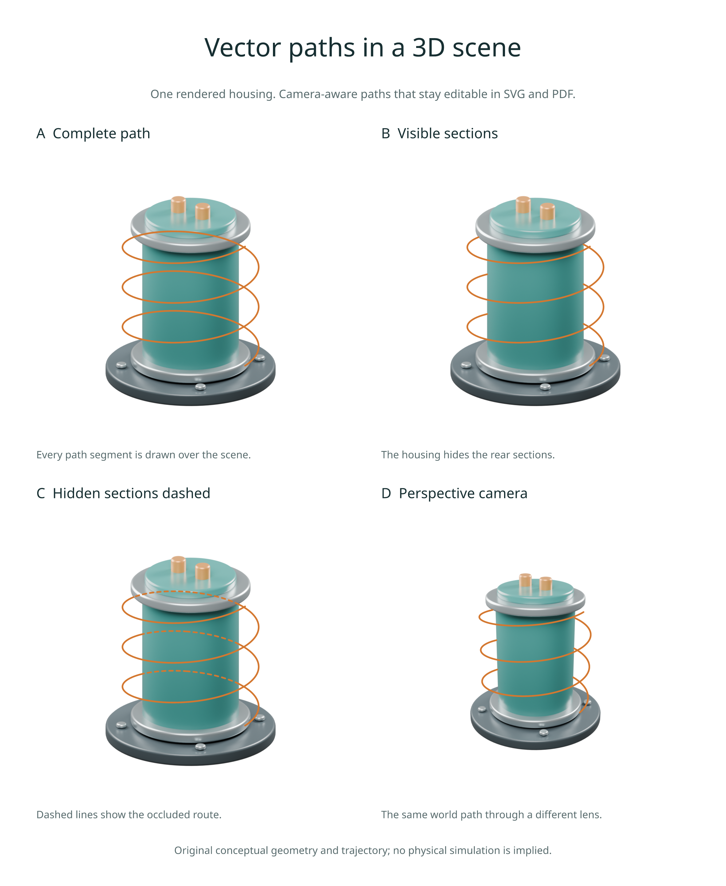

# Camera-aware vector paths

Available in **3.0.0.dev4**. Add a trajectory, construction line or route to a
rendered scene, while keeping that path editable in SVG and PDF. The saved
camera and depth pass determine where the path appears and which parts objects
hide. Editing a path does not run Blender again.



## Render once, add paths

This example requires your own `.blend` file and world-space coordinates:

```python
import inklet as i

scene = i.render_blend('apparatus.blend', width=90, camera='Overview',
    engine='CYCLES', quality='final', passes=('depth',))

route = [(-1, 0, 1), (0, 0, 2), (1, 0, 1)]
visible = scene.path3d(route, stroke='#d47830', stroke_width=.4)
figure = i.overlay([scene.diagram, visible], align='origin')
doc = i.document(width=102, margin=6)
doc.add('scene', figure)
doc.compile().save('route.svg', 'route.pdf')
```

The points use **Blender scene-world units**. The resulting path uses Inklet
millimetres, with its origin at the centre of the rendered image. Use
`align='origin'` to keep paths registered with the scene and other annotations.
The returned layer retains the image's physical frame even when no path is visible.

| Hidden sections | Behaviour | Depth pass needed |
| --- | --- | --- |
| `hidden='omit'` (default) | Draw visible sections only | Yes |
| `hidden='dash'` | Draw hidden sections with 1 mm dashes and gaps | Yes |
| `hidden='show'` | Draw the entire path over the scene | No |

All three modes clip the path centreline to the near/far planes and image frame.
Paths remain polylines in both SVG and PDF. Their colour and width use normal
Inklet stroke options. A visible `stroke_dash` style is independent of the fixed
hidden-section pattern. The paths are annotations: they do not cast shadows or
appear in scene reflections.

## Project a point

```python
point = scene.project((.5, 0, 1.2))
print(point.point)      # Vec2 in centred millimetres; positive y points down
print(point.depth)      # axial camera distance, in scene units
print(point.in_frame)   # includes near/far and image bounds
print(point.visible)    # True/False with depth; None without it
```

Orthographic and perspective cameras preserve the authored position, rotation,
lens, camera shift and frame aspect ratio. A point on the perspective camera
plane has no finite projection and raises `ValueError`. Points outside the
frame report `visible=False`.

You can register a projected point for Inklet's annotation tools:

```python
scene.diagram.anchor('probe', point.point)
```

Use `point.visible` to decide whether to label an obscured feature. This samples
the rendered depth; it differs from the scene worker's geometric ray tests for
named landmarks, which can exempt the landmark's own object.

## Precision and limits

Cycles Z is **axial camera depth**, for both supported camera types. It is not
Euclidean distance along a perspective ray. This is checked against real
orthographic, shifted perspective and off-axis Blender renders; see the
[Cycles camera implementation](https://github.com/blender/blender/blob/blender-v4.5-release/intern/cycles/kernel/camera/camera.h).

Visibility uses the nearest depth pixel along the **stroke centreline**. The
default `step_px=1` samples each projected segment at one-pixel intervals.
Perspective samples use reciprocal-depth interpolation. Collinear samples are
collapsed before export, so sampling a straight path does not require hundreds
of vector vertices.

Depth is a finite-resolution pass without antialiasing. At silhouettes, precision
is limited by the render resolution and sample spacing; this is not an exact
mesh intersection or a per-pixel mask of the whole stroke. Thick strokes can
extend beyond an occlusion boundary. Increase render DPI for finer boundaries.
The centreline is clipped to the frame; stroke caps may extend half a stroke
width beyond it, as with ordinary plot paths.

`depth_bias=1e-3` allows that much additional depth in scene units before a point
is hidden. Adjust it for your scene scale or points intended to lie on a surface.
`max_samples=200_000` bounds visibility work across the whole path; an oversized
request raises an error instead of producing an incomplete path.

Opaque, sharp surfaces are the most reliable case. Glass, alpha transparency,
volumes, motion blur and depth of field can differ from the first surface
reported by the Z pass. Invalid depth pixels are treated as hidden. These paths
do not simulate optical transmission.

## Reproduce the figure

From a development checkout with Blender and the rendering extras installed:

```sh
python examples/v3_scene_paths.py --quality final
```

This creates an original sensor housing and two cameras, renders both using the
GPU/CPU policy from [render jobs](render-jobs.md), then exports four vector-path
variants. The geometry and winding are conceptual, not a physical simulation.
No downloaded assets are required.

Open `out/v3-paths/figure.html`. The folder also contains SVG, PDF and PNG exports,
the editable `sensor.blend` scene, and `projection.json` with camera and overlay
records. Use `--blender /path/to/blender` to choose an installation.

[Figure source](../examples/v3_scene_paths.py) ·
[Blender scene source](../examples/blender/occlusion_scene.py) ·
[Back to the gallery](examples.md)

Scene snapshots retain projection and numeric pixels. These operations need
neither Blender nor NumPy after rendering. Older snapshots without camera
projection must be rendered again. Export manifests record each path's source
cache key, sampling controls, visibility runs and final placement under
`rendering.scene_overlays`.
