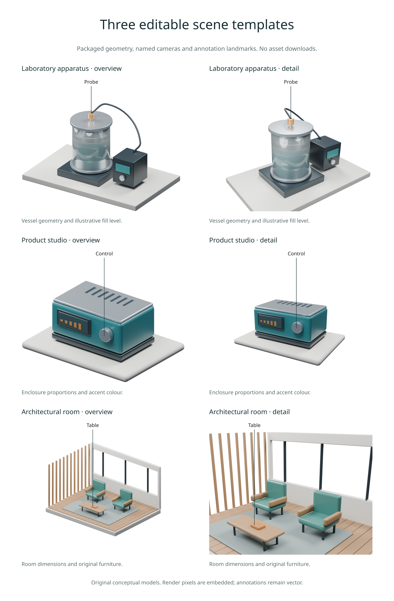

# Reusable scene templates

Available in **3.0.0.dev6**. Create an editable Blender scene directly from an
installed Inklet package. Templates include original geometry, materials,
studio lighting, named cameras and landmark empties. Creation requires Blender
4.2 or later, but does not render pixels or download assets.



## Create and render a scene

```python
import inklet as i

catalogue = i.scene_templates()
path = i.create_scene('product', 'device.blend',
    parameters={'width': 3.2, 'accent': '#246a72'})
scene = i.render_blend(path, width=90, camera='Overview', quality='preview',
    passes=('depth',), landmarks=catalogue['product']['landmarks'])
point = scene.metadata['landmarks']['control']['world']
label = scene.annotate3d(point, 'Control', side='e', clear=10,
    hidden='show', size=i.pt(8))
doc = i.document(width=120, margin=6)
doc.add('device', i.overlay([scene.diagram, label], align='origin'))
doc.compile().save('device.svg', 'device.pdf')
```

`create_scene()` returns the absolute output `Path`. It requires a `.blend`
extension and refuses an existing file. Use a new path for variants; pass
`overwrite=True` only when replacing the destination is intended. The complete
file is generated in a temporary directory beside its destination, then
committed atomically. Failed or cancelled generation preserves existing files.
The default no-overwrite commit uses a same-filesystem hard link, requiring a
filesystem that supports hard links; explicit replacement uses atomic rename.

`blender=`, `timeout=90`, `progress=` and `cancel=` control the authoring process.
`cancel` accepts a threading event, as with [render jobs](render-jobs.md).
Rendering is a separate call and uses the existing automatic GPU selection
with CPU fallback. `scene_templates()` only reads packaged data and needs
neither Blender nor rendering extras.

## Choose a template

| Template | Geometry | Authored units | Cameras |
| --- | --- | --- | --- |
| `laboratory` | Vessel, fluid, probe, controller and bench | 1 scene unit = 0.1 m (dm) | Overview, Detail, Front |
| `product` | Layered enclosure, display, control dial and plinth | 1 scene unit = 0.1 m (dm) | Overview, Detail, Front |
| `architecture` | Open room, rear window, timber screen, chairs and table | 1 scene unit = 1 m | Overview, Detail, Plan |

Overview is orthographic; Detail is perspective. Front and Plan are
orthographic. The names are stable across parameter changes. Detail cameras
intentionally crop parts of the surrounding bench or room.

The catalogue maps short landmark names to named Blender empties. Pass that
mapping to `render_blend(landmarks=...)` to project the points without hardcoding
their coordinates. These points follow the generated parameters. After manual
edits, move the empties alongside their targets as needed.

## Parameters

All three accept `accent`, a six-digit `#RRGGBB` colour. It is interpreted as
sRGB and converted to Blender's linear shader values. Numeric parameters use
the template's scene units and must be finite numbers within these ranges:

| Template | Parameter | Default | Range |
| --- | --- | --- | --- |
| laboratory | radius | 0.8 | 0.5–1.2 |
| laboratory | height | 2.0 | 1.0–3.0 |
| laboratory | fill_fraction | 0.6 | 0.1–0.9 |
| product | width | 2.8 | 1.8–4.0 |
| product | depth | 1.8 | 1.2–3.0 |
| product | height | 1.1 | 0.8–2.0 |
| architecture | width | 5.4 | 4.0–8.0 |
| architecture | depth | 4.2 | 3.0–6.0 |
| architecture | height | 2.9 | 2.4–4.0 |

Unknown parameters, numeric strings, booleans, invalid colours and out-of-range
values fail before Blender starts. `scene_templates()` returns fresh dictionaries
describing every parameter; changing that dictionary does not change defaults.

Templates are deliberately small starting points. Open the output in Blender
to edit geometry, cameras and lighting freely. Materials are procedural and
the file has no external textures or linked libraries, so it can be relocated
without an asset directory. These are conceptual models, not validated
instruments, product specifications or construction drawings.

## Measurements and provenance

Blender's metric unit settings match the authored conversion above. Inklet's
[`dimension3d()`](scene-annotations.md) still requires an explicit scale: for
a product template, `scale=100, unit='mm'` converts its world coordinates to
millimetres. This avoids silently changing measurements when a scene is edited.

Each file retains its original recipe as the `inklet_template` scene property
and an `inklet-template.json` text block. The record includes parameters,
template revision, generator and catalogue hashes, Blender version, cameras,
landmarks, units and MIT attribution. `inspect_blend()` exposes it under each
scene's `template`; rendered snapshots and export manifests retain it as well.

The record describes **generation**, not the current geometry after manual
edits. Inklet separately hashes the actual `.blend` file for render caching.
Regenerating a template may produce different file bytes even with unchanged
parameters; byte-identical `.blend` serialization is not promised.

## Reproduce the six-view figure

From a development checkout:

```sh
python examples/v3_scene_templates.py --quality final
```

This creates all three scenes under `out/v3-templates`, renders Overview and
Detail, and exports PNG, SVG, PDF and an HTML review. Repeated runs reuse the
existing scenes. `--rebuild` replaces those generated files. Use
`--blender /path/to/blender` to select an installation.

[Figure source](../examples/v3_scene_templates.py) ·
[Template catalogue](../src/inklet/three/templates.json) ·
[Blender authoring source](../src/inklet/three/blender/template_worker.py)

For a larger example combining many instruments and annotations, see the
[instrumented laboratory cutaway](complex-scene.md).
