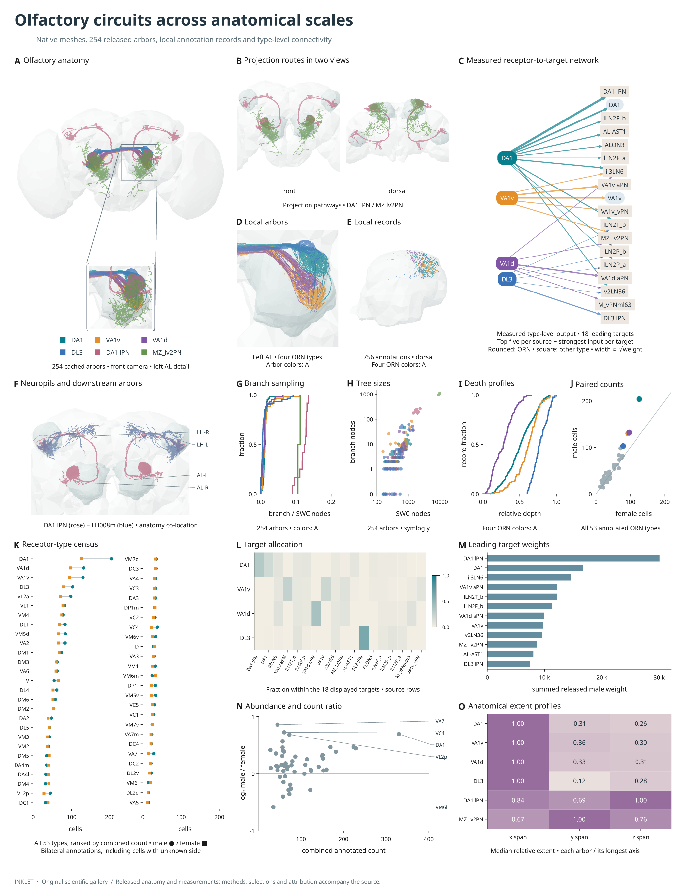
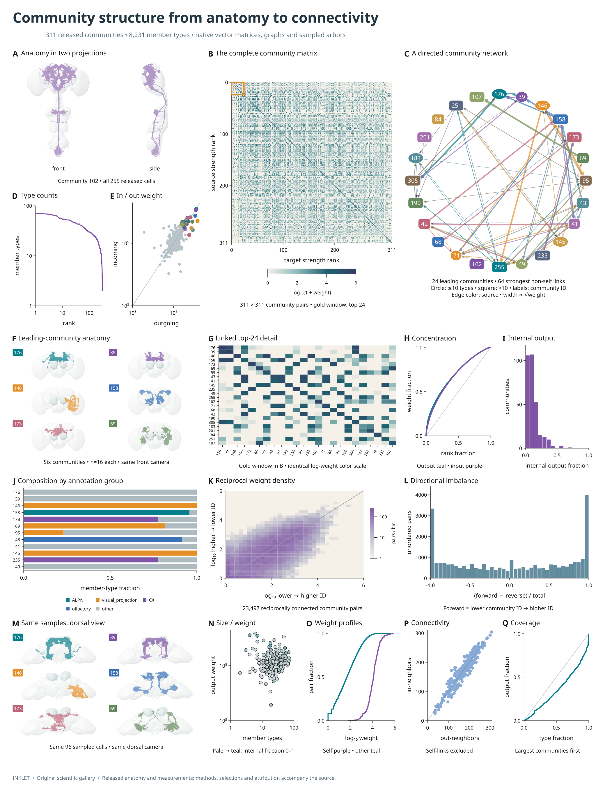

# Original scientific figure gallery

Two original multi-panel figures made with Inklet, using released fly-connectome
anatomy and tables. Every surface, arbor, annotation, graph, matrix and axis is
native vector geometry. The SVG and PDF exports contain editable text and no
embedded screenshots. These examples use different layouts and analytical
views from the paper that supplied the initial visual inspiration.

## Olfactory circuits across anatomical scales



[PDF](assets/scientific/olfactory.pdf) ·
[Editable SVG](assets/scientific/olfactory.svg)

Fifteen coordinated panels combine brain and neuropil surfaces, front and dorsal
projections, 254 cached arbors, a directed receptor-to-target network, local
annotation records, all 53 annotated ORN-type count pairs, an output-allocation
matrix, and morphology profiles. Close-ups share their source camera; their
locator boxes describe the displayed viewport. The network uses released
weights, not connections inferred from the anatomy picture.

Panels A–J use the six-type anatomy key; local records use its first four ORN
colors. The male/female census has its own explicit key. Skeleton branch counts
count nodes with multiple valid children, excluding missing-parent sentinels.
They describe reconstruction sampling, not synapse counts. Anatomical extent
profiles normalize each arbor by its longest registered coordinate span.

## Community structure from anatomy to connectivity



[PDF](assets/scientific/communities.pdf) ·
[Editable SVG](assets/scientific/communities.svg)

Seventeen panels combine the complete 311-community adjacency matrix and a
linked top-24 detail, a network with 64 measured directed links, multiple
anatomical projections, annotation-group composition, reciprocal-weight density,
directional imbalance, degree distributions and cumulative coverage.

Community ranks are ordered by incoming plus outgoing released male weight,
including self-connections. The graph shows the strongest 64 non-self links
within the leading 24 communities. Annotation groups use the released class, falling back to superclass when class
is missing; each member type gets one vote using its modal annotation.
Node shapes indicate community size, not
cell shape. Graph distances have no anatomical meaning. Anatomical samples
use all 255 cached members of community 102 and up to 16 sorted body IDs from
each of the six leading communities; these are deterministic convenience
samples, not representative population estimates.

## Rebuild and adapt

[Download source and measurements](assets/scientific/scientific-gallery-source.zip) ·
[Data provenance](assets/scientific/provenance.json) ·
[Validation record](assets/scientific/verification.json) ·
[Panel layout](assets/scientific/validation.json)

Run the example from a checkout of Inklet containing the new scientific
authoring APIs:

```bash
python -m pip install -e '.[render,images,three]'
python -m pip install -r examples/inspo/requirements.txt
python examples/inspo/fly_data.py --data out/fly-data
python examples/scientific_gallery/recreate.py --data out/fly-data --dpi 220
```

The acquisition command downloads and caches public source tables, meshes and
SWCs; its full cache is over a gigabyte. The gallery additionally caches its
selected community skeletons and spatial-index annotation records. Subsequent
builds reuse the cache. The downloadable archive contains recipes and derived
measurements, not the large upstream dataset. Its README describes the source
files needed to rebuild.

Start with [scientific authoring](scientific-authoring.md) for smaller examples
of the reusable components. In the gallery recipe, each subplot is a function
of its physical width and height. `panel_mosaic` allocates spanning panels and
rebuilds their plot areas without reducing typography; `anatomy_view` handles
registered zooms; `Graph.build()` supplies routed networks; measured labels
and clear-space legends handle annotations.

## Data and interpretation

The figures are exploratory documentation examples, not new biological
findings or a reproduction of the paper's statistical analysis. All numerical
panels are recomputed from released tables or skeletons. No manually transcribed
paper values are used.

- [MaleCNS release](https://male-cns.janelia.org/download/): anatomy and released
  annotations; source attribution and license recorded in the manifest.
- [Pinned community and matched-type tables](https://github.com/flyconnectome/2025malecns/tree/67767d2233657983993ff6c2be48e836a935863c): community memberships and male connection weights.
- [Pinned FlyWire annotations](https://github.com/flyconnectome/flywire_annotations/tree/8587524c1748ce5ef2080822a2fc890fc03bf597): female type counts; these data carry a CC BY-NC 4.0 license.
- [Pinned navis-flybrains templates](https://github.com/navis-org/navis-flybrains/tree/273333c8d8bf5adeebebd274e554621462e388bd): meshes and shared plotting-space landmarks; retain the repository and template attribution.

The local AL view contains 756 sampled annotation records, with 742 unique
coordinate/type tuples. Repeated coordinates are retained; they are not claimed
to be unique presynaptic sites. The depth distribution is weighted by records.
Spatial levels 3–5 and confidence thresholds define the sample; it is not a
complete inventory of AL synapses.

Surfaces are simplified for display; degree-two arbor chains are simplified
in 3D while retaining branch and tip endpoints. Overlaid paths are X-ray
illustrations. Registration is shared across layers, but registered distances
are not treated as calibrated physical measurements. Data licenses and source
attribution remain applicable to the exported examples; the Inklet code license
does not replace upstream data licenses.
