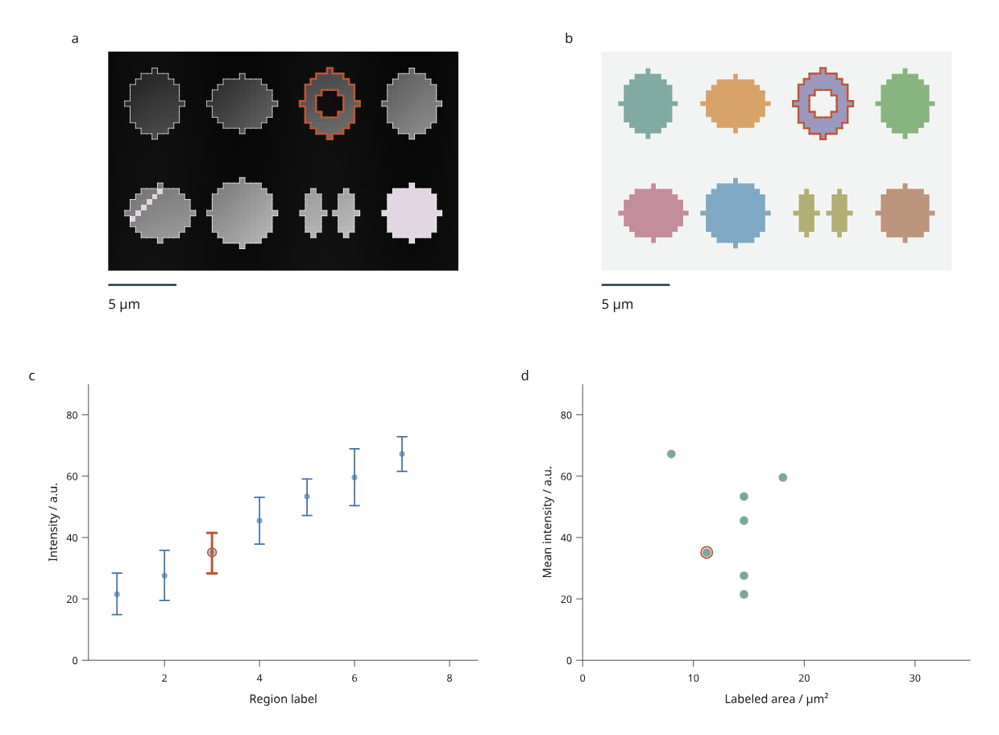

# Calibrated image measurements

Link a calibrated intensity image, a label map, regional intensity ranges and an
area comparison. Select an irregular region, save and reopen its state, replace
the image or labels, and recompile at two physical widths.

These are development APIs under `inklet.experimental`, **not part of PyPI
3.1.0**. They extend the bounded scientific workflow in Phase C of the
[4.0 roadmap](roadmap.md).



[Open the interactive report](assets/v4/scientific-report.html) ·
[Complete Python recipe](../examples/v4/scientific_report.py) ·
[170 mm version](assets/v4/scientific-report-170mm.png)

Panel **a** shows simulated intensities; **b** shows supplied labels. Regions
1–4 occupy the upper row and 5–8 the lower row. Region 3 has a hole; region 7 has
two disconnected parts. Panel **c** shows each region's mean and observed
minimum–maximum, and **d** compares mean intensity with labeled area. Orange
outlines identify region 3. The intensity window is fixed at 0–100 a.u.; pale
mauve pixels represent missing intensities. Label colors use a fixed palette.

The 40 × 64 pixel image and segmentation are original simulated MIT material by
Mark Marosi, not microscopy observations or inferred biological objects. Some
region-5 pixels and all region-8 intensities are missing in the original input.
Their labeled areas still count those pixels. Observed ranges are **not
confidence intervals** and do not estimate measurement uncertainty.

## Run the workflow

```sh
python examples/v4/scientific_report.py --render --output out/scientific
```

Click a labeled region in either image, a regional measurement mark, or a
selection button in the keyboard-accessible data table. Both disconnected parts
share one region ID. Picking uses the supplied pixel labels: a hole or an
unlabeled background pixel is not a region target. Nearby marks can still be
picked within the browser's normal pointer tolerance.

Filtering controls region boundaries, picking targets and plot marks. **The
source image remains visible as reference context**, including the intensities
and label colors of filtered regions. Area and intensity statistics always
refer to the compiled source image; filtering does not recalculate them.

The offline page includes four precompiled alternatives:

| Revision | Change | Expected measurement behavior |
| --- | --- | --- |
| Original | 0.4 × 0.4 µm pixels; missing intensities | Seven regions have intensity summaries; all eight have area |
| Calibrated | Row spacing becomes 0.6 µm; column spacing stays 0.4 µm | Every area increases by 50%; pixel counts and intensity summaries stay the same |
| Updated | Region 2 intensities increase by 5 a.u.; missing intensities are filled | Intensity summaries rebuild; areas and pixel counts stay the same |
| Relabeled | Region 8 becomes background | Its measurement row and selectable boundary disappear; the intensity image is retained |

A calibration change also updates physical image aspect and scale-bar length.
Pixels remain distinct in SVG and canvas display; non-square calibration is
represented by non-square pixels, rather than letterboxing the source raster.
Expand **Image calibration and measurements** to inspect the current spacing,
units, methods and source digest. This report updates with the revision. The
browser does not run Python or fetch a remote image during revision switches.

## Save, reopen and export

```sh
# Original saved state.
python examples/v4/scientific_report.py --state /path/to/view.json --render --output out/reopened

# State saved after choosing Calibrated in the browser.
python examples/v4/scientific_report.py --revision calibrated --state /path/to/calibrated-view.json --render --output out/calibrated

# Apply an ORIGINAL state to Relabeled, explicitly dropping removed IDs.
python examples/v4/scientific_report.py --revision relabeled --rebase-state /path/to/view.json --missing drop --render --output out/relabeled
```

The output includes the input JSON, measurements, source digest, calibration,
method report, revision report and saved state. `figure.svg` reproduces the exact
saved viewport. The 210 mm and 170 mm exports recompile the full page while
retaining selected and visible region IDs.

`--render` adds PNG and PDF using Chrome/Chromium and Pillow. Source pixels are
embedded as a lossless RGB PNG; boundaries, scale bars, plot marks and text remain
vector content in SVG and PDF. Source intensities are retained separately in
`input.json`: the display window and 8-bit color mapping do not change measured
values. HTML/SVG generation needs no optional numerical or image library.

## Calibrated source data

```python
from inklet.experimental.measurement import LabelImage

image = LabelImage(
    intensity=[[1, 2, 5, 6], [3, 4, 7, 8]],
    labels=[[1, 1, 2, 2], [1, 1, 2, 2]],
    regions=[("region-1", 1), ("region-2", 2)],
    spacing_yx=(0.5, 0.5),
    unit="um",
)
table = image.table("measurements")
assert table.columns["area"] == (1.0, 1.0)
assert table.columns["mean"] == (2.5, 6.5)
```

`LabelImage` copies rectangular Python lists/tuples into immutable snapshots.
Intensity and label shapes must agree. Intensities must be finite numbers or
`None`. Labels must be nonnegative integers within the keyed table's safe integer
range; zero means background. Every observed positive label needs exactly one
unique region ID, and every mapped label must be present. Missing, duplicate or
ambiguous correspondences fail before rendering.

`spacing_yx` declares row and column spacing. Units must explicitly be `m`, `mm`,
`um` or `nm`; there is no implicit conversion. Physical pixel edges start at
(0, 0), with X rightward and Y downward. Nonpositive or unrepresentable pixel
areas and extents are rejected.

`image.table(name)` derives these source measurements:

| Column | Definition |
| --- | --- |
| `id`, `label` | Stable region ID and supplied integer label |
| `pixels` | Number of source pixels carrying that label |
| `valid_pixels`, `missing_pixels` | Labeled pixels with/without an intensity |
| `area` | Labeled pixel count × row spacing × column spacing, in squared image units |
| `mean` | Arithmetic mean of nonmissing labeled intensities |
| `minimum`, `maximum` | Observed extrema of those same valid intensities |

An entirely missing region retains its area and counts, with `None` for all
intensity summaries. It therefore has no mean/range mark. Background pixels do
not enter region measurements. `image.report()` records these methods, units,
shape, region correspondence and the source digest.

## Build a linked image view

```python
from inklet.experimental.browser import BrowserFigure, LabelImageView

figure = BrowserFigure(image.table("measurements"), [
    LabelImageView("intensity", image, window=(0, 8), scale_bar=0.5),
    LabelImageView("labels", image, window=(0, 8), scale_bar=0.5, mode="labels"),
])
```

`window` fixes intensity-to-gray mapping. Values outside it clip for display;
missing values have a distinct color. `scale_bar` is a positive length in the
image's physical unit. The optional `palette` is a sequence of hex colors;
label `n` uses palette index `(n - 1) % len(palette)`, so removing a label does
not shift the colors of remaining labels.

The region table must agree with the image's derived measurement columns,
including their scalar types; extra columns and row reordering are allowed.
This prevents a new image from silently displaying stale areas or means.
Rebuild the table and view together when replacing the image.

Browser views currently support at most **65,536 source pixels** and **20,000
selection/outline marks**. Highly fragmented labels can reach the mark limit
first. Crop the input or simplify labels explicitly; this preview does not
silently resample or approximate region membership. The general measurement
adapter is separate from these browser limits.

## Replace input JSON

Edit the exported `input.json`, retaining explicit IDs and label correspondence:

```sh
python examples/v4/scientific_report.py --json /path/to/input.json --rebase-state /path/to/view.json --missing drop --render --output out/replacement
```

The recipe uses µm, a 5 µm scale bar and fixed plot domains. Adapt `make_views()`
for other physical units, field widths, label ranges or measurement domains.
Supplied inputs are identified separately from the built-in simulation, and
the output records their content digest. Processing happens in Python; the
browser only switches between already compiled alternatives.

This completes the bounded calibrated label-image workflow. Volume/mesh-linked
views, scalar/vector-field interaction, external microscopy file adapters for
this browser model, uncertainty inference and general editing constraints remain
outside this increment. Existing [microscopy tools](microscopy-tiff.md) and
[3D capabilities](three-images.md) remain separate foundations to connect.
