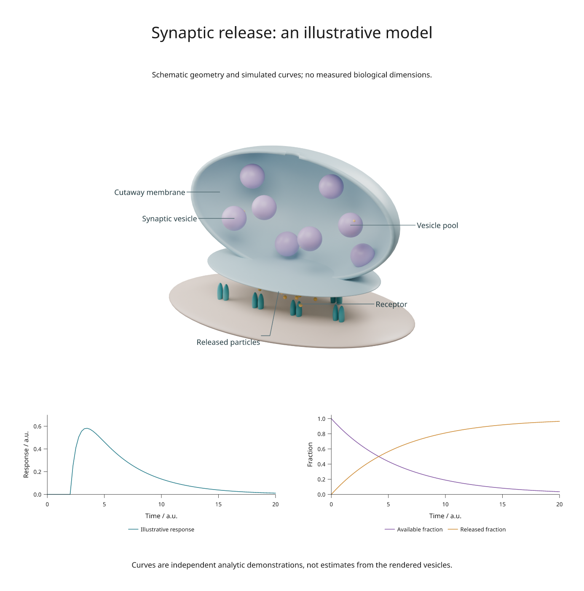

# Biological scenes with vector labels

Build an original synapse schematic in Blender, add labels in Inklet, and place
two plots below it. The scene is rendered; labels, leaders, axes and plot marks
remain vector in SVG/PDF. Changing a label does not require another Blender render.



[SVG](assets/scenes/synapse.svg) · [PDF](assets/scenes/synapse.pdf) ·
[Figure recipe](../examples/scientific_blender.py) ·
[Blender scene generator](../examples/blender/synapse_scene.py)

This is a **schematic**, with arbitrary geometry and simulated curves. Vesicle
sizes, spacing and numbers do not represent measured anatomy. For calibrated
microscopy and source segmentation meshes, see [real organelle scenes](real-biology.md).

## Build the example

Use a checkout with Blender 4.5 LTS and Inklet's rendering extra installed.
The example was rendered with Blender 4.5.13; no external meshes or textures are needed.

```sh
python -m pip install -e '.[render]'
python examples/scientific_blender.py --output out/scientific-blender
```

If Blender is outside `PATH`, add `--blender /path/to/blender`. The command
creates `synapse.blend`, SVG/PDF/PNG exports and `review.txt`. Cycles uses an
available GPU, with CPU fallback. The scene image is rendered at 300 DPI with
64 samples; see [rendering setup](blender-scenes.md#setup) for dependencies.

Open the `.blend` file to edit the materials, lights, camera or named structures.
The generator creates a half-shell membrane, an active zone, eight vesicles,
paired receptor shapes and release particles. The cutaway exposes otherwise
hidden objects; it is an explanatory construction, not a section measurement.

## Add a label without rebuilding the scene

After running the example, this code renders or retrieves the cached camera
view and places a label at a world coordinate:

```python
import inklet as i

scene = i.render_blend('out/scientific-blender/synapse.blend',
    width=140, height=105, camera='Overview', engine='CYCLES',
    samples=64, dpi=300, passes=('depth',))
label = scene.annotate3d((-1.5, -.1, 1.8), 'Synaptic vesicle',
    side='w', clear=14, hidden='show', size=i.pt(8),
    leader_style={'stroke': '#536c73', 'stroke_width': .22})
art = i.overlay([scene.diagram, label], align='origin')
doc = i.document(width=220, margin=8)
doc.add('synapse', art)
doc.compile().save('labelled-synapse.svg', 'labelled-synapse.pdf')
```

The point is in Blender world coordinates; `clear` and stroke width are in
millimetres. `size=i.pt(8)` sets 8-point text. Keep `align='origin'`: the label may
extend beyond the image without moving the camera projection.

This schematic uses `hidden='show'` to keep explanatory labels visible. For a
label that should disappear when its target is behind a surface, use
`hidden='omit'`; use `hidden='dash'` to indicate a hidden target. These options
require depth information. A screen-space label leader is not depth-tested.
See [scene annotations](scene-annotations.md) for dimensions, arrows and angles.

## Combine the scene with plots

The [figure recipe](../examples/scientific_blender.py) places the scene across
two columns, then assigns the two plots to explicit cells in the same row.
Labels participate in measured layout; their extents are included when the
scene is placed on the page.

The left curve uses `(1 - exp(-(t-2)/0.8)) * exp(-(t-2)/4)` after time 2 and zero
before it. The right curves use `exp(-t/6)` and its complement. Time and response
are arbitrary units. These formulas illustrate plot composition; they are not
fitted to the vesicles or a biological experiment.

## Adapt it for scientific work

| Task | Change |
|---|---|
| Replace schematic geometry | Import your mesh into the `.blend` scene and retain a named camera |
| Label a biological structure | Choose a world point on its surface and check the rendered projection |
| Add a physical dimension | Supply an explicit world-to-physical scale to `dimension3d()` |
| Plot measurements | Replace the analytic curves with a [typed CSV dataset](csv-figure.md) |
| Review outputs | Inspect the figure at its intended print size and read the diagnostics |

For measured anatomy, retain source calibration and provenance through mesh
import. Blender scene units alone do not establish a physical scale. The
[real microscopy example](real-biology.md) demonstrates this with organelle
surfaces and associated measurements; the [annotated laboratory](complex-scene.md)
shows a larger apparatus with detail views.
