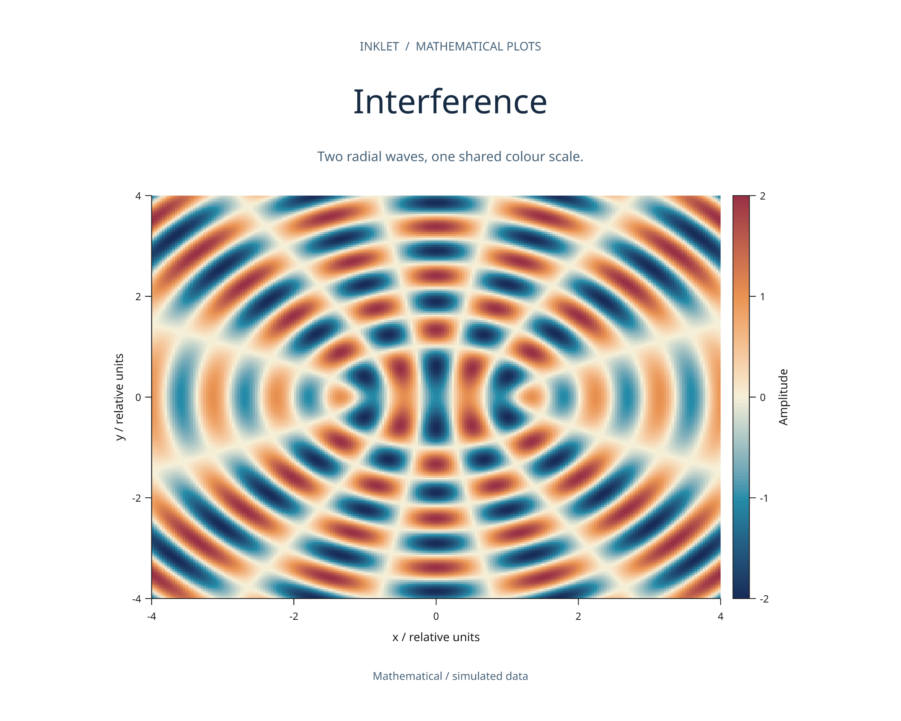
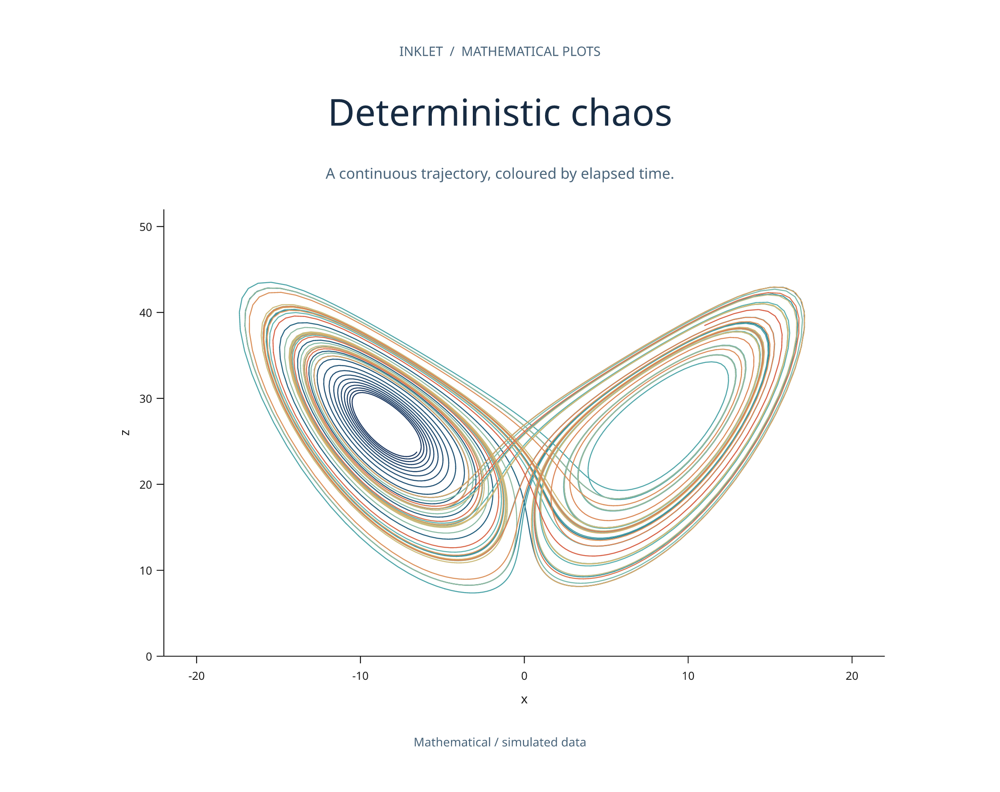
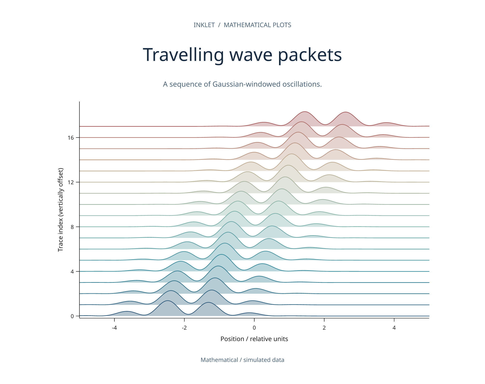
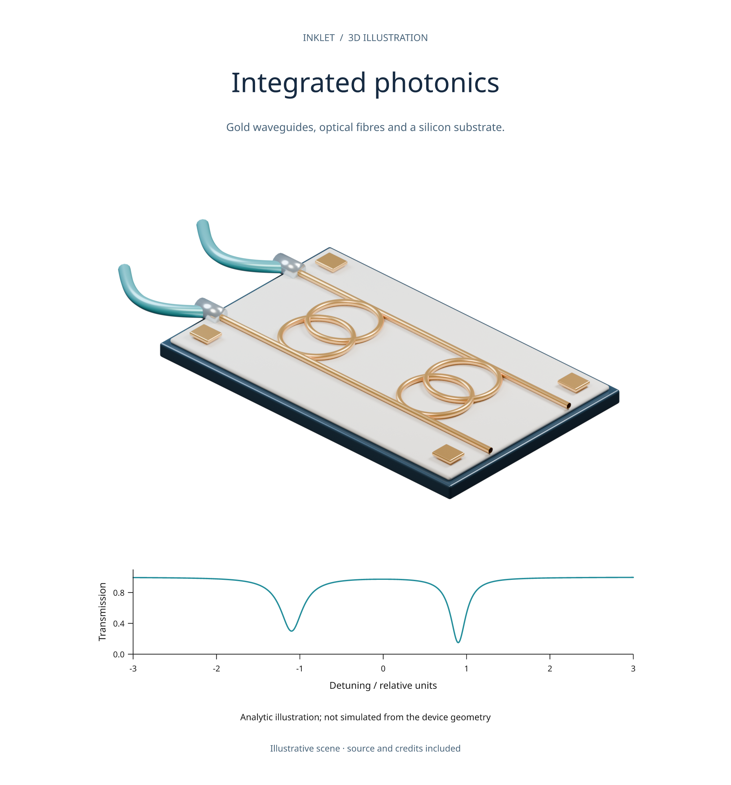
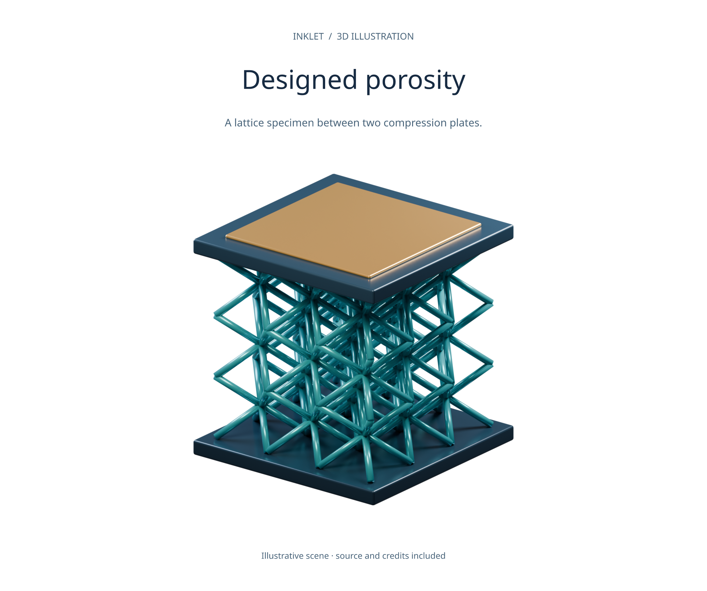
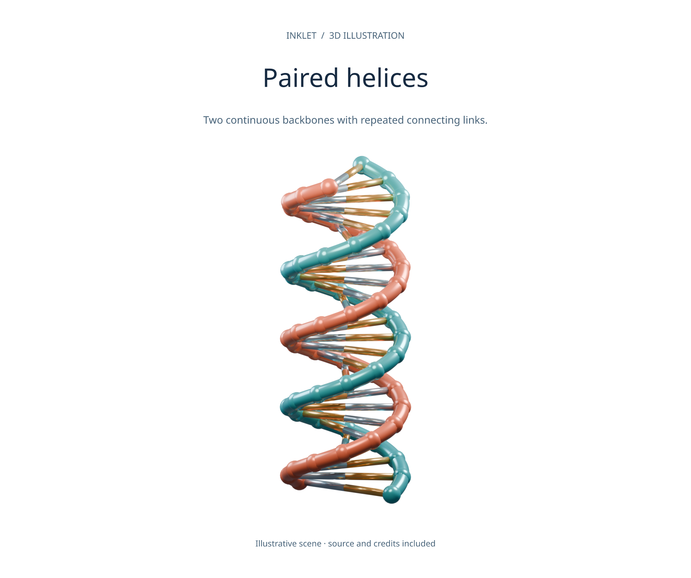
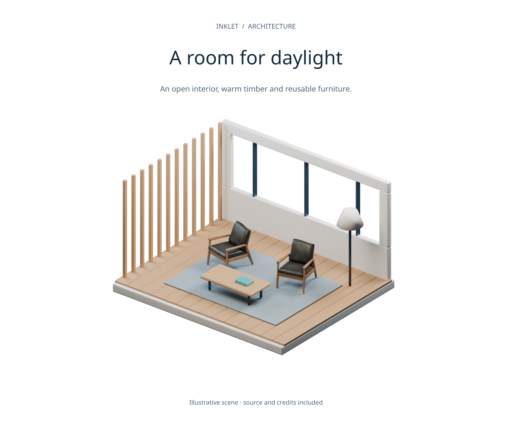
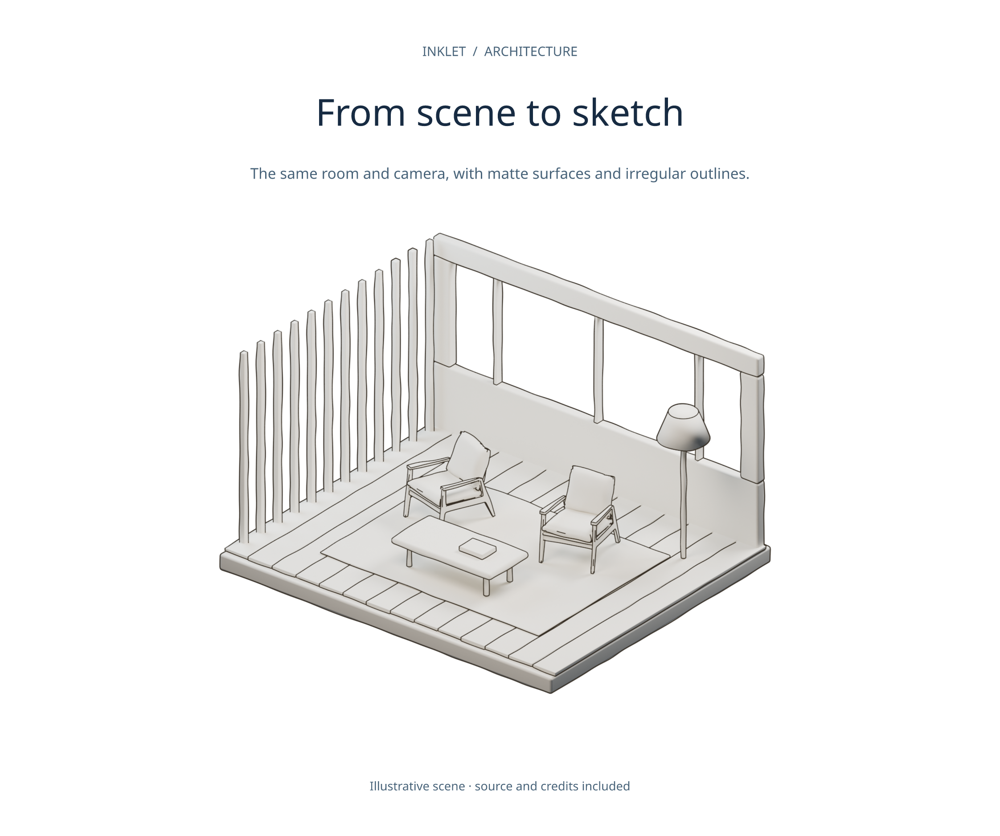

# Showcase library

Eight figures made with Inklet: mathematical plots, original 3D illustrations
and an architectural interior. Each recipe includes its data definition or asset
credits. These are **v3 development** examples; install from a checkout.

<div class="showcase-grid">
<article><a href="../gallery/showcase-interference.png"></a><h2>Interference</h2><p>Two analytic radial waves and one shared colour scale.</p></article>
<article><a href="../gallery/showcase-attractor.png"></a><h2>Deterministic chaos</h2><p>A numerically integrated Lorenz trajectory with vector strokes.</p></article>
<article><a href="../gallery/showcase-wave-packets.png"></a><h2>Travelling wave packets</h2><p>Gaussian-windowed oscillations at eighteen parameter values.</p></article>
<article><a href="../gallery/showcase-photonics.png"></a><h2>Integrated photonics</h2><p>Original device illustration beside an analytic transmission curve.</p></article>
<article><a href="../gallery/showcase-lattice.png"></a><h2>Designed porosity</h2><p>A procedural lattice specimen; no mechanical results are implied.</p></article>
<article><a href="../gallery/showcase-helix.png"></a><h2>Paired helices</h2><p>A parametric illustration, not an atomistic molecular structure.</p></article>
<article><a href="../gallery/showcase-architecture.png"></a><h2>A room for daylight</h2><p>Original room geometry with CC0 furniture by Vibrant Nordic / Poly Haven.</p></article>
<article><a href="../gallery/showcase-architecture-sketch.png"></a><h2>From scene to sketch</h2><p>The same scene and camera, rendered with the sketch style.</p></article>
</div>

## Build and download the collection

From a repository checkout, install Inklet and the rendering extras:

```sh
python -m pip install -e '.[render,images]'
python tools/showcase_gallery.py --list
python tools/showcase_gallery.py --plots-only
python tools/showcase_gallery.py --download-assets --quality final --archive
```

The full build also needs Blender 4.2 LTS with Cycles and Freestyle, plus
Poppler for independent PDF previews. The mathematical subset needs no Blender
or downloaded assets. Draft/preview renders are faster; final uses 300 DPI and
up to 256 Cycles samples.

Open `out/showcase/index.html` for an offline gallery with category filtering.
Each card links to its review, SVG, PDF, PNG, source recipe and, for 3D entries,
the editable `.blend` scene. The archive is written to `out/inklet-showcase.zip`.
The architecture scene packs the chair textures so its `.blend` is portable.

Use `--only architecture architecture-sketch` to build selected entries. A
subset build replaces the catalogue/index with that selection and retains older
export folders on disk. `catalog.json` records recipe hashes, quality, image
hashes, diagnostics and asset provenance.

[Figure recipes](../examples/showcase/figures.py) ·
[Blender scene builders](../examples/showcase/blender_scenes.py) ·
[Gallery builder](../tools/showcase_gallery.py) ·
[Reproduction notes](../examples/showcase/README.md)

## Reuse and interpretation

The plot definitions are analytic or explicitly simulated. The photonic curve
is an illustrative formula and was not simulated from the rendered device.
The architectural scene is a concept, not a measured design or construction
drawing. The sketch is generated from scene geometry.

The **Modern Arm Chair 01** asset by **Vibrant Nordic** is supplied by
[Poly Haven](https://polyhaven.com/a/modern_arm_chair_01) under
[CC0](https://polyhaven.com/license). The optional download includes its `.blend`
and 1K textures, roughly 12 MB in total. The [asset lock](../examples/showcase/assets.lock.json)
pins every file by size and SHA-256 hash. Downloads happen only with
`--download-assets` and are reused after validation.

All other scene geometry and all figure recipes are original Inklet code under
MIT. Gallery renders can be used to demonstrate Inklet; retain the supplied
credits and data descriptions when sharing the collection.

For the rendering APIs behind these examples, see [Blender scenes](blender-scenes.md)
and [v3 rendering](v3.md). Native 3D, diagrams and a wider selection of chart types
are also demonstrated in the [twenty-panel stress figure](stress20.md).
