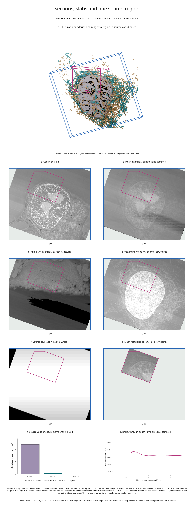

# Slab projections and one shared region

This nine-panel figure combines real HeLa electron microscopy, finite-thickness
intensity projections, source coverage, a 3D organelle scene and measurements
within a single physical region. The same `ROI-1` box controls every selection;
image resizing and projection sampling do not change the source-grid volumes.

[Full-size figure](../gallery/slab-biology.png) ·
[Executable recipe](../examples/slab_biology.py) ·
[Measurements and sampling evidence](assets/research-preview/slab-biology.json)



## Reproduce it

Use the development branch, the same locked COSEM source objects as the
[original real-biology example](real-biology.md), and Blender 4.5 LTS:

```bash
git clone https://github.com/Mapika/inklet.git
cd inklet
python -m pip install -e '.[volume,render]'
python -m pip install -r examples/biology/requirements.txt
python examples/slab_biology.py --blender /path/to/blender
```

The recipe reuses verified data in `out/real-biology/source.n5` and creates
`out/slab-biology/figure.svg`, `.pdf`, `.png`, an HTML review,
`slabs.json` and `projection-arrays.npz`. The NPZ contains unwindowed mean/min/max
images, source contribution counts, the restricted mean and its contribution
counts. Raw data and Blender scenes are generated locally and are not bundled.
GPU rendering is preferred, with CPU fallback when no GPU is available.

## Read the panels

- **a:** Blue edges bound a 3.2 µm slab around the oblique centre plane. Magenta
  edges show `ROI-1`, with world XYZ bounds `(12, 0.4, 17)` to `(24, 2.8, 27)` µm.
  Dashed edges are depth-occluded by scene geometry.
- **b–e:** The centre section and mean/minimum/maximum projections share the
  same 80 nm output pixels and `[17000, 26000]` display window. Each projection
  reduces 41 trilinearly sampled planes at equal-width bin midpoints. Minima
  emphasize darker EM structures; maxima emphasize brighter structures. Neither
  reconstructs a surface or represents a categorical label projection.
- **f:** Black is zero source coverage, white means all 41 requested midpoint
  samples contributed, and intermediate greys indicate partial coverage. This
  is sample coverage, not an uncertainty estimate or proof of continuous coverage.
- **g:** Mean intensity includes only samples inside both the source and `ROI-1`
  at each depth. Pale grey indicates no contributors. The magenta image outline
  marks the box intersection with the **centre plane**; the selected slab
  footprint can extend beyond it.
- **h:** Volumes of source nucleus ID 1 and mitochondrial IDs 157 and 124 within
  the box use original s4 voxel centres and full voxel volumes. The measurement
  is independent of the slab's 41 samples and does not claim complete organelles.
- **i:** Each point is the mean over available ROI pixels at one slab depth.
  The evidence file includes its contributing pixel count. Missing depths break
  the line and are not plotted as zero intensity.

The [slab and region API guide](slabs-and-regions.md) documents source-boundary
handling, half-open region membership, projection normalization and measurement
estimators. All projections exclude unavailable samples from the mean. Partial
pixels keep full image opacity, which is why the coverage panel is separate.

## Source and interpretation

This uses **COSEM / HHMI Janelia, jrc_hela-3**, with automated source segmentations
at level s4. Its anisotropic source spacing remains 51.84 / 64 / 64 nm in ZYX.
Output sampling does not improve acquisition resolution. Masks can overlap;
these selected labels do not form a disjoint compartment partition. This is a
visualization example, without cell-membership, biological-replication or
uncertainty inference.

Data and derived figure: **CC BY 4.0**. Code: **MIT**. Source hashes and
attribution are in the [third-party notices](../THIRD_PARTY_NOTICES.md) and
[original example](real-biology.md). Publication: Heinrich et al.,
[Whole-cell organelle segmentation in volume electron microscopy](https://doi.org/10.1038/s41586-021-03977-3),
*Nature* 599, 141–146 (2021). This example adds finite slab projections,
coverage maps, physical ROI selections and source-grid region measurements.
