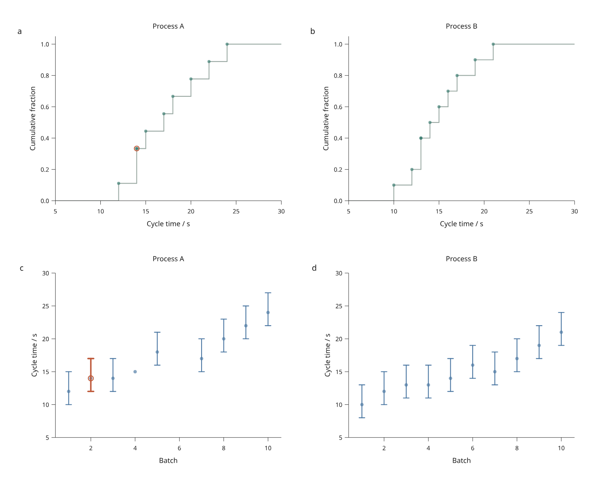

# Linked distributions and intervals

Connect empirical distributions to individually selectable observations and
supplied uncertainty intervals. `ECDFView` and `IntervalView` are development
APIs under `inklet.experimental.browser`, **not part of PyPI 3.1.0**.



[Open the interactive figure](assets/v4/statistical-views.html) ·
[Complete Python recipe](../examples/v4/statistical_views.py)

The example contains 20 simulated batches from two processes. Process A has
one missing estimate, so its distribution uses nine observations; Process B
uses ten. A batch with missing bounds retains its center marker. Orange marks
link the selected batch across panels. All values are invented MIT material by
Mark Marosi. The supplied ranges are illustrative, **not confidence intervals**.

## Empirical distributions

```python
from inklet.experimental.browser import BrowserFigure, ECDFView
from inklet.experimental.selection import KeyedTable

table = KeyedTable("observations", {
    "id": ["a", "b", "c", "d"],
    "value": [12, 14, 14, None],
})
figure = BrowserFigure(table, [
    ECDFView("distribution", "value", (5, 25), x_label="Cycle time / s"),
])
```

The empirical cumulative distribution is `count(value <= x) / n`, where `n`
counts nonmissing source observations in this panel. Tied values share the
same fraction: both rows at 14 above lie at 1.0. This follows the
[standard ECDF definition](https://stat.ethz.ch/R-manual/R-patched/RHOME/library/stats/html/ecdf.html).
It does not assume a parametric distribution or estimate a density.

The gray staircase is a **fixed reference distribution**. Filtering hides
observation markers but leaves that curve and its denominator unchanged, even
when no rows are visible. This compares a selection against an explicit source
population. To change that population, compile a revision or use `replace_data()`.

Only markers are selectable. The reference curve is not pickable. Tied markers
overlap: pointer picking selects the last source-painted row, while the data
table lets you select either row. Source order and IDs remain unchanged even
though calculating the staircase sorts values.

Tooltips and the accessible data table report each observation's cumulative
fraction. A separate derived column is shown for each ECDF panel; an em dash
means that row has no fraction in that panel. Source columns are preserved.

Values and the x domain must be numeric. `None` is reported and excluded from
the denominator. An empty population draws no curve or markers but retains its
axes. The fixed y domain `(0, 1.05)` gives markers at probability 1 room above
them. Domains and reference populations stay fixed during page pan/zoom.

## Supplied intervals

```python
from inklet.experimental.browser import BrowserFigure, IntervalView
from inklet.experimental.selection import KeyedTable

table = KeyedTable("estimates", {
    "id": ["batch-1", "batch-2"],
    "batch": [1, 2], "estimate": [12, 14],
    "lower": [10, None], "upper": [15, None],
})
figure = BrowserFigure(table, [
    IntervalView("ranges", "batch", "estimate", (0, 3), (5, 20),
                 lower="lower", upper="upper",
                 interval_label="Illustrative supplied range; not a confidence interval",
                 x_label="Batch", y_label="Cycle time / s"),
])
```

Bounds are **absolute endpoints**, not distances from the estimate. Complete
intervals must satisfy `lower <= center <= upper`. Reversed bounds are rejected
even with a missing center. Missing x/y coordinates omit the row's marks;
a missing bound retains the center and omits the interval.

`interval_label` is required to identify the method or meaning. Inklet draws
supplied values; it does not calculate confidence levels, bootstrap estimates
or significance. Filtering never recalculates bounds. For actual uncertainty
results, include the method, level and source population in this label and
your external caption.

Use `orientation="horizontal"` for a numeric x value axis and y position axis.
The position axis may be a [`TimeAxis`](time-series.md); the value axis must be
numeric. Both directions support reversed domains. Caps, markers and strokes
use millimetres: `cap_width_mm=2`, `radius_mm=0.6`, `line_width_mm=0.3`.
Selection modestly thickens interval strokes, and every piece selects the same row.

## Facets and diagnostics

Both views support [`FacetView`](linked-facets.md). Each ECDF facet has its own
source population and denominator; empty categories retain their panels. The
example uses shared physical margins and common domains for comparison.

Expand **Statistical methods and populations** in the browser to inspect the
method and population. This report updates on revision switches. In Python,
read `figure.payload()["layers"][n]["statistics"]`:

| View | Reported fields |
| --- | --- |
| ECDF | `kind`, `method`, `population`, `n`, `missing`, `filtering` |
| Interval | `kind`, `label`, `population`, `missing_intervals`, `filtering` |

`missing_intervals` counts drawable centers missing one or both bounds. The
ordinary layer `missing` count describes rows without x/y coordinates. Reports
describe the compiled source data, independently of the visibility filter.

## Save, revise and export

```sh
python examples/v4/statistical_views.py --output out/v4-statistics
python examples/v4/statistical_views.py --state /path/to/view.json --output out/v4-restored
python examples/v4/statistical_views.py --revised --state /path/to/revised-view.json --output out/v4-revised
```

The recipe writes offline HTML, SVG and JSON state. Its revision corrects
Process A's first estimate and removes Process B's tenth batch. Reference curves
and intervals rebuild together. Removed selected/filtered IDs require an
explicit drop policy; see [data replacement](data-revisions.md).

Weighted or censored distributions, recomputed filtered summaries, histogram
bin selection, density estimation and inference are outside this increment.
Existing static histograms, boxplots and violins remain available through the
[ordinary plotting API](plot-types.md).
