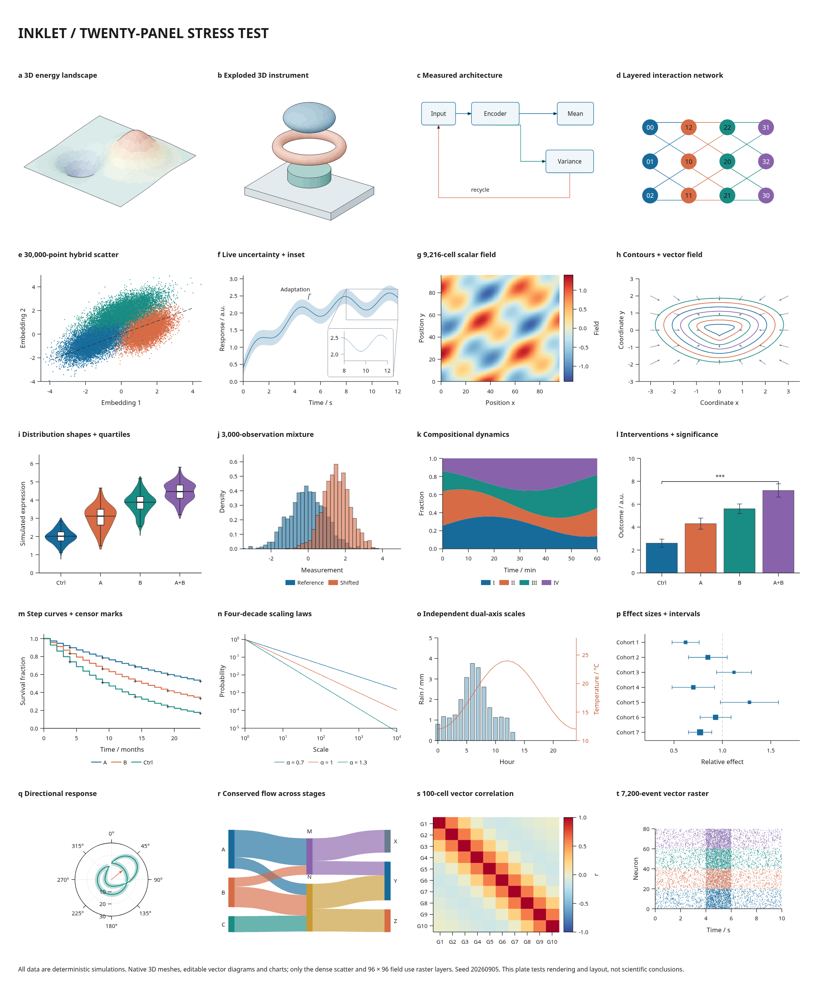

# Twenty-panel stress test



The [figure definition](../examples/stress20.py) builds a 360 × 440 mm plate
from twenty nested v2.5 subfigures. Everything is generated locally with seed
20260905. All observations are simulated; the diagrams and instrument are
illustrative. No paper images, downloaded meshes or external datasets are used.

| Panels | Contents |
|---|---|
| a–d | 2,592-triangle surface; 2,988-triangle exploded assembly with depth ordering; measured architecture with a feedback route; 12-node, 18-edge layered graph |
| e–h | 30,000-point scatter; live uncertainty band with an inset and callout; 96 × 96 scalar field; parametric contours with a vector field |
| i–l | Violin and box plots; two 1,500-observation histograms; normalized stacked areas; bars with error intervals and an automatically placed bracket |
| m–p | Step curves and censor marks; logarithmic axes; independent left/right scales; forest plot with horizontal intervals |
| q–t | Polar band and mean vector; conserved Sankey flow; 100-cell vector correlation matrix; 7,200 events in 80 vector paths |

Only the dense scatter and scalar field are raster layers. Text, axes, diagrams,
3D artwork and every other chart remain vector. Three live data tables carry
source records, revisions and content hashes into the export manifest.

Run from the repository root, with Inklet's image extras, Chrome/Chromium and
Poppler installed:

```sh
.venv/bin/python tools/stress20.py
```

Open `out/stress20/stress20.html` for SVG/PDF review. The directory also contains
standalone SVG, PDF and PNG files, diagnostics, a manifest, backend difference
image and `results.json`. `edited/` includes a revision comparison; `width-320/`
and `width-400/` contain resized exports. The same full test runs in CI and its
exports are included in the figure-checks artifact.

The runner verifies all twenty named panels, unique export IDs, exactly two
raster layers, cached snapshot reuse, updates to all three dataset hashes,
changes confined to the four edited panels, an unchanged original snapshot,
fixed physical font sizes after resizing, and no diagnostic errors or warnings.
The callout's explicit coordinate is updated along with its source data.

## Findings

This figure exposed two compiler bugs, both fixed with focused regression tests:

- Nested documents using common local names such as `heading` and `body`
  generated duplicate export IDs and failed compilation. IDs now include their
  containing cell's scope, with separate delimiters for structural children.
- Source discovery created temporary lists for each nested document. Python
  could reuse a previous list's ID, causing later subfigures to be mistaken for
  already visited objects and silently dropping dataset provenance. Traversal
  now visits the retained authoring objects directly.

An observed local run compiled the full plate in approximately 15 seconds,
returned the unchanged cached snapshot in 14 milliseconds, and exported the
review bundle in 1.7 seconds. The SVG was 2.0 MB and PDF 599 KB. The resolved
drawing had 2,810 nodes, 738 vector paths and two image layers. These are local
measurements, not cross-machine performance guarantees; each run records its
own timings.

There are seven informational findings at the default width: six graph-edge
crossings and one notice about varied stroke widths. At 320 mm there is an
additional crowding notice for the final two correlation labels (0.85 mm
clearance). The labels remain distinct; the runner retains that finding.

Independent Chrome and Poppler renderings were inspected. At 150 dpi, 2.69% of
pixels differ by more than 25 in any RGB channel, with a mean absolute channel
difference of 0.72% of the full range. The comparison crops one extra bottom row
from Poppler's rounded-up page dimensions; it does not rescale either image.
Differences occur mainly around text, fine marks and raster interpolation.
This is a backend comparison, not a claim of pixel identity.

The remaining performance issue is dense-scatter recompilation. Profiling the
scatter alone shows three marker builds and rasterizations as layout settles.
An edit to the 30,000-point dataset therefore still takes roughly 15 seconds,
even when other panels are reused. Measuring plot furniture independently of
expensive marks, and avoiding temporary vector markers for the raster path,
are concrete next optimization targets. The current test records this cost.
