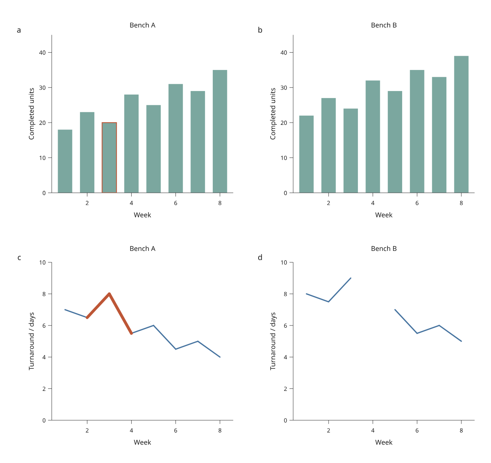

# pandas and Polars inputs

Create an immutable `KeyedTable` directly from a pandas or Polars DataFrame,
then use it in linked plots, facets or joined maps. These adapters are available
in the development checkout under `inklet.experimental.selection`;
they are **not in PyPI 3.1.0**.



[Open the interactive figure](assets/v4/table-inputs.html) ·
[Complete Python recipe](../examples/v4/table_inputs.py)

The example imports 16 simulated workshop observations. Both adapters produce
the same data digest, measured scene and SVG. Bench B has missing turnaround
in week 4, so its line has a gap. The orange marks identify the selected
`a-3` observation across its two panels. All values are invented MIT material
by Mark Marosi; they are not measured production data.

## Install the integration you use

From a development checkout:

```sh
python -m pip install -e '.[pandas]'
# Or:
python -m pip install -e '.[polars]'
```

pandas 2.2–3.x and Polars 1.x are the supported version families. Each is an
optional integration imported only when its adapter is called. Core plotting
and exported HTML require neither library.

## Build a keyed snapshot

```python
import pandas as pd
from inklet.experimental.selection import KeyedTable

frame = pd.DataFrame({
    "sample_id": ["a-1", "a-2", "a-3"],
    "week": [1, 2, 3],
    "units": pd.array([18, None, 20], dtype="Int64"),
})
table = KeyedTable.from_pandas("workshop", frame, key="sample_id")
```

The equivalent Polars input:

```python
import polars as pl
from inklet.experimental.selection import KeyedTable

frame = pl.DataFrame({
    "sample_id": ["a-1", "a-2", "a-3"],
    "week": [1, 2, 3],
    "units": [18, None, 20],
})
table = KeyedTable.from_polars("workshop", frame, key="sample_id")
```

`name` identifies the logical table across revisions. `key` names a column
containing unique, nonempty strings. It defaults to `"id"`. The pandas index is
ignored, including named and multi-level indexes. If an index contains the
intended IDs, explicitly turn it into a string column first. Numeric keys are
rejected rather than converted automatically.

Source row order is retained. Inklet copies the scalar values; later frame
edits cannot alter an existing table, figure or saved state. No sorting,
aggregation, interpolation or row removal takes place during import.

## Missing values and supported columns

| Input | Result |
| --- | --- |
| Strings, booleans, portable integers, finite floats | Built-in Python scalar values |
| `None`, pandas `NA`/`NaT`, floating-point NaN, Polars null | `None`; rows remain present |
| String categorical or enum values | Strings; category metadata and unused levels are not retained |
| Positive or negative infinity | Error naming the column and zero-based row |
| Integers outside `[-(2**53-1), 2**53-1]` | Error; represent identifiers or exact large values as strings explicitly |
| Dates, timestamps, durations, decimals, complex numbers, nested cells | Error; convert explicitly or omit the column |

These rules account for [pandas missing-value representations](https://pandas.pydata.org/docs/user_guide/missing_data.html)
and [Polars' distinction between null and NaN](https://docs.pola.rs/user-guide/expressions/missing-data/).
The direct `KeyedTable(name, columns)` constructor still requires native JSON
scalars and explicit `None`; its stricter contract is unchanged.

By default all columns are imported. Select an ordered subset to omit fields
that the figure does not need:

```python
table = KeyedTable.from_pandas(
    "workshop", frame, key="sample_id",
    columns=("sample_id", "week", "units"),
)
```

The subset must include the key. Unknown names, repeated names and unordered
sets are rejected. Source headers must be unique nonempty strings even when
selecting a subset. Unselected cells are not converted or validated.

Polars lazy inputs must be collected explicitly by the author before import.
There is no implicit query execution. Neither adapter stores dtype metadata,
units or provenance: record units in your axes and supply the figure's source
credit. For facets, specify category order with
[`FacetView(..., values=...)`](linked-facets.md).

Matching normalized scalar values give matching digests across libraries.
An integer `1` and a float `1.0` remain distinct; if pandas infers a float column
from integers mixed with missing values, choose a nullable integer dtype when
that is the intended representation.

## Revise, explore and export

```sh
python examples/v4/table_inputs.py --backend pandas --output out/v4-tables
python examples/v4/table_inputs.py --backend polars --output out/v4-polars

# Reconstruct a saved view from the original data with either adapter.
python examples/v4/table_inputs.py --backend polars \
  --state /path/to/view.json --output out/v4-restored

# A view saved after applying the correction needs that same revision.
python examples/v4/table_inputs.py --backend polars --revised \
  --state /path/to/corrected-view.json --output out/v4-corrected
```

The recipe writes offline HTML, vector SVG and saved JSON state. In the browser,
expand **Data revision** and apply **Corrected**. The selected `a-3` bar changes
from 20 to 24 units; its turnaround remains 8 days. The revision also removes
`b-8`. If that row is selected or explicitly filtered, the default policy rejects
the switch until you choose **Drop removed IDs**. Inspect the change report.

To update your own figure, create a new table with the same name and key and
call `figure.replace_data(new_table, state=saved_state)`. See
[data replacement](data-revisions.md) for removed-ID and viewport policies.
Saved state can move between adapters when their normalized inputs and measured
scene match exactly. Revisions with changed contents require explicit rebasing.

This increment adds scalar table import. Automatic date-aware browser axes,
grouped summaries and statistical views remain upcoming work.
