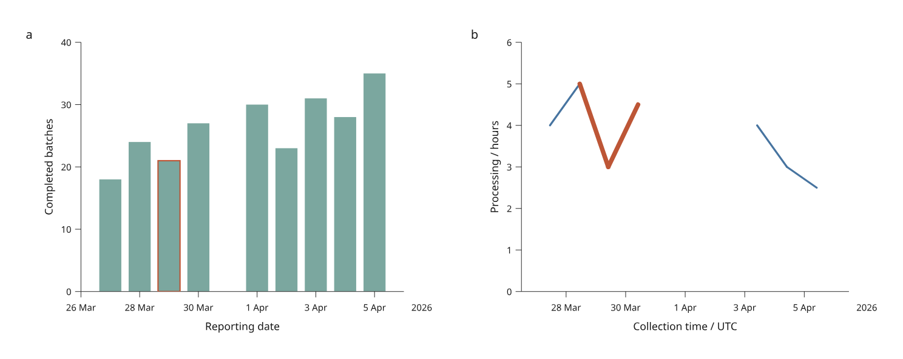

# Linked dates and time series

Use calendar dates or offset-aware timestamps in linked lines, bars, scatter
and facets. `TimeAxis` is available in the development checkout under
`inklet.experimental.browser`; it is **not in PyPI 3.1.0**.



[Open the interactive figure](assets/v4/time-series.html) ·
[Complete Python recipe](../examples/v4/time_series.py)

This original simulated example links a reporting date to its collection
timestamp. The source changes from an explicit `+01:00` offset to `+02:00`,
so consecutive noon collections can be 23 hours apart. Calendar dates remain
one day apart. Counts and durations are invented MIT material by Mark Marosi.

The gaps in panel b are deliberate: March 31 is absent, and April 2 has no
duration. April 1 is a valid isolated observation with no adjacent drawable
segment; its value remains available in the table. Apply **Restored** under
**Data revision** to add March 31 and fill April 2, reconnecting the line.

## Calendar dates

```python
from inklet.experimental.browser import BrowserFigure, BarView, TimeAxis
from inklet.experimental.selection import KeyedTable

table = KeyedTable("daily", {
    "id": ["feb-28", "feb-29", "mar-01"],
    "day": ["2024-02-28", "2024-02-29", "2024-03-01"],
    "count": [18, 24, 21],
})
figure = BrowserFigure(table, [
    BarView("counts", "day", "count",
            TimeAxis(("2024-02-27", "2024-03-02")), (0, 30),
            x_label="Reporting date", y_label="Completed batches",
            bar_width=18 * 3600),
])
```

The default `mode="date"` accepts strict `YYYY-MM-DD` strings. Domain endpoints
may also be Python `date` objects. It rejects clock times and timezone-bearing
values. Leap days and variable month lengths use elapsed calendar days; major
ticks fall on calendar boundaries. Date axes do not introduce intraday ticks.

Bar width is in **seconds** on a temporal position axis: `18 * 3600` occupies
three quarters of a calendar day. Bars keep a numeric value axis and baseline;
horizontal bars may put `TimeAxis` on their y position axis. Scatter and lines
can use temporal x, y or both axes. Reversed domains are supported.

## Explicit UTC instants

```python
from inklet.experimental.browser import BrowserFigure, LineView, TimeAxis
from inklet.experimental.selection import KeyedTable

table = KeyedTable("readings", {
    "id": ["first", "second", "third"],
    "collected": ["2026-03-29T01:30:00+01:00",
                  "2026-03-29T03:30:00+02:00",
                  "2026-03-29T04:30:00+02:00"],
    "value": [3, 5, 4],
})
figure = BrowserFigure(table, [
    LineView("readings", "collected", "value",
             TimeAxis(("2026-03-29T00:00:00Z", "2026-03-29T03:00:00Z"),
                      mode="utc"),
             (0, 6), x_label="Collection time", y_label="Value",
             max_gap_seconds=3600),
])
```

UTC inputs require full ISO timestamps with seconds and either `Z` or a known
`±HH:MM` offset. Domain endpoints may also be aware Python datetimes. Naive
timestamps, date-only strings, numeric epochs, leap seconds and unknown
`-00:00` offsets are rejected. Resolve local-clock ambiguity before import.

Equivalent instants share a coordinate regardless of their written offsets.
Domain strings are normalized to UTC, and the axis label gains ` / UTC`.
Raw table strings remain unchanged for hover, search and the accessible table.
The browser receives measured geometry and outlined tick labels; it never
parses dates using its locale or timezone. This preview displays UTC rather
than named local-time zones.

Instants support exact **millisecond precision**. Additional fractional digits
are accepted only when they are zero. Round finer data explicitly upstream.
Short intervals get millisecond labels, and tick labels distinguish dates when
the range crosses midnight or a year boundary. Numeric-axis behavior remains
unchanged; a pair of date strings does not implicitly opt into `TimeAxis`.

## Missing observations and line order

| Situation | Line behavior |
| --- | --- |
| A row has `None` in either coordinate | Both incident segments are absent |
| A date is absent from the table | Remaining adjacent source rows connect by default, with true elapsed spacing |
| Elapsed x gap exceeds `max_gap_seconds` | That source-adjacent segment is absent |
| Elapsed x gap equals the limit | Segment is retained |
| A row is filtered out | Its incident segments disappear; surviving rows are not reconnected |
| Repeated timestamps | Row identities remain distinct; coincident coordinates are allowed |

`max_gap_seconds` is an optional positive finite threshold, available only on
lines with a temporal x axis. It compares absolute elapsed time, including when
source rows run backwards. It does not sort, resample or infer a frequency.
Within facets, adjacency and gap checks apply to that category's source order.

Inspect `figure.payload()["layers"]` for `time_axes` metadata and, when a limit
is supplied, `max_gap_seconds` and `time_gaps`. `time_gaps` counts omitted source
segments due to the threshold; it is independent of interactive filtering.
Axes and domains stay fixed during page pan/zoom and filtering.

## Native pandas and Polars temporal columns

The [DataFrame adapters](table-inputs.md) accept an explicit `time_columns`
mapping for selected non-key columns:

```python
table = KeyedTable.from_pandas(
    "readings", frame, time_columns={"day": "date", "collected": "utc"},
)
# The same keyword is available on KeyedTable.from_polars(...).
```

Date objects become calendar strings; aware timestamps become canonical
`YYYY-MM-DDTHH:MM:SS.sssZ` strings. Missing values become `None`. Datetime
columns are not treated as calendar dates automatically, even at midnight.
For pandas, select `.dt.date` explicitly when discarding clock time is intended.
Naive timestamps must be localized upstream using your chosen ambiguity policy.

By default the scalar adapters still reject temporal objects. Declaring a
temporal column does not permit durations or submillisecond values. Precision
is checked before Polars converts nanosecond datetimes to Python values, avoiding
the truncation described in its [conversion documentation](https://docs.pola.rs/api/python/stable/reference/dataframe/api/polars.DataFrame.to_dicts.html).

## Save and reconstruct

```sh
python examples/v4/time_series.py --output out/v4-time

# Optional: build the same figure through either installed DataFrame adapter.
python examples/v4/time_series.py --backend pandas --output out/v4-pandas
python examples/v4/time_series.py --backend polars --output out/v4-polars

# A state saved while Restored was active needs the matching revised inputs.
python examples/v4/time_series.py --revised --state /path/to/view.json \
  --output out/v4-restored
```

The script writes offline HTML, vector SVG and JSON state. Omit `--revised` for
a state saved from the original data. Native, pandas and Polars paths produce
the same normalized table and measured figure. Revision switching preserves
valid selections; strict state loading rejects a different data or scene
revision. See [data replacement](data-revisions.md) for explicit rebasing.
