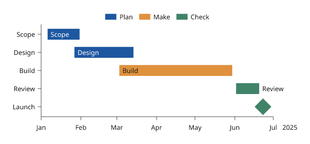
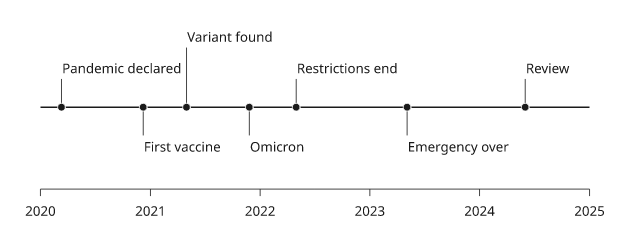
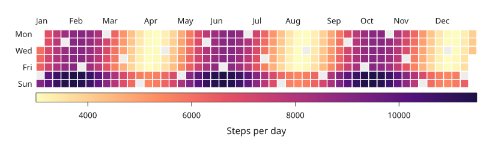

# Timelines and calendars

Schedules, event sequences and daily values placed in time. Times are what the
x scale takes: numbers on a linear scale, or dates, datetimes and ISO strings
on a date scale (a panel with `x=('2025-01-01', '2025-07-01')` has one).

All values below are illustrative. Each snippet can be run independently with
core Inklet; PNG preview generation additionally uses the `render` extra.
Run a block from the repository root with `.venv/bin/python`; each block writes
an SVG and PDF that can be opened without a notebook.

## Gantt charts

`gantt` draws one bar per task from its start to its end, on the row its label
names. A task that ends where it starts is a milestone, drawn as a diamond.
`groups=` colours tasks by group, with one legend entry per group. List the
rows in reverse so that the first task is at the top.

```python
import inklet as i

rows = ['Launch', 'Review', 'Build', 'Design', 'Scope']
tasks = [('Scope', '2025-01-06', '2025-01-31', 'Scope'),
         ('Design', '2025-01-27', '2025-03-14', 'Design'),
         ('Build', '2025-03-03', '2025-05-30', 'Build'),
         ('Review', '2025-06-02', '2025-06-20', 'Review'),
         ('Launch', '2025-06-23', '2025-06-23')]
p = i.plot_spec(x=('2025-01-01', '2025-07-01'), y=rows, height=30, width=80)
p.gantt(tasks, groups=['Plan', 'Plan', 'Make', 'Check', 'Check'], labels=True)
p.axes().legend(side='top')
doc = i.document(width=100)
doc.add('gantt', p)
doc.save('gantt.svg', 'gantt.pdf')
```



*An illustrative schedule. A label that does not fit inside its bar is
written after it.*

## Event timelines

`timeline` draws events as labelled stems off a base line. Stems alternate
above and below the line and move outward only as far as needed to keep the
labels from overlapping. `levels=` sets the levels yourself.

```python
import inklet as i

events = [('2020-03-11', 'Pandemic declared'), ('2020-12-08', 'First vaccine'),
          ('2021-05-01', 'Variant found'), ('2021-11-26', 'Omicron'),
          ('2022-05-01', 'Restrictions end'), ('2023-05-05', 'Emergency over'),
          ('2024-06-01', 'Review')]
p = i.plot_spec(x=('2020-01-01', '2025-01-01'), height=26, width=90)
p.timeline(events)
p.axis('bottom')
doc = i.document(width=100)
doc.add('timeline', p)
doc.save('timeline.svg', 'timeline.pdf')
```



*Illustrative events. The base line runs through the middle of the panel,
or at the y value `at=`; `line=False` leaves it out.*

## Calendar heatmaps

`calendar` draws one square per day, with one column per week and one row per
weekday. Month names are written above and every other weekday at the left.
Days in the range without a value are drawn pale. Colours use the matrix
ramps, so `colorbar()` explains them. Use `calendar_weeks` to size the panel.

```python
import inklet as i
import datetime as dt
import math

start, end = dt.date(2025, 1, 1), dt.date(2025, 12, 31)
steps = {}
for d in range(365):
    day = start + dt.timedelta(days=d)
    if d % 17 != 3:
        steps[day] = 6000 + 3000 * math.sin(d / 20) + (2500 if day.weekday() >= 5 else 0)
weeks = i.plot.calendar_weeks(start, end)
p = i.plot_spec(width=weeks * 2.2, height=7 * 2.2)
p.calendar(steps, start=start, end=end)
p.colorbar(side='bottom', label='Steps per day')
doc = i.document(width=130)
doc.add('calendar', p)
doc.save('calendar.svg', 'calendar.pdf')
```



*Simulated step counts. The pale squares are days with no value.*

## Next steps

[Compare plot types](plot-types.md), configure [axes and scales](axes-and-scales.md),
or [arrange several panels](layout.md). For exact options, see the [API](api.md).
