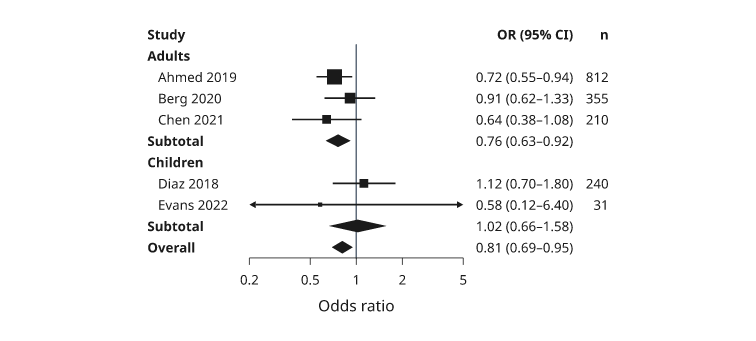

# Uncertainty and supplied intervals

Inklet draws the bounds or error magnitudes you supply; it does not infer
a confidence interval from raw observations. State what the interval means
and how another calculation produced it. Distinguish absolute bounds from
distances around a central estimate.

All values below are illustrative. Each snippet can be run independently with
core Inklet; PNG preview generation additionally uses the `render` extra. Run a
block as a script from the repository root, or paste it into a Python session.
Every block creates its own document and writes SVG and PDF.

## Bands

A band joins supplied lower and upper bounds over x.
Both arrays contain absolute y coordinates. Draw the central line afterward.

```python
import inklet as i
x = list(range(13))
mean = [2.0, 2.25, 2.55, 2.7, 2.95, 3.15, 3.35, 3.6, 3.72, 3.95, 4.1, 4.28, 4.5]
low = [1.45, 1.72, 2.05, 2.1, 2.42, 2.55, 2.72, 3.05, 3.0, 3.35, 3.4, 3.68, 3.82]
high = [2.55, 2.82, 3.0, 3.35, 3.5, 3.8, 3.98, 4.15, 4.52, 4.55, 4.82, 4.88, 5.18]
p = i.plot_spec(x=(0, 12), y=(0, 5.6), height=44)
p.band(x, low, high, fill='#b8d6cd', stroke='none')
p.line(list(zip(x, mean)), stroke='#288675', stroke_width=.5)
p.grid(x=False, y=True, count=5, stroke='#e1e7e4', stroke_width=.15)
p.axes(x='Time / s', y='Estimate / a.u.')
doc = i.document(width=110)
doc.add('band', p)
doc.save('band.svg', 'band.pdf')
```


*Rendered from the code above. The 13-point centre line and changing bounds are
supplied illustrative values; the band is not a confidence interval.*

## Error bars

Error bars show distances from each estimate.
`yerr` and `xerr` accept symmetric magnitudes or one `(down, up)` pair per
point. Convert absolute interval limits by subtracting the central estimate.
`cap` is the half-width of an end cap in millimetres.

```python
import inklet as i
points = [(1, 2.1), (2, 3.35), (3, 2.85), (4, 4.15), (5, 3.75)]
p = i.plot_spec(x=(0, 6), y=(0, 5.5), height=44)
p.errorbars(points, yerr=[(.25, .4), (.45, .3), (.35, .55), (.5, .38), (.28, .46)],
            xerr=[.08, .12, .1, .14, .09], cap=1, stroke='#24698c')
p.scatter(points, size=1.8, color='#24698c')
p.grid(x=False, y=True, count=5, stroke='#e1e7e4', stroke_width=.15)
p.axes(x='Dose / µM', y='Response / mV')
doc = i.document(width=110)
doc.add('errorbars', p)
doc.save('errorbars.svg', 'errorbars.pdf')
```


*Rendered from the code above. Five illustrative dose–response estimates have
asymmetric response distances and supplied dose uncertainty.*

## Line with errors

A line can show supplied uncertainty as a band or error bars.
`err` uses error magnitudes, like `errorbars`; `err_style="band"` shades the
spread and `err_style="bars"` draws whiskers. The uncertainty is drawn before the line.

```python
import inklet as i
p = i.plot_spec(x=(0, 12), y=(0, 6), height=44)
p.line([(0, 1.5), (1, 1.95), (2, 2.35), (3, 2.85), (4, 3.1),
       (5, 3.55), (6, 3.85), (7, 4.05), (8, 4.35), (9, 4.55),
       (10, 4.78), (11, 5.0), (12, 5.18)],
       err=[.28, .34, .3, .42, .38, .45, .36, .5, .44, .52, .46, .58, .5],
       err_style='band', stroke='#b86443', name='Supplied estimate')
p.grid(x=False, y=True, count=5, stroke='#e1e7e4', stroke_width=.15)
p.axes(x='Time / s', y='Estimate / a.u.').legend(side='bottom')
doc = i.document(width=110)
doc.add('line-errors', p)
doc.save('line-errors.svg', 'line-errors.pdf')
```


*Rendered from the code above.*

## Reusable series

A Series keeps the name, values, colour and absolute bounds together.
Use `plot_spec().series()` when several panels should share that definition.
The lower and upper arrays are absolute bounds, not error magnitudes.

```python
import inklet as i
times = list(range(7))
control = i.Series('Control', times, [1.3, 1.65, 1.95, 2.2, 2.5, 2.72, 2.95], '#24698c',
                   [1.0, 1.32, 1.6, 1.82, 2.08, 2.3, 2.5],
                   [1.6, 1.98, 2.3, 2.58, 2.9, 3.12, 3.4])
treatment = i.Series('Treatment', times, [1.5, 1.95, 2.3, 2.72, 3.0, 3.32, 3.6], '#288675',
                     [1.15, 1.58, 1.9, 2.3, 2.55, 2.85, 3.08],
                     [1.88, 2.3, 2.7, 3.1, 3.45, 3.78, 4.12])
p = i.plot_spec(x=(0, 6), y=(0, 4.5), height=44)
p.series(control, stroke_width=.45)
p.series(treatment, stroke_width=.45)
for series in (control, treatment):
    p.series(series, uncertainty=False, stroke_width=.45)
p.grid(x=False, y=True, count=5, stroke='#e1e7e4', stroke_width=.15)
p.axes(x='Time / s', y='Estimate / a.u.').legend(side='bottom')
doc = i.document(width=110)
doc.add('series', p)
doc.save('series.svg', 'series.pdf')
```


*Rendered from the code above. The reusable definitions compare illustrative
Control and Treatment trajectories with absolute, nonconstant bounds; these
bands do not claim confidence intervals.*

The final line-only pass keeps both trajectories visible above the overlapping
bands. Reusing a series name keeps one combined entry in the legend.

## Forest plots

`i.forest` draws one row per study or subgroup: a square at the point
estimate on a line across its confidence interval, a diamond for a summary
row and a bold label for a group header. Rows are listed top to bottom as
mappings with `label`, `estimate`, `low`, `high` and optionally `weight`,
`summary=True` or `header=True`; a bare string is a header, and a tuple
`(label, estimate, low, high)` is a study. Rows after a header are indented
until the next summary. With weights, the square areas follow the weights.

`log=True` puts x on a log axis, for odds or hazard ratios, and draws the
line of no effect at 1; on a linear axis it is at 0. `limits=` fixes the x
range, and an interval that runs past it ends in an arrowhead at the limit.
`left=` and `right=` list the text columns on each side: `'label'`, `'ci'`
(the estimate and interval as text, with `digits` decimals), `'estimate'`,
`'weight'`, any other key of the row mappings, or a `(header, key or
function)` pair. Numbers are right-aligned. `measure` names the estimate in
the column headers. `inklet.plot.forest_layout` returns the parsed rows,
limits and clipped interval ends without drawing.

```python
import inklet as i

rows = [
    'Adults',
    {'label': 'Ahmed 2019', 'estimate': .72, 'low': .55, 'high': .94, 'weight': 18.2, 'n': 812},
    {'label': 'Berg 2020', 'estimate': .91, 'low': .62, 'high': 1.33, 'weight': 9.4, 'n': 355},
    {'label': 'Chen 2021', 'estimate': .64, 'low': .38, 'high': 1.08, 'weight': 6.1, 'n': 210},
    {'label': 'Subtotal', 'estimate': .76, 'low': .63, 'high': .92, 'summary': True},
    'Children',
    {'label': 'Diaz 2018', 'estimate': 1.12, 'low': .70, 'high': 1.80, 'weight': 6.3, 'n': 240},
    {'label': 'Evans 2022', 'estimate': .58, 'low': .12, 'high': 6.4, 'weight': 1.0, 'n': 31},
    {'label': 'Subtotal', 'estimate': 1.02, 'low': .66, 'high': 1.58, 'summary': True},
    {'label': 'Overall', 'estimate': .81, 'low': .69, 'high': .95, 'summary': True},
]
plot = i.forest(rows, log=True, limits=(.2, 5), measure='OR', right=['ci', 'n'],
                label='Odds ratio', width=34)
doc = i.document(width=120)
doc.add('forest', plot)
doc.save('forest.svg', 'forest.pdf')
```



*Illustrative numbers. The Evans 2022 interval runs past both axis limits
and ends in arrowheads; its square is the smallest because its weight is.*

## Next steps

[Compare plot types](plot-types.md), configure [axes and scales](axes-and-scales.md),
or [arrange several panels](layout.md). For exact options, see the [API](api.md).
