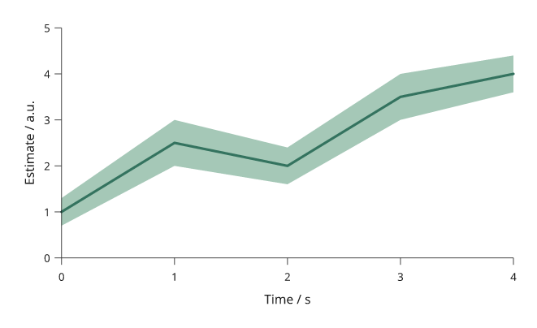
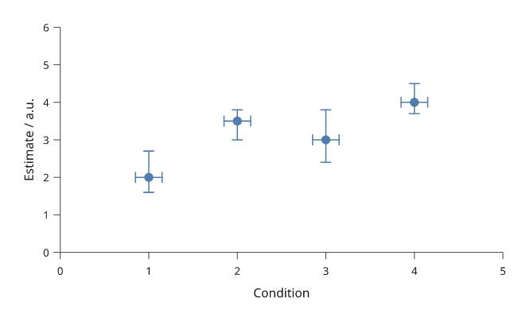
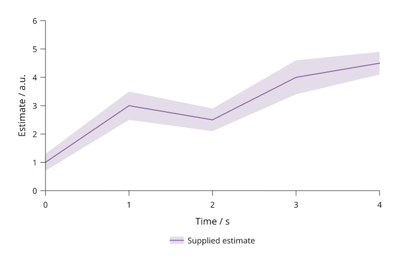
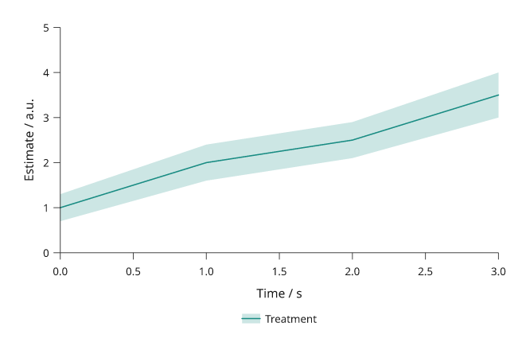

# Uncertainty and supplied intervals

Inklet draws the bounds or error magnitudes you supply; it does not infer
a confidence interval from raw observations. State what the interval means
and how another calculation produced it. Distinguish absolute bounds from
distances around a central estimate.

All values below are illustrative. Each snippet can be run independently with
core Inklet; PNG preview generation additionally uses the `render` extra.

## Bands

A band joins supplied lower and upper bounds over x.
Both arrays contain absolute y coordinates. Draw the central line afterward.

```python
import inklet as i
x, mean = [0, 1, 2, 3, 4], [1, 2.5, 2, 3.5, 4]
p = i.plot_spec(x=(0, 4), y=(0, 5), height=45)
p.band(x, [.7, 2, 1.6, 3, 3.6], [1.3, 3, 2.4, 4, 4.4],
       fill='#a5c8b7', stroke='none')
p.line(list(zip(x, mean)), stroke='#34735f', stroke_width=.5)
p.axes(x='Time / s', y='Estimate / a.u.')
doc = i.document(width=105)
doc.add('band', p)
doc.save('band.svg', 'band.pdf')
```



*Rendered from the code above.*

## Error bars

Error bars show distances from each estimate.
`yerr` and `xerr` accept symmetric magnitudes or one `(down, up)` pair per
point. Convert absolute interval limits by subtracting the central estimate.
`cap` is the half-width of an end cap in millimetres.

```python
import inklet as i
points = [(1, 2), (2, 3.5), (3, 3), (4, 4)]
p = i.plot_spec(x=(0, 5), y=(0, 6), height=45)
p.errorbars(points, yerr=[(.4, .7), (.5, .3), (.6, .8), (.3, .5)],
            xerr=.15, cap=1, stroke='#527da8')
p.scatter(points, size=1.8, color='#527da8')
p.axes(x='Condition', y='Estimate / a.u.')
doc = i.document(width=105)
doc.add('errorbars', p)
doc.save('errorbars.svg', 'errorbars.pdf')
```



*Rendered from the code above.*

## Line with errors

A line can carry its own supplied uncertainty.
`err` uses error magnitudes, like `errorbars`; `err_style="band"` shades the
spread and `err_style="bars"` draws whiskers. The spread is painted first.

```python
import inklet as i
p = i.plot_spec(x=(0, 4), y=(0, 6), height=45)
p.line([(0, 1), (1, 3), (2, 2.5), (3, 4), (4, 4.5)],
       err=[.3, .5, .4, .6, .4], err_style='band',
       stroke='#8862a0', name='Supplied estimate')
p.axes(x='Time / s', y='Estimate / a.u.').legend(side='bottom')
doc = i.document(width=105)
doc.add('line-errors', p)
doc.save('line-errors.svg', 'line-errors.pdf')
```



*Rendered from the code above.*

## Reusable series

A Series keeps the name, values, colour and absolute bounds together.
Use `plot_spec().series()` when several panels should share that definition.
The lower and upper arrays are absolute bounds, not error magnitudes.

```python
import inklet as i
signal = i.Series('Treatment', [0, 1, 2, 3], [1, 2, 2.5, 3.5], '#198c83',
                  [.7, 1.6, 2.1, 3], [1.3, 2.4, 2.9, 4])
p = i.plot_spec(x=(0, 3), y=(0, 5), height=45)
p.series(signal)
p.axes(x='Time / s', y='Estimate / a.u.').legend(side='bottom')
doc = i.document(width=105)
doc.add('series', p)
doc.save('series.svg', 'series.pdf')
```



*Rendered from the code above.*

## Next steps

[Compare plot types](plot-types.md), configure [axes and scales](axes-and-scales.md),
or [arrange several panels](layout.md). For exact options, see the [API](api.md).
