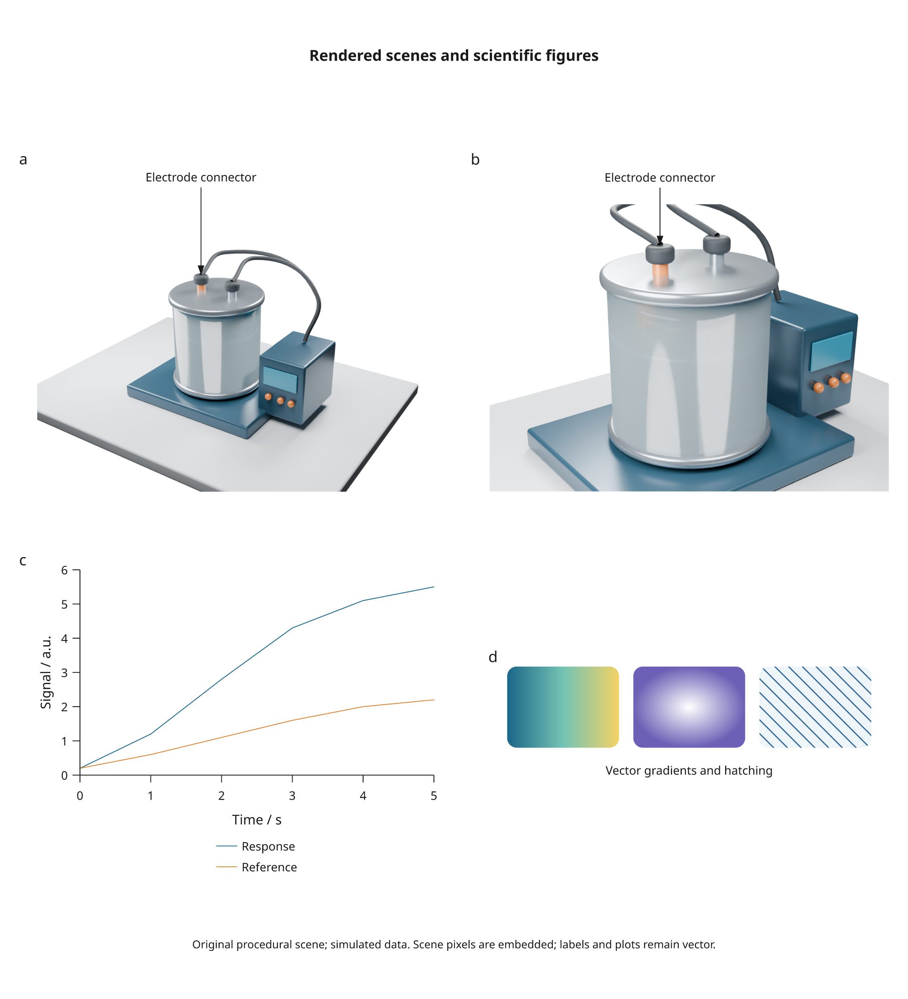

# Rendering in v3

This is the **3.0 development build**. PyPI and the stable documentation still
provide 2.6. Install a checkout with `python -m pip install -e '.[render]'` to use
these additions.

V3 adds complete Blender scenes, browser-free PNG export, shared vector paint,
group blending and explicit raster layers. Existing plotting and document APIs
remain available. The default review PNG renderer changes from Chromium to
resvg; independent PDF previews continue to use Poppler.

Dev2 adds scene inspection, render-quality presets, a procedural sketch style
and a [curated showcase library](showcase.md) with plots, 3D illustrations and
an architectural scene built using a downloadable CC0 furniture model.

Dev3 adds [automatic GPU selection and render jobs](render-jobs.md). Cycles uses
an available GPU, otherwise CPU. Cancellable jobs report progress, limit GPU
concurrency, and share identical renders within a Python process. Explicit
device selection and the actual backend are recorded in the render manifest.



## Export PNG directly

```python
import inklet as i

doc = i.document(width=89)
doc.add('title', i.component(i.title, 'A measured figure'))
doc.add('plot', i.plot_spec(x=(0, 2), y=(0, 4))
        .line([(0, 1), (1, 3), (2, 2)]).axes(x='Time', y='Value'))
figure = doc.compile()
figure.save('figure.svg', 'figure.pdf')
```

With the `render` extra installed:

<!-- Requires preview renderers. -->

```python
figure.save('figure.png', dpi=300)
figure.export('review', compare_pdf=False)
```

PNG uses the physical page dimensions and specified DPI. It stores the intended
DPI in PNG metadata. Text is rasterized from Inklet's shaped glyph outlines, so
the raster renderer cannot substitute a different font. `i.to_png(diagram)` has
a transparent background by default; document/figure methods use their paper
colour unless you pass `background=None`.

`figure.export(..., png_backend='chromium')` retains the previous preview path.
The CLI equivalent is `--png-backend chromium`. `--no-pdf-preview` plus the
`render` extra gives a review bundle without Chrome or Poppler.

## Vector gradients and hatching

```python
brush = i.LinearGradient(((0, '#1b6687'), (.5, '#73c3b4'), (1, '#f4d166')))
painted = i.paint(i.circle(width=30, height=30, stroke='none'), brush)
radial = i.paint(i.circle(width=30, height=30, stroke='none'),
                 i.RadialGradient(((0, 'white'), (1, '#6b60b5'))))
hatched = i.paint(i.box('', width=30, height=20, stroke='none'),
                  i.Hatch(color='#245b8a', spacing=2, stroke=.2,
                          angle=45, background='#edf5f9'))
```

`paint()` replaces fills on eligible shapes while retaining text and strokes.
Brushes are immutable. Gradient stops are opaque colours with strictly increasing
offsets, beginning at 0 and ending at 1. Start/end/centre/radius use fractions of
the shape's bounding box. A radial gradient becomes elliptical in a rectangular
box. Hatch spacing and stroke width are local millimetres and follow enclosing
transforms. Both SVG and PDF retain these paints as vector artwork.

## Blending, masks and dense layers

```python
art = i.overlay([
    i.circle(width=30, height=30, fill='#6688aa'),
    i.blend(i.circle(width=20, height=20, fill='#aa7744'), 'multiply'),
])
```

Group blending supports `normal`, `multiply`, `screen`, `overlay`, `darken`,
`lighten`, `difference` and `exclusion` in SVG and PDF. The group's children
compose in isolation before the result blends with artwork behind it.

With the `render` extra:

<!-- Requires preview renderers. -->

```python
layer = i.rasterize(art, dpi=300, reason='Dense illustrative layer')
stencil = i.circle(width=20, height=20, fill='white', stroke='none')
masked = i.mask(art, stencil, mode='alpha', dpi=300)
```

Masks use shared drawing coordinates. `mode='alpha'` uses stencil opacity;
`mode='luminance'` combines opacity with brightness, where black hides and white
reveals. Masks currently produce explicit raster layers in **both** SVG and
PDF. Place editable labels outside a masked or rasterized layer.

`rasterize()` preserves physical bounds and directly registered anchors. It is
an explicit authoring choice; the engine does not silently rasterize charts.
Small PNG renders use a bounded memory cache. Repeated image bytes are shared
within SVG and PDF; Blender scene renders also have an asset-aware disk cache.

## Complete Blender scenes

See [Blender scenes](blender-scenes.md) for installation, named cameras, projected
landmarks, view layers, data bindings, numeric depth/normal/object-ID passes,
object masks, dependency tracking and limitations.

The [showcase builder](../tools/v3_showcase.py) creates a reusable laboratory
`.blend` file from the original [Blender script](../examples/blender/lab_scene.py),
then exports the [mixed figure](../examples/v3_rendering.py):

```sh
python tools/v3_showcase.py --output out/v3
```

The source scene retains its cameras, materials and lights for direct editing
in Blender. The figure uses two camera views and projected object annotations.
All scene geometry is original; the plotted measurements are simulated.

## Capability and provenance records

```python
print(i.rendering_capabilities())
print(figure.metadata['rendering'])
```

| Feature | SVG | PDF | PNG |
| --- | --- | --- | --- |
| Gradients and hatches | Vector | Vector | Rasterized by resvg |
| Group blending | Native group | Native transparency group | Rasterized by resvg |
| Masks | Explicit image layer | Same image layer | Same masked pixels |
| Blender scene | Embedded image | Embedded image | Scene pixels plus figure artwork |
| Text outside raster layers | Editable or outlined | Embedded or outlined | Shaped glyph outlines rasterized |

Document and bundle manifests record paint resources, blend modes, image reuse,
explicit raster-layer reasons and complete scene provenance. Scene snapshots
embed their pixels, so exporting an already compiled figure does not need the
original `.blend` file or Blender. Raster-rendered colours are not covered by
geometry-only contrast diagnostics; inspect the rendered figure.
