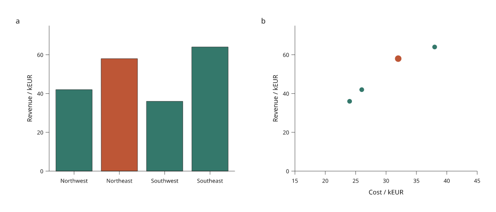

# 4.0 foundations: selection and engine checks

This experiment is available in the development checkout under
`inklet.experimental.selection`; it is not included in the published 3.1.0
package. It starts phase A of the [4.0 roadmap](roadmap.md). APIs and saved-state
schemas may change before stabilization.



[Open the offline interaction example](assets/v4/linked-selection.html) ·
[Python recipe](../examples/v4/linked_selection.py) ·
[Reference-project briefs and fixtures](../examples/v4/README.md)

## What works now

The example connects revenue bars and a cost/revenue scatter plot through
explicit row IDs. It supports a selected region, visible-group filtering,
saved JSON state and SVG download. Hidden selections are retained and described
in the status text. The data table supplies values and keyboard-accessible
selection controls. Plot titles and captions remain outside the artwork.

The HTML bundles 20 complete figures compiled by Python. It opens from a file
without a server, remote fonts or other network requests. This verifies the
state contract and exact static output before a browser renderer is chosen.
It does not provide arbitrary browser data updates, zoom or direct plot picking.

In a development checkout with the render extra installed:

```sh
python examples/v4/linked_selection.py --output out/v4-linked
```

Open `out/v4-linked/index.html`, select a region, filter it, and save the selection.
The downloaded state can be rebuilt in Python:

```sh
python examples/v4/linked_selection.py --state /path/to/selection.json --output out/v4-restored
```

The regenerated `figure.svg` should match the browser's downloaded SVG byte for
byte under the same source, inputs and font environment. Python also exports
PDF and PNG. This comparison was checked through a browser download and rebuild,
including a selection restricted to the southern regions.

## Identity and saved-state rules

`KeyedTable` records an immutable table with a stable name and unique nonempty
string IDs. Scalar JSON columns are supported, with `None` for missing values.
Dates, arrays and rich dataframe values need an explicit adapter; they are not
silently coerced. Integers beyond the exactly portable JSON integer range must
be encoded as strings. Scientific datasets outside this experiment retain their
existing APIs and numeric types.

The later [pandas and Polars input increment](table-inputs.md) adds optional
scalar DataFrame adapters with explicit keys and missing-value normalization.
Dates and nested cells still require author conversion.

`SelectionState` uses schema `inklet.selection/0.1` and includes the table name,
content digest, selected IDs and optional visible IDs. Reordering or replacing
input data changes its digest. An empty visibility list hides every row; a null
visibility list includes all rows, including new rows after rebasing.

`state.validate(table)` rejects changed inputs. `state.rebase(table)` explicitly
binds to revised data and preserves surviving identities. Removed selected or
filtered IDs cause an error unless `missing='drop'` is requested; the returned
`RebasedSelection` lists every removed ID. A different table name always fails.
Explicit ID filters do not automatically expand when rows are added.

Saving and loading arbitrary subsets is supported in Python. The example's
browser controls accept only the 20 enumerated states. Changed data or an
unsupported state produces a visible error and leaves the current view intact.
It does not infer a correspondence or execute an uploaded file as code.

## Engine corrections

Two adversarial cases led to concrete changes:

- A two-dimensional NumPy input could leave dataset cells pointing at mutable
  array rows. Caller edits then changed values without incrementing the dataset
  revision. Dataset construction and updates now snapshot nested array values
  as immutable tuples, including arrays inside mapping cells.
- A valid bar series whose values all equal the baseline raised an exception.
  It now draws no rectangles while preserving the axes and requested legend.
  Empty input and invalid coordinates retain their existing validation policies.

Regression checks cover strided arrays, caller edits before/after compilation,
explicit updates, reversed axes, signed/constant values, nested documents,
all-baseline grouped/horizontal bars, old snapshot immutability and resize round
trips. This is a bounded corpus, not evidence that every mark/scale case works.

## Stage timings and baseline

Compiled statistics now separate `dependency_seconds`, `fitting_seconds`,
`paint_seconds`, `diagnostics_seconds` and `metadata_seconds`. Fitting includes
recipe execution, text measurement, track fitting, placement and routing; these
are not yet individually timed. Existing `layout_seconds` remains the inclusive
dependency-plus-fitting measurement for compatibility.

An unchanged compilation returns the existing snapshot, whose statistics still
describe its original build. The benchmark measures cached lookup time outside
that snapshot. It records three fresh-process samples for each workload, tests
cached/clean agreement and old snapshots, and checks a resize round trip.

[3.1 baseline](assets/v4/before.json) · [Current measurements](assets/v4/after.json) ·
[Benchmark tool](../tools/benchmark_v4.py) · [Local ceilings](../tools/v4-budgets.json)

The reference environment is Linux/WSL2, CPython 3.12, Intel Core Ultra 9 285H.
Workloads contain a line and vector scatter panel, with either 100 or 3,000
points per panel. Initial 3.1 median cold builds were about 69 ms and 640 ms;
data edits about 53 ms and 719 ms. Whole-process peak memory, including validation
and export, was about 59 MiB and 257 MiB. These are baselines, not speedup claims.

```sh
python tools/benchmark_v4.py --output out/v4-baseline.json
# Only on the declared reference environment:
python tools/benchmark_v4.py --budgets tools/v4-budgets.json --output out/v4-budget-check.json
```

Budgets are initial regression ceilings with scheduling headroom, chosen from
the 3.1 baseline before optimization. They are not interactive latency targets.
The tool rejects a mismatched CPU/Python/system budget profile. Font caches and
filesystem caches may be warm; process RSS is not memory allocated solely by the
compiler. Maps, images, meshes and browser latency need additional workloads.

## Next development gate

The [browser rendering study](browser-rendering.md) now compares SVG, canvas
and hybrid modes with measured text, clipping and dense scatter. It implements
direct picking, arbitrary visible/selected subsets, page pan/zoom and portable
view state. The [backend decision](design/browser-backends.md) is deliberately
limited to fixed-axis circular scatter. The [mixed-plot preview](linked-plots.md) now extends geometry and picking to
lines and bars. The [region map preview](linked-maps.md) adds polygon joins and a first regional
analysis figure. [Explicit data replacement](data-revisions.md) now recompiles
figures with retained selections, viewport policy and a revision report. The
world map demonstrates revised CSV input and a source-year cohort.

The three reference projects now have small, attributed fixtures and numerical
checks. The analyst project has the linked-plot prototype; maps/facets and the
integrated engineering/scientific recipes remain future work. Animation and
presentation authoring remain in the 5.0 direction.
