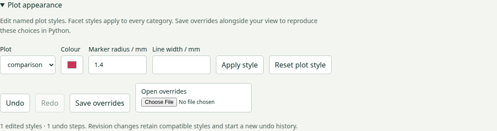

# Reproducible plot editing

Available in **4.0.0.dev3**, under `inklet.experimental`.

The offline inspector edits named plot styles: colour, marker radius and line
width where supported. Apply a change, undo or redo it, and save a small
`overrides.json` file. Python can reconstruct the same visual decisions without
rewriting the source recipe. Selection, filtering and page zoom remain in the
separate `view.json` file; save both files to reproduce an edited view.



## Try the regional report

```bash
python examples/v4/regional_report.py --renderer compiled --editor --render --output out/editor
```

Open `out/editor/index.html`, expand **Plot appearance**, and choose
`comparison`. Change the colour and marker radius, then **Apply style**. All
three category panels update together. Select Hungary or filter a group; those
operations retain the authored style. **Undo** and **Redo** affect appearance
only. **Reset plot style** removes that target's overrides and is undoable.

Download **Save overrides** and **Save view**. Reconstruct the original revision:

```bash
python examples/v4/regional_report.py --renderer compiled --editor \
  --overrides /path/to/overrides.json --state /path/to/view.json \
  --render --output out/reopened
```

Add `--revised` when the view was saved against the revised source. As in the
[regional guide](regional-report.md), a source replacement uses `--rebase-state`
and an explicit missing-ID policy. The recipe writes the overrides, revision
report, exact-viewport SVG and 210/160 mm SVG/PDF/PNG exports.

## Python authoring and export

```python
from inklet.experimental.browser import BrowserFigure, ScatterView
from inklet.experimental.selection import KeyedTable

table = KeyedTable('measurements', {'id': ['a', 'b'], 'x': [1, 2], 'y': [2, 3]})
figure = BrowserFigure(table, [ScatterView('observations', 'x', 'y', (0, 3), (0, 4))])
overrides = figure.overrides({'observations': {'color': '#a03050', 'radius_mm': 1.2}})
page = figure.to_html(renderer='compiled', backend='auto', editor=True, overrides=overrides)
svg = figure.to_svg(overrides=overrides)
```

Supplying `overrides` enables the inspector. `editor=True` alone starts with no
edits. Both the classic and compiled renderers support the inspector. Passing
the browser's saved JSON to `figure.to_svg(state, overrides=overrides)` reproduces
its authored marks. The original figure and input dictionaries remain unchanged.

Colours must be six-digit hex strings; radii and widths must be finite, positive
millimetre values no greater than 10. The inspector advertises only properties
supported by that plot definition. It excludes maps, calibrated fields, images
and drawings so a style edit cannot silently replace a scientific colour key.
Fixed ECDF reference curves retain their paint and statistical population.

## Identity, source revisions and failure

Override targets are the recipe's named plot definitions, with a recorded view
kind. A facet target applies to all its categories, so reordering categories
does not retarget the edit to a different group. The file identifies the source
table by name, but deliberately permits new table contents and page widths.
Authors must keep names attached to the same conceptual plots across revisions.

Removing a target, changing its view kind, or removing an edited capability
creates an orphaned override. Browser revision switching rejects by default.
The explicit **Drop removed IDs and overrides** policy reports discarded target
names alongside the row-state report. Switching back does not resurrect them.
Malformed files, invalid property values and different table names always fail.

In Python, reconcile before exporting revised source:

```python
from inklet.experimental.browser.overrides import rebase_overrides

retained, report = rebase_overrides(overrides, revised_figure, missing='drop')
svg = revised_figure.to_svg(overrides=retained)
```

Omit `missing='drop'` to reject orphans. Successful revisions start a new undo
history; ordinary style commands retain up to 100 history entries. Opening a
valid overrides file is one undoable command. A failed render or file load leaves
the visible document and history unchanged. File reads, commands and source
revisions exclude one another while preparation is in progress.

## Current limits and checks

This is the first bounded authoring increment. Label movement, text editing,
panel dimensions, layout locks, camera controls and reusable composition editing
remain open. Undo history is local to the open page and is not serialized.
Style commands prepare a complete replacement renderer and rebuild picking
geometry; they do not promise incremental layout or low-latency dense editing.

Checks cover invalid schemas and values, compatible and orphaned targets,
facet reordering, physical resizing, failed and overlapping commands, undo/redo,
initial restoration and browser/Python export geometry. Full regional screenshots
compare edited SVG, Canvas and WebGL2 output at display ratios 1 and 2. The
installed-wheel smoke check exercises both saved overrides and bundled editor
assets with core dependencies only.
