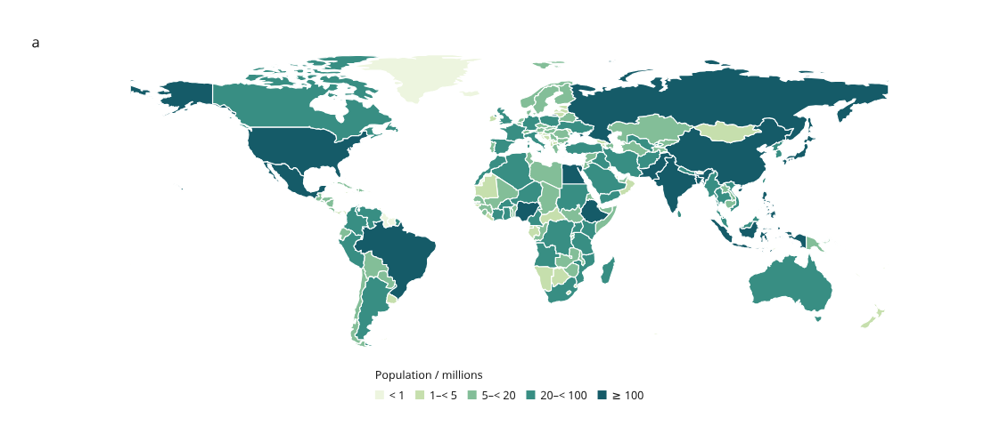

# A real world map

The main map example now uses real country geometry and population estimates,
with linked world and Europe views. Click Hungary or France to select the same
country in both panels. Search by country name, continent or
source ID, save the view, and reconstruct it in Python.



[Open the interactive world and Europe maps](assets/v4/world-population.html) ·
[Python recipe](../examples/v4/world_population.py) ·
[Population CSV](../examples/v4/data/world-population.csv) ·
[GeoJSON](../examples/v4/data/world-countries.geojson)

Made with [Natural Earth](https://www.naturalearthdata.com/downloads/110m-cultural-vectors/110m-admin-0-countries/).
Its map data are [public domain](https://www.naturalearthdata.com/about/terms-of-use/).
The data is a pinned historical snapshot: population years vary by row, with
169 of the 176 included rows dated 2019. These are not current population
estimates. Every source year is retained in the CSV and interactive table.

## Try it

```sh
python examples/v4/world_population.py --output out/v4-world
# Open index.html, change the selection or viewport, then Save view.
python examples/v4/world_population.py --state /path/to/view.json --output out/v4-restored
```

Hungary starts selected in both views. Enter `Hungary`, `France`, `Europe` or
`HUN` in **Search rows**. Filtering retains hidden selections and fixed color
bins. Clear the search to show all countries again. Switch between SVG, canvas
and hybrid, pan/zoom the page, or download vector SVG. Integer population
values retain their digits in the table; noninteger numbers use six significant
digits for display. CSV and embedded values retain the source precision.

The example opens offline. It uses the committed inputs and makes no map-service
or data requests. Data attribution appears outside the artwork in the page
footer. The static `figure.svg` contains both linked maps; `world.svg` supplies
the single-map overview. The supported GeoJSON subset and map behavior are
described in the [region guide](linked-maps.md).

To replace the table with revised values or a source-year cohort while retaining
valid selections, follow [Replace figure data](data-revisions.md). It includes a
169-country example, a change report and exact saved-view reconstruction.

## What was imported

The source is Natural Earth's **Admin 0 countries at 1:110m**, exported at pinned
repository commit `9380cca83db5f9aef52d5e762765100745f84b27` from May 2022.
The [manifest](../examples/v4/data/world-map-source.json) records the exact URL,
source SHA-256, prepared-file hashes and every transformation.

- Retain 176 of 177 source features, excluding Antarctica. Some small countries
  are absent from this coarse source scale. The source's country/map units and
  boundary depiction are retained.
- Keep polygon parts, holes and coordinates without further simplification.
- Use Natural Earth's `ADM0_A3` as the explicit join key. These are source codes,
  not a claim that every code belongs to ISO 3166.
- Copy `ADMIN`, `CONTINENT`, `POP_EST` and `POP_YEAR` into the table. Map values
  are `POP_EST / 1,000,000`; no population values are simulated or extrapolated.
- Remove the old CRS declaration only after verifying it is CRS84, whose
  longitude/latitude coordinates match the importer. Unused properties are
  removed from the prepared geometry file.

The world view clips to longitude −180…180 and latitude −60…85; the Europe view
clips to −15…45 and 34…72. Both use the existing flat longitude/latitude
projection. They share the full table and country geometry, including overseas
parts, while their geographic extents differ. This is not a tile-based basemap
or an equal-area projection.

To reproduce the inputs from the pinned download:

```sh
python tools/prepare_world_map.py --check
# Or verify a local copy, without a network request:
python tools/prepare_world_map.py --source /path/to/ne_110m_admin_0_countries.geojson --check
```

Without `--check`, the preparation tool writes the verified derived inputs.
Ordinary example generation never downloads data.

## Checks

Regression checks verify input hashes, exact country joins and known interior
locations in Hungary, France, the United States, Brazil and Australia. Browser
checks cover all three backends at device pixel ratios 1/2, country-name search,
linked selection, saved state and source credit. The existing polygon tests
continue to check holes, clipping and browser/Python export agreement.

The [small synthetic region example](assets/v4/regional-analysis.html) and
[geometry review](assets/v4/region-shapes.html) remain useful regression fixtures.
The real dataset is now the main map demonstration.
